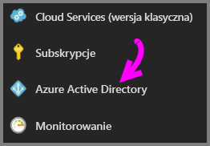
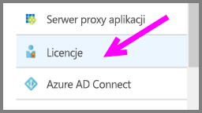
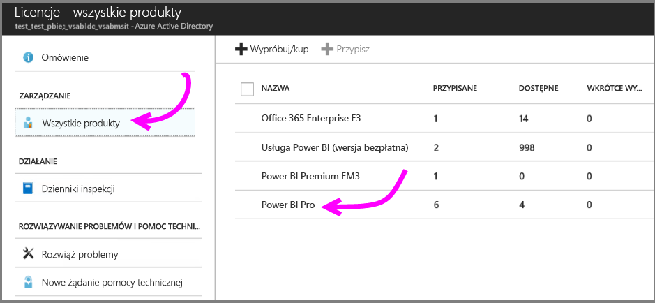
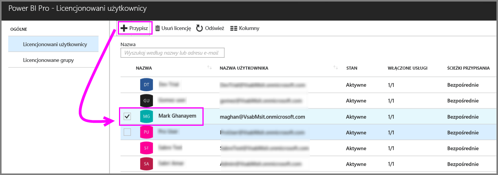
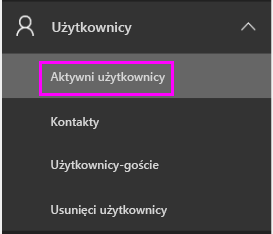
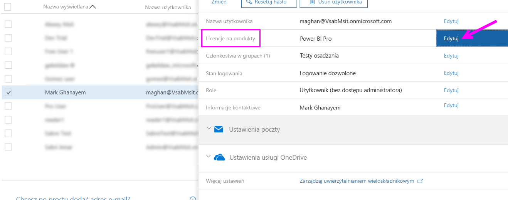
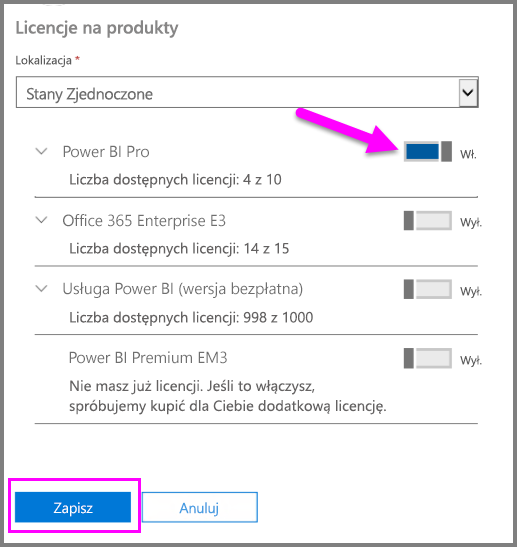
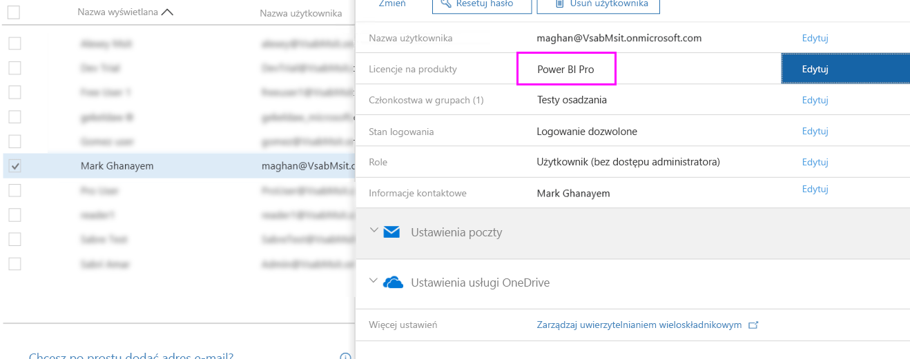

# Przypisywanie licencji usługi Power BI Pro

Administratorzy mogą wybrać spośród różnych portali zarządzania i poleceń cmdlet programu PowerShell, aby przypisać licencje Power BI Pro do użytkowników. Zarządzanie licencjami usługi Power BI jest obsługiwane przez usługę Azure Active Directory (Azure AD).

* Właściciele subskrypcji platformy Azure mogą użyć bloku usługi Azure Active Directory w witrynie [Azure Portal](https://ms.portal.azure.com/#@microsoft.onmicrosoft.com/dashboard/private/39bc3cf7-31a4-43f6-954c-f2d69ca2f0). 

* Administratorzy globalni i administratorzy kont użytkowników mogą użyć [centrum administracyjnego usługi Office 365](https://portal.office.com/AdminPortal/Home#/homepage).

## Zarządzanie licencjami usługi Power BI Pro w witrynie Azure Portal

Usługa Power BI używa usługi Azure AD jako usługi podstawowej. Usługa Azure AD przechowuje konta i grupy użytkowników oraz inne ustawienia, np. informacje o zakupionych produktach.

### Przypisywanie licencji do pojedynczych kont użytkowników

Wykonaj następujące kroki, aby przypisać licencje Pro do pojedynczych kont użytkowników, jeśli jesteś właścicielem subskrypcji platformy Azure:

1. Przejdź do witryny [Azure Portal](https://ms.portal.azure.com/#@microsoft.onmicrosoft.com/dashboard/private/39bc3cf7-31a4-43f6-954c-f2d69ca2f0). 

2. Na pasku nawigacyjnym po lewej stronie kliknij usługę Azure Active Directory.

    

3. W bloku Azure Active Directory kliknij pozycję Licencje.

    

4. W bloku licencji kliknij pozycję Wszystkie produkty, a następnie kliknij pozycję Power BI Pro, aby wyświetlić listę licencjonowanych użytkowników.

    

5. Kliknij pozycję Przypisz, aby dodać licencję usługi Power BI Pro do kolejnego konta użytkownika.

    

> [!NOTE]
> Chociaż można zarządzać większością aspektów licencjonowania, nie można kupować licencji usługi Power BI Pro w witrynie Azure Portal. Użyć centrum administracyjnego usługi Office 365, aby zakupić subskrypcję usługi Power BI Pro. Aby uzyskać więcej informacji, zobacz [Zakup usługi Power BI Pro](https://docs.microsoft.com/en-us/power-bi/service-admin-purchasing-power-bi-pro).
>

## Zarządzanie licencjami usługi Power BI Pro w centrum administracyjnym usługi Office 365

Jeśli jesteś administratorem globalnym, to w centrum administracyjnym usługi Office 365 dokonasz zakupu subskrypcji usługi Power BI Pro oraz będziesz zarządzać odpowiednimi licencjami dla organizacji.

Wykonaj następujące kroki, aby przypisać licencje Pro do pojedynczych kont użytkowników, jeśli jesteś administratorem usługi Office 365:

1. Przejdź do centrum administracyjnego usługi Office 365.

2. W okienku nawigacyjnym po lewej stronie rozwiń pozycję Użytkownicy, a następnie kliknij pozycję Aktywni użytkownicy.

    

3. Wybierz jednego lub wielu użytkowników, a następnie kliknij pozycję Edytuj licencje produktu.

    

4. W obszarze Power BI Pro przełącz ustawienie na włączone, a następnie kliknij pozycję Zapisz.

    

5. Sprawdź pozycję Stan pod kątem wybranych kont, do których przypisano licencję usługi Power BI Pro.

    

> [!NOTE]
> Jeśli w subskrypcji zabrakło licencji, dodaj więcej, rozwijając pozycję Rozliczenia w lewym okienku nawigacyjnym i klikając przycisk Subskrypcje. Na stronie Subskrypcje wybierz subskrypcję usługi Power BI Pro, a następnie kliknij pozycję Dodaj/Usuń licencje.
>

## Następne kroki
[Warunki i postanowienia oferty rozszerzonej wersji próbnej Pro](https://aka.ms/power-bi-trial)
 
[Umowa usługi Power BI dla użytkowników indywidualnych](https://powerbi.microsoft.com/terms-of-service/)
 
[Zawiadomienie dotyczące usługi Power BI Premium](https://aka.ms/pbipremium-announcement)
 
[Znajdowanie zalogowanych użytkowników usługi Power BI](service-admin-access-usage.md)

Masz więcej pytań? [Zadaj pytanie społeczności usługi Power BI](https://community.powerbi.com/)