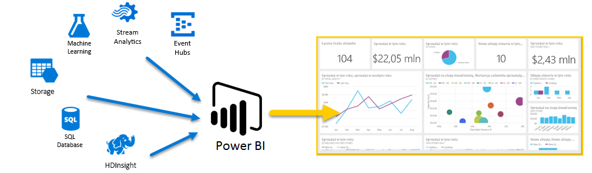
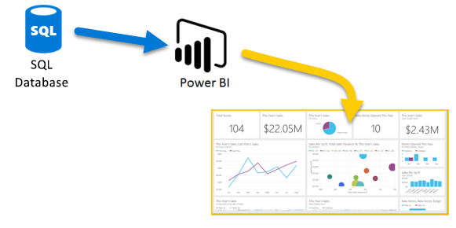
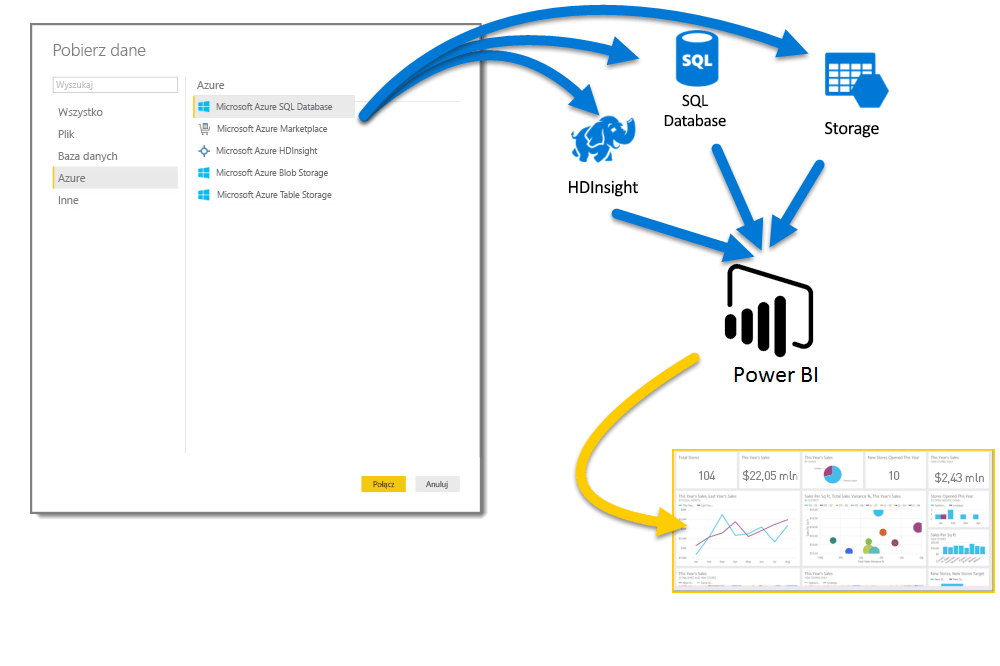
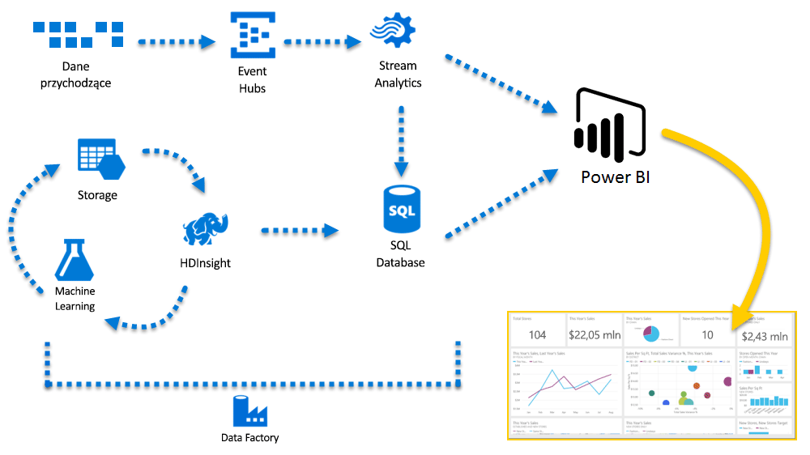

# Platforma Azure i usługa Power BI

Za pomocą usług platformy **Azure** i usługi **Power BI** możesz przekształcić nakłady na przetwarzanie danych w analizy i raporty, które zapewniają szczegółowe informacje o Twojej firmie w czasie rzeczywistym. Bez względu, czy przetwarzanie danych jest oparte na chmurze, czy też lokalne, bezpośrednie lub złożone, z jednym źródłem lub skalowane do ogromnych rozmiarów, oparte na magazynie lub czasie rzeczywistym, platforma Azure i usługa Power BI mają wbudowaną łączność i integrację w celu ożywienia wysiłków analizy biznesowej.

Usługa Power BI ma dostępne wiele połączeń platformy Azure, zaś rozwiązania analizy biznesowej, które możesz utworzyć za pomocą tych usług, są równie unikatowe, jak Twoja działalność. Możesz dołączyć nawet tylko jedno źródło danych platformy Azure lub całą ich grupę, a następnie nadać kształt i uściślić dane w celu tworzenia niestandardowych raportów.

## Baza danych Azure SQL i usługa Power BI

Możesz zacząć od bezpośredniego połączenia z bazą danych SQL Azure i tworzyć raporty, aby monitorować rozwój Twojej firmy. Przy użyciu programu [Power BI Desktop](desktop-getting-started.md) możesz tworzyć raporty, które identyfikują trendy i kluczowe wskaźniki wydajności, które posuwają Twoją firmę do przodu.

Istnieje wiele innych informacji, które pozwolą Ci się dowiedzieć więcej o [bazie danych Azure SQL](http://azure.microsoft.com/services/sql-database/).

## Transformowanie, kształtowanie i scalanie danych w chmurze

Masz więcej złożonych danych i wszelkiego rodzaju źródła? Żaden problem. Za pomocą programu **Power BI Desktop** i usług platformy Azure połączenia można uzyskać zaledwie po naciśnięciu okna dialogowego **Pobieranie danych**. W ramach tego samego zapytania możesz połączyć się z **bazą danych SQL Azure**, źródłem danych **Azure HDInsight** i **magazynem obiektów Blob platformy Azure** (lub **magazynem tabel platformy Azure**), a następnie wybrać tylko potrzebne podzbiory w ramach każdej z nich i uściślić je stamtąd.

Możesz również tworzyć różne raporty dla różnych grup odbiorców, używając tych samych połączeń danych, a nawet tego samego zapytania. Wystarczy tylko utworzyć nową stronę raportu, uściślić wizualizacje dla każdej grupy odbiorców i obejrzeć, jak przyjmują zachowywane informacje biznesowe do wiadomości.

Aby uzyskać więcej informacji, zapoznaj się z następującymi zasobami:

* [Baza danych SQL Azure](http://azure.microsoft.com/services/sql-database/)
* [Usługa Azure HDInsight](http://azure.microsoft.com/services/hdinsight/)
* [Usługa Azure Storage](http://azure.microsoft.com/services/storage/) (magazyn obiektów Blob i magazyn tabel)

## Pobieranie złożonych (i z wyprzedzeniem) przy użyciu usług platformy Azure i usługi Power BI

Możesz rozwinąć na tyle, na ile to potrzebne za pomocą platformy Azure i usługi Power BI. Wykorzystaj przetwarzanie danych z wielu źródeł, użyj ogromnych systemów czasu rzeczywistego, użyj usług [Stream Analytics](http://azure.microsoft.com/services/stream-analytics/) i [Event Hubs](http://azure.microsoft.com/services/event-hubs/) oraz podłącz zróżnicowane usługi SaaS do raportów analizy biznesowej, aby firma uzyskała przewagę.

## Szczegółowe informacje kontekstowe uzyskiwane dzięki analizie w usłudze Power BI Embedded

Osadzaj niesamowite, interaktywne wizualizacje danych w aplikacjach, witrynach internetowych, portalach i innych rozwiązaniach, aby korzystać z zalet z danych biznesowych. Używając [usługi Power BI Embedded jako zasobu na platformie Azure](https://azure.microsoft.com/services/power-bi-embedded/), można łatwo osadzać interaktywne raporty i pulpity nawigacyjne, aby użytkownicy mogli korzystać w urządzeniach ze spójnych środowisk wysokiej jakości.  Usługa Power BI używana wraz z analizą osadzoną ma na celu ułatwienie przechodzenia między elementami Dane -> Wiedza -> Szczegółowe informacje -> Akcje.  Ponadto można rozszerzyć wartość usługi Power BI i platformy Azure, osadzając analizę w [wewnętrznych aplikacjach i portalach organizacji](https://powerbi.microsoft.com/en-us/developers/embedded-analytics/organization/).

Wiele informacji na temat interfejsów API usługi Power BI możesz znaleźć w [portalu deweloperów usługi Power BI](http://dev.powerbi.com).

Aby uzyskać więcej informacji, zobacz [Co deweloperzy mogą robić z usługą Power BI?](developer/what-can-you-do.md)

## Osadzanie danych usługi Power BI w aplikacji

Osadzaj niesamowite, interaktywne wizualizacje danych w aplikacjach, witrynach internetowych, portalach i innych rozwiązaniach, aby przedstawiać dane biznesowe w kontekście. Używając [usługi Power BI Embedded na platformie Azure](https://azure.microsoft.com/services/power-bi-embedded/), można łatwo osadzać interaktywne raporty i pulpity nawigacyjne, aby użytkownicy mogli korzystać w urządzeniach ze spójnych środowisk wysokiej jakości.

## Co można zrobić za pomocą platformy Azure i usługi Power BI?

Istnieje szeroka gama scenariuszy, gdzie można łączyć **platformę Azure** i **usługę Power BI** — możliwości i okazje, są tak unikatowe, jak Twoja firma. Aby uzyskać więcej informacji na temat **usług platformy Azure**, zapoznaj się z tą [stroną przeglądu](https://docs.microsoft.com/azure/machine-learning/team-data-science-process/plan-your-environment), która opisuje **scenariusze analizy danych za pomocą platformy Azure**, i dowiedz się, jak przekształcić źródła danych w analizę, która napędza firmę.