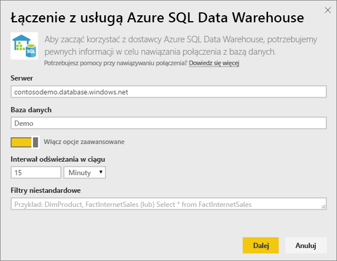

# Usługa Azure SQL Data Warehouse z zapytaniem bezpośrednim
Usługa Azure SQL Data Warehouse z zapytaniem bezpośrednim umożliwia tworzenie dynamicznych raportów na podstawie danych i metryk, które już znajdują się w usłudze Azure SQL Data Warehouse. Dzięki zapytaniu bezpośredniemu zapytania są wysyłane do usługi Azure SQL Data Warehouse w czasie rzeczywistym, gdy eksplorujesz dane. W połączeniu ze skalą usługi SQL Data Warehouse umożliwia to użytkownikom tworzenie dynamicznych raportów w kilka minut w obliczu terabajtów danych. Ponadto wprowadzenie przycisku **Otwórz w usłudze Power BI** umożliwia użytkownikom bezpośrednie łączenie usługi Power BI z usługą SQL Data Warehouse bez konieczności ręcznego określania informacji.

W przypadku używania łącznika usługi SQL Data Warehouse:

* Określ w pełni kwalifikowaną nazwę serwera podczas łączenia (szczegóły poniżej)
* Upewnij się, że reguły zapory dla serwera są ustawione na opcję „Zezwalaj na dostęp do usług platformy Azure”
* Wszystkie akcje, takie jak wybór kolumny lub dodawanie filtru, spowodują bezpośrednie wysłanie zapytania do magazynu danych
* Kafelki są ustawione na odświeżanie co około 15 minut. Nie trzeba planować odświeżania.  Można dostosować tę opcję w Ustawieniach zaawansowanych podczas łączenia.
* Funkcja Pytania i odpowiedzi nie jest dostępna dla zestawów danych zapytania bezpośredniego
* Zmiany schematu nie są pobierane automatycznie

Te ograniczenia i uwagi mogą ulegać zmianom, gdy będziemy kontynuować proces ulepszania środowisk. Etapy łączenia się są szczegółowo opisane poniżej.

## Użycie przycisku „Otwórz w usłudze Power BI”
Najprostszym sposobem na przemieszczanie się między usługą SQL Data Warehouse i usługą Power BI jest użycie przycisku **Otwórz w usłudze Power BI** znajdującego się w witrynie Azure Portal w wersji zapoznawczej. Ten przycisk pozwala na łatwe rozpoczęcie tworzenia nowych pulpitów nawigacyjnych w usłudze Power BI.

1. Aby rozpocząć, przejdź do swojego wystąpienia usługi SQL Data Warehouse w witrynie Azure Portal w wersji zapoznawczej. Pamiętaj, że usługa SQL Data Warehouse jest obecna w witrynie Azure Portal w wersji zapoznawczej tylko w tej chwili.
2. Kliknij przycisk **Otwórz w usłudze Power BI**.
   
    
3. Jeśli nie możesz zalogować się bezpośrednio lub nie masz konta w usłudze Power BI, musisz się zalogować.
4. Nastąpi przekierowanie do strony logowania do usługi SQL Data Warehouse ze wstępnie wypełnionymi informacjami z usługi SQL Data Warehouse. Wprowadź swoje poświadczenia i kliknij przycisk Połącz, aby utworzyć połączenie.

## Łączenie się za pośrednictwem usługi Power BI
Usługa SQL Data Warehouse jest również wymieniona na stronie Pobierz dane w usłudze Power BI. 

1. Wybierz pozycję **Pobierz dane** w dolnej części okienka nawigacji po lewej stronie.  
   
    
2. W obszarze **Bazy danych** wybierz pozycję **Pobierz**.
   
    
3. Wybierz pozycję **SQL Data Warehouse** \> **Połącz**.
   
    
4. Wprowadź informacje wymagane do połączenia. W poniższej sekcji **Znajdowanie parametrów** przedstawiono, gdzie te dane mogą się znajdować w witrynie Azure Portal.
   
    
   
    
   
    
   
   > [!NOTE]
   > Nazwa użytkownika będzie oznaczała użytkownika, który jest zdefiniowany w wystąpieniu usługi Azure SQL Data Warehouse.
   > 
   > 
5. Przejdź do szczegółów zestawu danych, wybierając nowy kafelek lub nowo utworzony zestaw danych wskazany przez gwiazdkę. Ten zestaw danych będzie mieć taką samą nazwę jak baza danych.
   
    
6. Można eksplorować wszystkie tabele i kolumny. Wybór kolumny spowoduje odesłanie zapytania do źródła, dynamicznie tworząc element wizualny. Filtry również zostaną przetłumaczone na zapytania z powrotem do magazynu danych. Te elementy wizualne mogą być zapisywane w nowym raporcie i ponownie przypięte do pulpitu nawigacyjnego.
   
    

## Znajdowanie wartości parametrów
W pełni kwalifikowaną nazwę serwera i nazwę bazy danych można znaleźć w witrynie Azure Portal w wersji zapoznawczej. Pamiętaj, że usługa SQL Data Warehouse jest obecna w witrynie Azure Portal w wersji zapoznawczej tylko w tej chwili.

> [!NOTE]
> Jeśli Twoja dzierżawa usługi Power BI będzie znajdować się w tym samym regionie co usługa Azure SQL Data Warehouse, nie będą naliczane opłaty za ruch wychodzący. Lokalizację dzierżawy usługi Power BI można znaleźć za pomocą [tych instrukcji](https://docs.microsoft.com/power-bi/service-admin-where-is-my-tenant-located).
>

## Następne kroki
[Wprowadzenie do usługi Power BI](service-get-started.md)  
[Pobieranie danych dla usługi Power BI](service-get-data.md)  
[Azure SQL Data Warehouse](https://azure.microsoft.com/documentation/services/sql-data-warehouse/)  

Masz więcej pytań? [Odwiedź społeczność usługi Power BI](http://community.powerbi.com/)