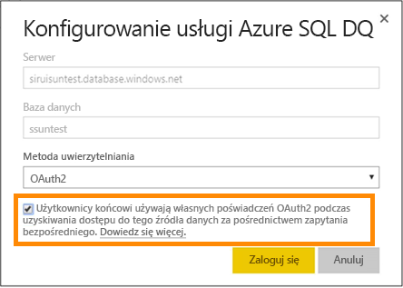
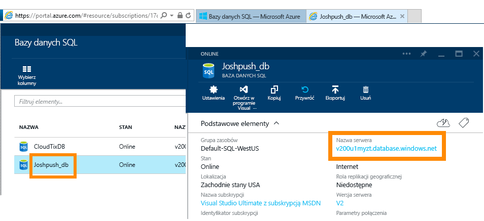
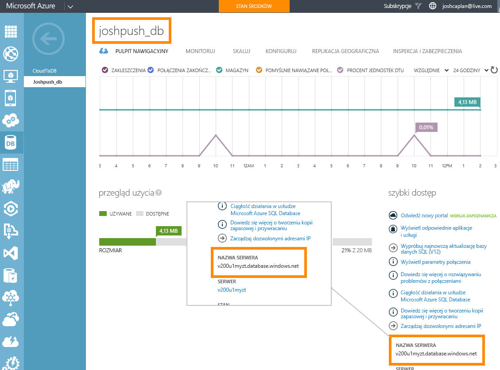

# Usługa Azure SQL Database i zapytanie bezpośrednie
Dowiedz się, jak łączyć się bezpośrednio z usługą Azure SQL Database i tworzyć raporty wykorzystujące dane w czasie rzeczywistym. Dane mogą być przechowywane w lokalizacji źródłowej, a nie w usłudze Power BI.

Dzięki zapytaniu bezpośredniemu zapytania są wysyłane do usługi Azure SQL Database w czasie, gdy eksplorujesz dane w widoku raportu. To środowisko jest zalecane użytkownikom zaznajomionym z bazami danych i jednostkami, z którymi one się łączą.

**Uwagi:**

* Określ w pełni kwalifikowaną nazwę serwera podczas łączenia (szczegóły poniżej)
* Upewnij się, że reguły zapory dla bazy danych mają ustawioną opcję „[Zezwalaj na dostęp do usług platformy Azure](https://msdn.microsoft.com/library/azure/ee621782.aspx)”
* Wszystkie akcje, takie jak wybór kolumny lub dodawanie filtru, spowodują wysłanie zapytania zwrotnego do bazy danych
* Kafelki są odświeżane co godzinę (nie trzeba określać harmonogramu odświeżania). Można dostosować tę opcję w Ustawieniach zaawansowanych podczas łączenia.
* Funkcja Pytania i odpowiedzi nie jest dostępna dla zestawów danych zapytania bezpośredniego
* Zmiany schematu nie są pobierane automatycznie

Te ograniczenia i uwagi mogą ulegać zmianom, gdy będziemy kontynuować proces ulepszania środowisk. Etapy nawiązywania połączenia są szczegółowo opisane poniżej.

> [!Important]
> Pracowaliśmy nad ulepszeniem łączności z usługą Azure SQL Database.  Aby uzyskać najlepsze wyniki podczas łączenia ze źródłem danych usługi Azure SQL Database, użyj programu Power BI Desktop.  Po skompilowaniu modelu i raportów możesz opublikować go w usłudze Power BI.  Bezpośredni łącznik z usługą Azure SQL Database w usłudze Power BI jest już przestarzały.
>

## Program Power BI Desktop i zapytania bezpośrednie
W celu nawiązania połączenia z usługą Azure SQL Database za pomocą zapytania bezpośredniego należy użyć programu Power BI Desktop. Metoda ta zapewnia dodatkową elastyczność i możliwości. Raporty utworzone za pomocą programu Power BI Desktop mogą być następnie publikowane w usłudze Power BI. Dowiedz się więcej na temat nawiązywania połączenia z [usługą Azure SQL Database za pomocą zapytania bezpośredniego](desktop-use-directquery.md) w programie Power BI Desktop. 

## Logowanie jednokrotne

Po opublikowaniu zestawu danych zapytania bezpośredniego środowiska Azure SQL w usłudze można włączyć logowanie jednokrotne za pośrednictwem usługi Azure Active Directory (Azure AD) OAuth2 dla użytkowników końcowych. 

Aby włączyć logowanie jednokrotne, przejdź do ustawień zestawu danych, otwórz kartę **Źródła danych**, a następnie zaznacz pole logowania jednokrotnego.

Gdy opcja logowania jednokrotnego zostanie włączona, a użytkownicy będą mogli uzyskiwać dostęp do raportów kompilowanych na podstawie źródła danych, usługa Power BI wyśle ich uwierzytelnione poświadczenia usługi Azure AD w zapytaniach do bazy danych Azure SQL. Dzięki temu usługa Power BI będzie mogła uwzględniać ustawienia zabezpieczeń konfigurowane na poziomie źródła danych.

Opcja logowania jednokrotnego działa we wszystkich zestawach danych, które używają danego źródła danych. Nie ma ona wpływu na metodę uwierzytelniania używaną na potrzeby scenariuszy importowania.

## Znajdowanie wartości parametrów
W pełni kwalifikowaną nazwę serwera i nazwę bazy danych można znaleźć w witrynie Azure Portal.

## Następne kroki
[Używanie zapytania bezpośredniego w programie Power BI Desktop](desktop-use-directquery.md)  
[Co to jest usługa Power BI?](power-bi-overview.md)  
[Pobieranie danych dla usługi Power BI](service-get-data.md)  
Masz więcej pytań? [Odwiedź społeczność usługi Power BI](http://community.powerbi.com/)
