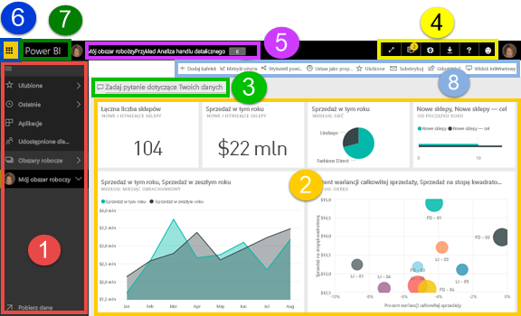
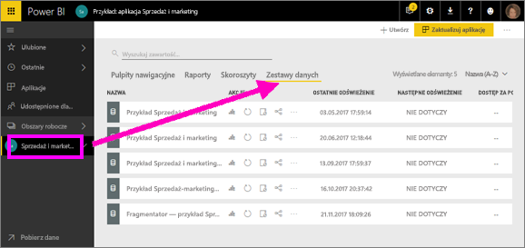
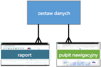
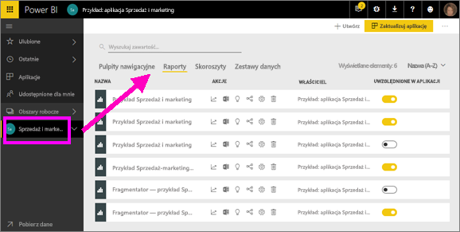
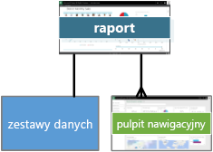
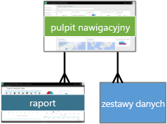
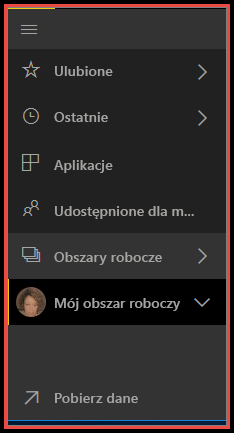
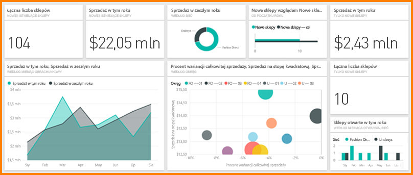

# Power BI — podstawowe pojęcia dotyczące usługi Power BI

W tym artykule przyjęto, że użytkownik [zarejestrował się już w usłudze Power BI](service-self-service-signup-for-power-bi.md) i [dodał pewne dane](service-get-data.md).

Po otwarciu usługi Power BI zobaczysz wyświetlony ***pulpit nawigacyjny***. Pulpity nawigacyjne są elementem różniącym się w przypadku usługi Power BI i aplikacji Power BI Desktop.

Najważniejsze funkcje interfejsu użytkownika usługi Power IB:

1. Lewe okienko nawigacji
2. Kanwa (w tym przypadku pulpit nawigacyjny z kafelkami)
3. Pole pytań funkcji pytań i odpowiedzi
4. Przyciski ikon, w tym Pomoc i opinie
5. Tytuł pulpitu nawigacyjnego (ścieżka nawigacji, czyli linki do stron nadrzędnych)
6. Uruchamianie aplikacji usługi Office 365
7. Przycisk strony głównej usługi Power BI
8. Przyciski ikon z etykietami

Później przyjrzymy się im dokładniej, a najpierw sprawdzimy niektóre pojęcia dotyczące usługi Power BI.

Możesz też obejrzeć ten film, zanim przeczytasz dalszą część artykułu.  W filmie Will omówi podstawowe pojęcia i przedstawi przewodnik po usłudze Power BI.

<iframe width="560" height="315" src="https://www.youtube.com/embed/B2vd4MQrz4M" frameborder="0" allowfullscreen></iframe>

## Pojęcia dotyczące usługi Power BI
4 główne bloki konstrukcyjne usługi Power BI to: ***pulpity nawigacyjne***, ***raporty***, ***skoroszyty*** i ***zestawy danych***. Są one podzielone na ***obszary robocze***. Przed rozpoczęciem omawiania bloków konstrukcyjnych należy zapoznać się z 4 obszarami roboczymi, więc od tego zaczniemy. 

## Obszary robocze
Obszary robocze to kontenery pulpitów nawigacyjnych, raportów, skoroszytów i zestawów danych w usłudze Power BI. Istnieją dwa typy obszarów roboczych: *Mój obszar roboczy* i *obszary robocze aplikacji*. Co to jest *aplikacja*? *Aplikacja* usługi Power BI to kolekcja pulpitów nawigacyjnych i raportów utworzona w celu udostępnienia najważniejszych metryk dla organizacji. Aplikacje są interakcyjne, ale nie można ich edytować. 

- Obszar *Mój obszar roboczy* to osobisty obszar roboczy dla każdego klienta usługi Power BI do pracy z własną zawartością. Tylko Ty masz dostęp do swojego obszaru Mój obszar roboczy. Z poziomu obszaru Mój obszar roboczy możesz udostępniać pulpity nawigacyjne i raporty. Jeśli chcesz współpracować nad pulpitami nawigacyjnymi i raportami lub utworzyć aplikację, warto pracować w obszarze roboczym aplikacji.      
-  *Obszary robocze aplikacji* służą do wspólnej pracy nad zawartością ze współpracownikami i udostępniania im tej zawartości. Można też w nich tworzyć i publikować aplikacje dla organizacji oraz zarządzać nimi. Pełnią one funkcję tymczasowych obszarów i kontenerów zawartości aplikacji usługi Power BI. Możesz dodawać współpracowników do obszarów roboczych aplikacji oraz współpracować nad pulpitami nawigacyjnymi, raportami, skoroszytami i zestawami danych. Wszyscy członkowie obszaru roboczego aplikacji muszą mieć licencje usługi Power BI Pro, ale użytkownicy aplikacji (współpracownicy mający dostęp do aplikacji) nie muszą mieć licencji Pro.  

Aby dowiedzieć się więcej, zobacz sekcję **Udostępnianie wyników pracy** w spisie treści, począwszy od tekstu [Jak współpracować nad pulpitami nawigacyjnymi i raportami oraz udostępniać je](service-how-to-collaborate-distribute-dashboards-reports.md)

Teraz można przejść do bloków konstrukcyjnych usługi Power BI. Nie możesz mieć pulpitów nawigacyjnych lub raportów bez danych (właściwie możesz mieć puste pulpity nawigacyjne i puste raporty, ale nie będą zbyt użyteczne przed dostarczeniem danych), więc rozpocznijmy od **zestawów danych**.

## Zestawy danych
*Zestaw danych* jest kolekcją danych, które są *importowane* lub z którymi *nawiązuje się połączenie*. Usługa Power BI umożliwia nawiązywanie połączeń z wszystkimi rodzajami zestawów danych i importowanie ich, a także łączy wszystkie te możliwości w jednym miejscu.  

Zestawy danych są skojarzone z *obszarami roboczymi* — jeden zestaw danych może należeć do wielu obszarów roboczych. Gdy otworzysz obszar roboczy, skojarzone zestawy danych będą wyświetlane na karcie **Zestawy danych**. Każdy z zestawów danych na liście reprezentuje jedno źródło danych, np. skoroszyt programu Excel w usłudze OneDrive, lokalny tabelaryczny zestaw danych SSAS lub zestaw danych programu Salesforce. Istnieje wiele różnych, obsługiwanych zestawów danych. Ponadto nieustannie dodajemy nowe zestawy danych. [Zobacz listę typów zestawów danych, których można używać w usłudze Power BI](service-get-data.md).

W poniższym przykładzie wybrano obszar roboczy aplikacji „Sales and marketing” i kliknięto kartę **Zestawy danych**.

**JEDNEGO** zestawu danych...

* Można używać wielokrotnie w co najmniej jednym obszarze roboczym.
* Można używać w wielu różnych raportach.
* Wizualizacje z tego jednego zestawu danych można wyświetlać w wielu różnych pulpitach nawigacyjnych.
  
  

Aby [nawiązać połączenie z zestawem danych lub zaimportować go](service-get-data.md), wybierz pozycję **Pobierz dane** (u dołu lewego paska nawigacyjnego) lub wybierz pozycje **+ Utwórz > Zestaw danych** (w prawym górnym rogu). Postępuj zgodnie z instrukcjami, aby nawiązać połączenie z konkretnym źródłem lub zaimportować je i dodać zestaw danych do aktywnego obszaru roboczego. Nowe zestawy danych są oznaczone żółtą gwiazdką. Praca wykonywana w usłudze Power BI nie zmienia źródłowego zestawu danych.

Jeśli jesteś [częścią ***obszaru roboczego aplikacji***](service-collaborate-power-bi-workspace.md), zestawy danych dodane przez jednego członka obszaru roboczego będą dostępne dla innych członków obszaru roboczego.

Możesz odświeżać, eksplorować i usuwać zestawy danych oraz zmieniać ich nazwy. Użyj zestawu danych, aby utworzyć raport od podstaw lub przez uruchomienie [szybkiego wglądu w szczegółowe dane](service-insights.md).  Aby sprawdzić, które raporty i pulpity nawigacyjne już używają zestawu danych, wybierz pozycję **Wyświetl powiązane**. Aby eksplorować zestaw danych, wybierz go. Tak właściwie otworzysz zestaw danych w edytorze raportu, w którym będziesz w stanie rozpocząć szczegółowe badanie danych i tworzenie wizualizacji. Przejdźmy do kolejnego tematu — raportów.

### Szczegółowe informacje
* [Power BI Premium — co to jest?](service-premium.md)
* [Pobieranie danych dla usługi Power BI](service-get-data.md)
* [Przykładowe zestawy danych dla usługi Power BI](sample-datasets.md)

## Raporty
Raport usługi Power BI to co najmniej jedna strona wizualizacji (wykresów i diagramów, np. wykresów liniowych, wykresów kołowych, map w formie drzewa i wielu innych). Wizualizacje są również zwane ***elementami wizualnymi***. Wszystkie wizualizacje w raporcie pochodzą z jednego zestawu danych. Raporty można tworzyć od podstaw w usłudze Power BI, importować je wraz z pulpitami nawigacyjnymi udostępnianymi przez współpracowników lub tworzyć je podczas nawiązywania połączenia z zestawami danych z programu Excel, Power BI Desktop, bazami danych, aplikacjami SaaS i [aplikacjami](service-get-data.md).  Na przykład po połączeniu ze skoroszytem programu Excel zawierającym arkusze Power View usługa Power BI utworzy raport w oparciu o te arkusze. Ponadto po nawiązaniu połączenia z aplikacją SaaS usługa Power BI zaimportuje wstępnie utworzony raport.

Istnieją 2 tryby umożliwiające wyświetlanie i wchodzenie w interakcję z raportami: [Widok do czytania i Widok do edycji](service-reading-view-and-editing-view.md).  Tylko osoba, która utworzyła raport, współwłaściciele oraz osoby, którym udzielono uprawnień, mają dostęp do wszystkich możliwości związanych z eksplorowaniem, projektowaniem, tworzeniem i udostępnianiem w ***Widoku edycji*** dla tego raportu. Ponadto osoby, którym raport zostanie udostępniony, mogą eksplorować raport i wchodzić z nim w interakcje przy użyciu ***Widoku odczytu***.   

Gdy otworzysz obszar roboczy, skojarzone raporty będą wyświetlane na karcie **Raporty**. Każdy raport na liście reprezentuje co najmniej jedną stronę wizualizacji opartą na tylko jednym źródłowym zestawie danych. Aby otworzyć raport, wybierz go. 

Gdy otworzysz aplikację, zostanie wyświetlony pulpit nawigacyjny.  Aby uzyskać dostęp do raportu źródłowego, wybierz kafelek pulpitu nawigacyjnego (później zostaną one omówione dokładniej) przypięty z raportu. Nie wszystkie kafelki są przypinane z raportów, więc może być konieczne kliknięcie kilku kafelków w celu znalezienia raportu. 

Domyślnie raport jest otwierany w widoku do czytania.  Po prostu wybierz pozycję **Edytuj raport**, aby otworzyć go w widoku do edycji (jeśli masz odpowiednie uprawnienia). 

W poniższym przykładzie wybrano obszar roboczy aplikacji „Sales and marketing” i kliknięto kartę **Raporty**.

**JEDEN** raport...

* Znajduje się w jednym obszarze roboczym.
* Może być skojarzony z wieloma pulpitami nawigacyjnymi w tym obszarze roboczym (kafelki przypięte z tego raportu mogą pojawiać się na wielu pulpitach nawigacyjnych).
* Może być utworzony przy użyciu danych z jednego zestawu danych. (Nieznacznym wyjątkiem od tej reguły jest aplikacja Power BI Desktop, w której można połączyć więcej niż jeden zestaw danych w pojedynczy raport, a następnie zaimportować ten raport do usługi Power BI).
  
  

### Szczegółowe informacje
* [Raporty w usłudze Power BI i programie Power BI Desktop](service-reports.md)
* [Raporty w aplikacjach mobilnych Power BI](mobile-reports-in-the-mobile-apps.md)

## Pulpity nawigacyjne
*Pulpit nawigacyjny* jest elementem tworzonym przez Ciebie **w usłudze Power BI** lub tworzonym i udostępnianym przez współpracownika **w usłudze Power BI**. Jest to jedna kanwa zawierająca zero lub więcej kafelków i widgetów. Każdy kafelek przypięty z raportu lub [sesji pytań i odpowiedzi](power-bi-q-and-a.md) wyświetla jedną [wizualizację](power-bi-report-visualizations.md), która została utworzona na podstawie zestawu danych i przypięta do pulpitu nawigacyjnego. Do pulpitu nawigacyjnego można też przypinać całe strony raportów jako pojedyncze kafelki. Istnieje wiele sposobów na dodanie kafelków do pulpitu nawigacyjnego; zbyt wiele, aby uwzględnić je w tym temacie. Aby dowiedzieć się więcej, zobacz [Kafelki pulpitu nawigacyjnego w usłudze Power BI](service-dashboard-tiles.md). 

Dlaczego ludzie tworzą pulpity nawigacyjne?  Poniżej przedstawiono niektóre z powodów:

* Aby zobaczyć, na pierwszy rzut oka, wszystkie informacje wymagane do podejmowania decyzji.
* Aby monitorować najważniejsze informacje dotyczące firmy.
* Aby upewnić się, że wszyscy współpracownicy są na tej samej stronie i używają tych samych informacji.
* Aby monitorować kondycję firmy, produktu, jednostki biznesowej lub kampanii marketingowej itd.
* Aby tworzyć spersonalizowany widok większego pulpitu nawigacyjnego — zawierający wszystkie ważne metryki.

Gdy otworzysz obszar roboczy, skojarzone pulpity nawigacyjne będą wyświetlane na karcie **Pulpity nawigacyjne**. Aby otworzyć pulpit nawigacyjny, wybierz go. Gdy otworzysz aplikację, zostanie wyświetlony pulpit nawigacyjny.  Każdy pulpit nawigacyjny reprezentuje dostosowany widok przedstawiający podzbiór źródłowych zestawów danych.  Jeśli jesteś właścicielem pulpitu nawigacyjnego, będziesz również mieć uprawnienia do edytowania źródłowych zestawów danych i raportów.  Jeśli pulpit nawigacyjny został Ci udostępniony, będziesz mieć możliwość interakcji z nim i raportami źródłowymi, ale nie będziesz móc zapisywać żadnych zmian.

Istnieje wiele sposobów umożliwiających Tobie lub Twoim współpracownikom [udostępnianie pulpitu nawigacyjnego](service-share-dashboards.md). Usługa Power BI Pro jest wymagana w przypadku udostępniania pulpitu nawigacyjnego oraz może być wymagana w przypadku wyświetlania udostępnionego pulpitu nawigacyjnego.

> [!NOTE]
> Przypinanie i kafelki zostały omówione bardziej szczegółowo poniżej w sekcji „Pulpit nawigacyjny z kafelkami”.
> 

**JEDEN** pulpit nawigacyjny...

* Jest skojarzony z jednym obszarem roboczym.
* Może wyświetlać wizualizacje z wielu różnych zestawów danych.
* Może wyświetlać wizualizacje z wielu różnych raportów.
* Może wyświetlać wizualizacje przypięte z innych narzędzi (np. programu Excel).
  
  

### Szczegółowe informacje
* [Tworzenie nowego pustego pulpitu nawigacyjnego i pobieranie danych](service-dashboard-create.md)
* [Duplikowanie pulpitu nawigacyjnego](service-dashboard-copy.md) 
* [Tworzenie widoku pulpitu nawigacyjnego dla telefonu](service-create-dashboard-mobile-phone-view.md)

## Skoroszyty
Skoroszyty są specjalnym typem zestawów danych. Niemal wszystkie potrzebne informacje o skoroszytach przedstawiono w powyższej sekcji **Zestawy danych**. Jednak możesz się zastanawiać, dlaczego czasami usługa Power BI klasyfikuje skoroszyt programu Excel jako **zestaw danych**, a czasami jako **skoroszyt**. 

Jeśli używasz polecenia **Pobierz dane** w plikach programu Excel, możesz *zaimportować* plik lub *nawiązać z nim połączenie*. Po wybraniu pozycji Połącz skoroszyt pojawi się w usłudze Power BI, podobnie jak w aplikacji Excel Online. Jednak, w przeciwieństwie do programu Excel Online, będziesz mieć dostęp do pewnych doskonałych funkcji ułatwiających przypinanie elementów z arkuszy bezpośrednio do pulpitów nawigacyjnych.

W usłudze Power BI nie możesz edytować swojego skoroszytu. Niemniej jeśli musisz wprowadzić zmiany, możesz kliknąć pozycję Edytuj, a następnie wprowadzić zmiany do swojego skoroszytu w aplikacji Excel Online lub otworzyć go w programie Excel na komputerze. Wszelkie wprowadzone zmiany są zapisywane w skoroszycie w usłudze OneDrive.

### Szczegółowe informacje
* [Pobieranie danych z plików skoroszytów programu Excel](service-excel-workbook-files.md)
* [Publikowanie w usłudze Power BI z programu Excel](service-publish-from-excel.md)

## Mój obszar roboczy
Omówiliśmy obszary robocze i bloki konstrukcyjne. Przyjrzyjmy się ponownie interfejsowi usługi Power BI i omówmy elementy, które składają się na stronę docelową usługi Power BI.

### 1. **Lewe okienko nawigacji**
Okienko nawigacji umożliwia znajdowanie obszarów roboczych i bloków konstrukcyjnych usługi Power BI (pulpitów nawigacyjnych, raportów, skoroszytów i zestawów danych) oraz poruszanie się między nimi.  

  

* Wybierz opcję **Pobierz dane**, aby [dodać zestawy danych, raporty i pulpity nawigacyjne do usługi Power BI](service-get-data.md).
* Rozwiń lub zwiń pasek nawigacyjny, korzystając z tej ikony .
* Otwórz ulubioną zawartość lub zarządzaj nią przez wybranie pozycji **Ulubione**.
* Wyświetl i otwórz ostatnio odwiedzaną zawartość przez wybranie pozycji **Ostatnio używane**.
* Wyświetl, otwórz lub usuń aplikację przez wybranie pozycji **Aplikacje**.
* Czy współpracownik udostępnił Ci zawartość? Wybierz pozycję **Udostępnione dla mnie**, aby wyszukiwać i sortować tę zawartość w celu znalezienia potrzebnych informacji.
* Wyświetlaj i otwieraj obszary robocze przez wybranie pozycji **Obszary robocze**.

Kliknij jeden raz:

* Ikonę lub nagłówek, aby otworzyć widok zawartości.
* Strzałkę w prawo (>), aby otworzyć menu wysuwane Ulubione, Ostatnio używane i Obszary robocze. 
* Cudzysłów ostrokątny rozwijania (), aby wyświetlić przewijaną listę pulpitów nawigacyjnych, raportów, skoroszytów i zestawów danych **Mój obszar roboczy**.
* Zestaw danych, aby go eksplorować.

### 2. **Kanwa** 
Otwarto pulpit nawigacyjny, dlatego w obszarze kanwy są wyświetlane kafelki wizualizacji. Gdyby na przykład otwarto edytor raportu, w obszarze kanwy byłaby wyświetlana strona raportu. 

Pulpity nawigacyjne składają się z [kafelków](service-dashboard-tiles.md).  Kafelki są tworzone w widoku edycji raportu, funkcji pytań i odpowiedzi oraz innych pulpitach nawigacyjnych i mogą być przypinane z programu Excel, SSRS i nie tylko. Specjalnym typem kafelka jest [widget](service-dashboard-add-widget.md), który jest dodawany bezpośrednio do pulpitu nawigacyjnego. Kafelki, które są wyświetlane na pulpicie nawigacyjnym, zostały tam specjalnie umieszczone przez twórcę/właściciela raportu.  Dodawanie kafelka do pulpitu nawigacyjnego jest nazywane *przypinaniem*.

Aby uzyskać więcej informacji, zobacz sekcję **Pulpity nawigacyjne** (powyżej).

### 3. **Pole pytań funkcji pytań i odpowiedzi**
Jednym ze sposobów na eksplorowanie danych jest zadanie pytania i umożliwienie znalezienia odpowiedzi w formie wizualizacji przez funkcję pytań i odpowiedzi usługi Power BI. Funkcja pytań i odpowiedzi umożliwia dodawanie zawartości do pulpitu nawigacyjnego lub raportu.

Funkcja pytań i odpowiedzi wyszukuje odpowiedź w zestawach danych połączonych z pulpitem nawigacyjnym.  Połączony zestaw danych to taki, który ma co najmniej jeden kafelek przypięty do tego pulpitu nawigacyjnego.

Kiedy tylko zaczniesz wpisywać pytanie, funkcja pytań i odpowiedzi przeniesie Cię na stronę funkcji pytań i odpowiedzi. Podczas wpisywania funkcja pytań i odpowiedzi pomaga zadać odpowiednie pytanie i znaleźć najlepszą odpowiedź przy użyciu parafrazowania, automatycznego uzupełniania, sugestii i innych funkcji. Jeśli otrzymasz żądaną wizualizację (odpowiedź), przypnij ją do pulpitu nawigacyjnego. Aby uzyskać więcej informacji, zobacz [Funkcja pytań i odpowiedzi w usłudze Power BI](power-bi-q-and-a.md).

### 4. **Przyciski ikon** 
Ikony w prawym górnym rogu stanowią zasoby umożliwiające korzystanie z ustawień, powiadomień, pobierania, pomocy i funkcji przekazywania opinii do zespołu usługi Power BI. Wybierz podwójną strzałkę, aby otworzyć pulpit nawigacyjny w trybie **pełnoekranowym**.  

### 5. **Tytuł pulpitu nawigacyjnego** (ścieżka nawigacji, czyli linki do stron nadrzędnych)
Czasami ustalenie, który obszar roboczy i pulpit nawigacyjny jest aktywny, jest trudne, dlatego usługa Power BI tworzy automatycznie ścieżkę nawigacji.  W tym przykładzie przedstawiono obszar roboczy (Mój obszar roboczy) i tytuł pulpitu nawigacyjnego (Retail Analysis Sample).  W przypadku otwarcia raportu nazwa raportu zostanie dołączona na końcu ścieżki nawigacji.  Każda sekcja ścieżki jest aktywnym hiperlinkiem.  

W tytule pulpitu nawigacyjnego jest wyświetlana ikona „C”. Ten pulpit nawigacyjny zawiera [tag klasyfikacji danych](service-data-classification.md) dla informacji poufnych. Tag identyfikuje poziom poufności i zabezpieczeń danych. Jeśli administrator wyłączył klasyfikację danych, każdy pulpit nawigacyjny będzie mieć ustawiony tag domyślny. Właściciele pulpitu nawigacyjnego powinni zmienić tag zgodnie z poziomem zabezpieczeń ich pulpitu nawigacyjnego.

### 6. **Uruchamianie aplikacji usługi Office 365**
Funkcja uruchamiania aplikacji umożliwia łatwe uzyskiwanie dostępu do wszystkich aplikacji usługi Office 365 jednym kliknięciem. W tym miejscu można szybko uruchomić pocztę e-mail, dokumenty, kalendarz i nie tylko. 

### 7. **Strona główna usługi Power BI**
Wybranie tej pozycji powoduje otwarcie [proponowanego pulpitu nawigacyjnego](service-dashboard-featured.md) (jeśli go ustawiono). W przeciwnym razie zostanie otwarty ostatnio wyświetlany pulpit nawigacyjny.

   

### 8. **Przyciski ikon z etykietami**
Ten obszar ekranu zawiera dodatkowe opcje interakcji z zawartością (w tym przypadku z pulpitem nawigacyjnym).  Oprócz widocznych ikon z etykietami można wybrać wielokropek, co spowoduje wyświetlenie opcji umożliwiających duplikowanie, drukowanie i odświeżanie pulpitu nawigacyjnego oraz innych opcji.

   

## Następne kroki
[Co to jest usługa Power BI?](power-bi-overview.md)  
[Navigation: Getting around in Power BI service](service-the-new-power-bi-experience.md)
[Power BI videos](videos.md) (Nawigacja: Poruszanie się po usłudze Power BI) (Power BI — wideo)  
[Edytor raportu — krótki przewodnik](service-the-report-editor-take-a-tour.md)

Masz więcej pytań? [Zadaj pytanie społeczności usługi Power BI](http://community.powerbi.com/)

