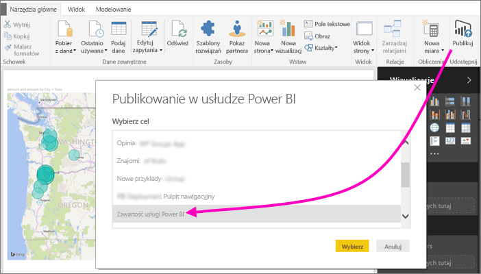
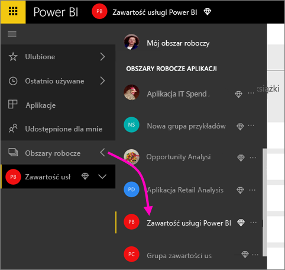
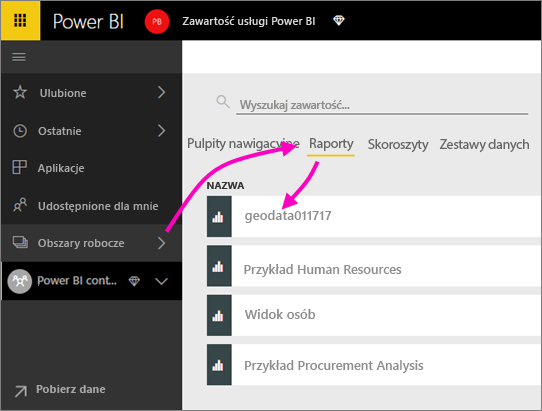
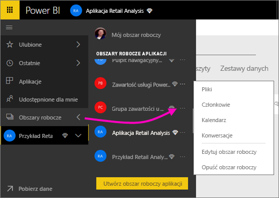
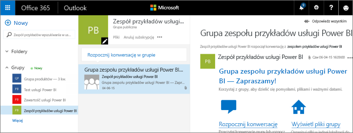
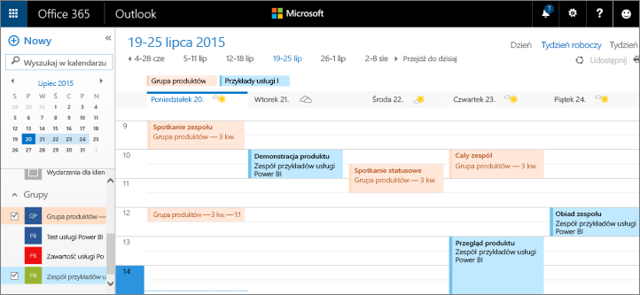

# Współpraca w obszarze roboczym aplikacji usługi Power BI
Obszary robocze aplikacji usługi Power BI są doskonałym miejscem do wspólnej pracy ze współpracownikami przy pulpitach nawigacyjnych, raportach i zestawach danych w celu tworzenia *aplikacji*. Współpraca nie kończy się na obszarach roboczych w usłudze Power BI. Usługa Office 365 oferuje inne usługi grupy, takie jak udostępnianie plików w usłudze OneDrive dla Firm, konwersacje w programie Exchange, udostępnianie kalendarza i zadań itd. Przeczytaj więcej na temat [grup w usłudze Office 365](https://support.office.com/article/Create-a-group-in-Office-365-7124dc4c-1de9-40d4-b096-e8add19209e9).

> [!NOTE]
> Wersja zapoznawcza nowego środowiska obszarów roboczych zmieni relację między obszarami roboczymi usługi Power BI a grupami usługi Office 365. Nie będziesz automatycznie tworzyć grupy usługi Office 365 przy każdym tworzeniu jednego z nowych obszarów roboczych. Przeczytaj o [tworzeniu nowych obszarów roboczych (wersja zapoznawcza)](service-create-the-new-workspaces.md)

Obszary robocze aplikacji są dostępne tylko w usłudze [Power BI Pro](service-free-vs-pro.md).

## Współpraca przy plikach programu Power BI Desktop w obszarze roboczym aplikacji
Po utworzeniu pliku programu Power BI Desktop, jeśli opublikujesz go w swoim obszarze roboczym aplikacji usługi Power BI, wszyscy w Twoim obszarze roboczym mogą przy nim współpracować.

1. W programie Power BI Desktop wybierz pozycję **Publikuj** na wstążce **Narzędzia główne**, a następnie w polu **Wybierz miejsce docelowe** wybierz swój obszar roboczy aplikacji.
   
    
2. W usłudze Power BI wybierz strzałkę obok pozycji Obszary robocze > wybierz swój obszar roboczy aplikacji.
   
    
3. Wybierz kartę Raporty, a następnie wybierz swój raport.
   
    
   
    W tym miejscu jest on podobny do każdego innego raportu w usłudze Power BI. Wraz z innymi w Twoim obszarze roboczym aplikacji możesz [zmodyfikować raport](service-reports.md) i zapisać kafelki na wybranym pulpicie nawigacyjnym.

## Współpraca w usłudze Office 365
Współpraca w usłudze Office 365 zaczyna się w obszarze roboczym aplikacji w usłudze Power BI.

1. W usłudze Power BI wybierz strzałkę obok pozycji Obszary robocze > wybierz wielokropek (**...**) obok nazwy swojego obszaru roboczego. 
   
   
2. Z tego menu możesz współpracować ze swoją grupą na kilka sposobów: 
   
   * Możesz zorganizować [konwersację grupową w usłudze Office 365](service-collaborate-power-bi-workspace.md#have-a-group-conversation-in-office-365).
   * Możesz [zaplanować zdarzenie](service-collaborate-power-bi-workspace.md#schedule-an-event-on-the-group-workspace-calendar) w kalendarzu obszaru roboczego grupy aplikacji.
   
   Po pierwszym przejściu do obszaru roboczego grupy aplikacji w usłudze Office 365 może to zająć trochę czasu. Poczekaj 15 do 30 minut, a następnie odśwież przeglądarkę.

## Konwersacja grupowa w usłudze Office 365
1. Wybierz wielokropek (...) obok swojej nazwy obszaru roboczego aplikacji \> **Konwersacje**. 
   
    
   
   Witryna poczty e-mail i konwersacji dla obszaru roboczego grupy aplikacji zostanie otwarta w programie Outlook dla usługi Office 365.
   
   
2. Przeczytaj więcej na temat [konwersacji grupowych w programie Outlook dla usługi Office 365](https://support.office.com/Article/Have-a-group-conversation-a0482e24-a769-4e39-a5ba-a7c56e828b22).

## Planowanie zdarzenia w kalendarzu obszaru roboczego grupy aplikacji
1. Wybierz wielokropek (**...**) obok swojej nazwy obszaru roboczego aplikacji \> **Kalendarz**. 
   
   
   
   Spowoduje to otwarcie kalendarza dla obszaru roboczego grupy aplikacji w programie Outlook dla usługi Office 365.
   
   
2. Przeczytaj więcej na temat [kalendarzy grupowych w programie Outlook dla usługi Office 365](https://support.office.com/Article/Add-edit-and-subscribe-to-group-events-0cf1ad68-1034-4306-b367-d75e9818376a).

## Zarządzanie obszarem roboczym aplikacji
Jeśli jesteś właścicielem lub administratorem obszaru roboczego aplikacji, możesz również dodawać lub usuwać elementy członkowskie obszaru roboczego. Przeczytaj więcej na temat [zarządzania obszarem roboczym aplikacji usługi Power BI](service-manage-app-workspace-in-power-bi-and-office-365.md).

## Następne kroki
* [Tworzenie aplikacji i obszarów roboczych aplikacji w usłudze Power BI](service-create-distribute-apps.md)
* Masz więcej pytań? [Odwiedź społeczność usługi Power BI](http://community.powerbi.com/)
* Chcesz przesłać opinię? Odwiedź witrynę [Power BI Ideas (Pomysły na ulepszenie usługi Power BI)](https://ideas.powerbi.com/forums/265200-power-bi)

