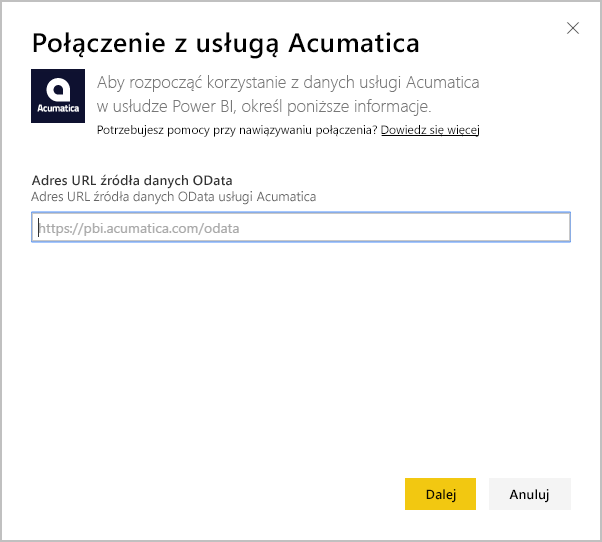

# Nawiązywanie połączenia z systemem Acumatica przy użyciu usługi Power BI
Pakiet zawartości Acumatica dla usługi Power BI umożliwia zyskanie szybkiego wglądu w dane zapewniające możliwości. Usługa Power BI pobiera dane, w tym możliwości, konta i klientów, a następnie tworzy domyślny pulpit nawigacyjny i powiązane raporty w oparciu o te dane.

Połącz się z [pakietem zawartości Acumatica](https://app.powerbi.com/getdata/services/acumatica) lub przeczytaj więcej na temat [integracji systemu Acumatica](https://powerbi.microsoft.com/integrations/acumatica) z usługą Power BI.

>[!NOTE]
>Ten pakiet zawartości wymaga systemu Acumatica w wersji 5.2 lub nowszej.

## Jak nawiązać połączenie
1. Wybierz pozycję **Pobierz dane** w dolnej części okienka nawigacji po lewej stronie.
   
   
2. W polu **Usługi** wybierz pozycję **Pobierz**.
   
   
3. Wybierz pozycję **Acumatica** \> **Pobierz**.
   
   
4. Wprowadź punkt końcowy Acumatica OData. Punkt końcowy OData pozwala zewnętrznemu systemowi na wysyłanie żądań dotyczących danych z systemu Acumatica. Punkt końcowy Acumatica OData jest sformatowany w następujący sposób i powinien używać protokołu HTTPS:
   
     https://[domena_witryny]/odata/[nazwa_firmy]
   
   Nazwa firmy jest wymagana tylko wtedy, gdy korzystasz z wdrożenia obejmującego wiele firm. Więcej informacji na temat odnajdywania tego parametru na koncie Acumatica znajduje się poniżej.
   
   
5. Jako metodę uwierzytelniania wybierz opcję **Podstawowa**. Wprowadź nazwę użytkownika i hasło konta Acumatica, a następnie kliknij opcję **Zaloguj**.
   
    
6. Po zaimportowaniu danych przez usługę Power BI zobaczysz nowy pulpit nawigacyjny, raport i zestaw danych w okienku nawigacji po lewej stronie. Nowe elementy są oznaczone żółtą gwiazdką \*, która zniknie po wybraniu. Wybranie pulpitu nawigacyjnego spowoduje wyświetlenie układu podobnego do przedstawionego poniżej:
   
    

**Co teraz?**

* Spróbuj [zadać pytanie w polu funkcji Pytania i odpowiedzi](power-bi-q-and-a.md) w górnej części pulpitu nawigacyjnego
* [Zmień kafelki](service-dashboard-edit-tile.md) na pulpicie nawigacyjnym.
* [Wybierz kafelek](service-dashboard-tiles.md), aby otworzyć raport źródłowy.
* Zestaw danych zostanie ustawiony na codzienne odświeżanie, ale możesz zmienić harmonogram odświeżania lub spróbować odświeżyć go na żądanie przy użyciu opcji **Odśwież teraz**

## Wymagania systemowe
Ten pakiet zawartości wymaga systemu Acumatica w wersji 5.2 lub nowszej. Potwierdź wersję u administratora systemu Acumatica.

## Znajdowanie parametrów
**Punkt końcowy Acumatica OData**

Punkt końcowy Acumatica OData jest sformatowany w następujący sposób i powinien używać protokołu HTTPS:

    https://[sitedomain]/odata/[companyname]

Domenę witryny aplikacji można znaleźć na pasku adresu przeglądarki po zalogowaniu się do systemu Acumatica. W poniższym przykładzie domeną witryny jest „https://pbi.acumatica.com”, więc punkt końcowy OData, który należy podać, wygląda następująco: „https://pbi.acumatica.com/odata”.

 

Nazwa firmy jest wymagana tylko wtedy, gdy korzystasz z wdrożenia obejmującego wiele firm. Możesz znaleźć te informacje na stronie logowania w systemie Acumatica.

## Rozwiązywanie problemów
Jeśli nie możesz się zalogować, upewnij się, że podany punkt końcowy Acumatica OData jest prawidłowo sformatowany.

    https://<application site domain>/odata/<company name>

Jeśli masz problemy z nawiązaniem połączenia, skontaktuj się z administratorem, aby sprawdzić wersję systemu Acumatica. Ten pakiet zawartości wymaga wersji 5.2 lub nowszej.

## Następne kroki
[Wprowadzenie do usługi Power BI](service-get-started.md)

[Pobieranie danych w usłudze Power BI](service-get-data.md)

