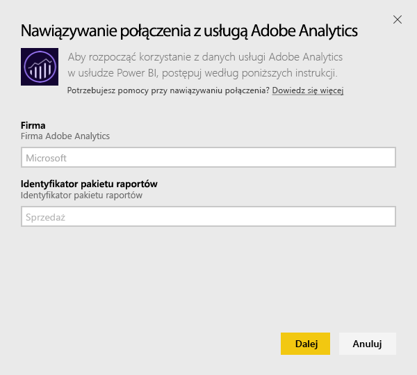
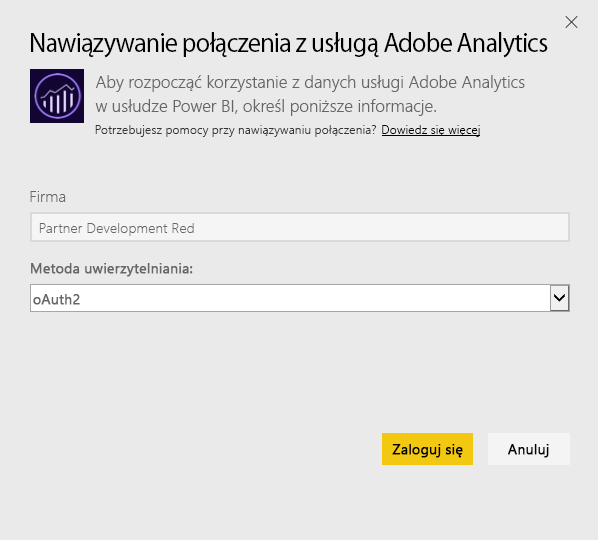
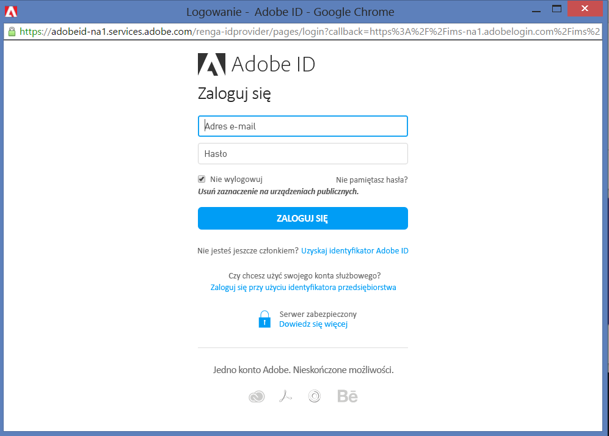
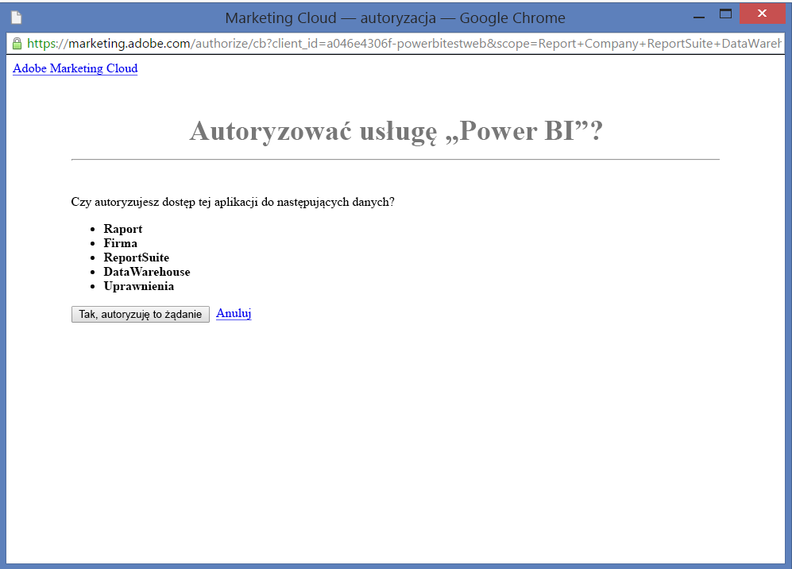
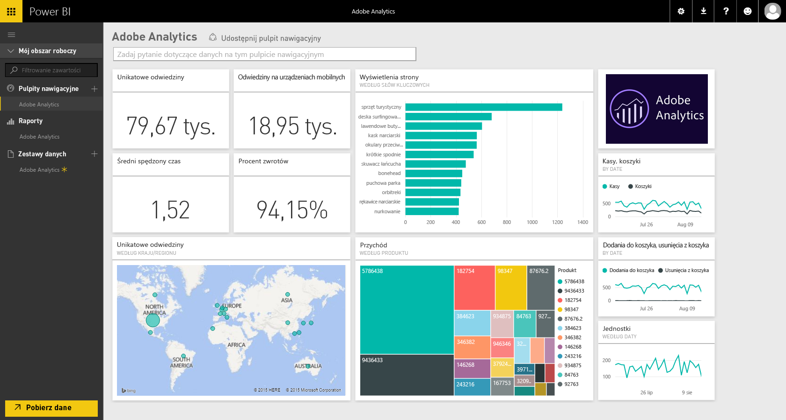

# Łączenie się z usługą Adobe Analytics za pomocą usługi Power BI
Łączenie się z usługą Adobe Analytics za pomocą usługi Power BI należy zacząć od połączenia się z kontem Adobe Analytics Marketing Cloud. Uzyskasz aplikację z pulpitem nawigacyjnym usługi Power BI oraz zestawem raportów usługi Power BI zawierających informacje o ruchu w witrynie oraz wymiarach użytkownika. Dane są odświeżane automatycznie raz dziennie. Możesz korzystać z pulpitu nawigacyjnego i raportów, ale nie możesz zapisywać zmian.

Połącz się z usługą [Adobe Analytics](https://app.powerbi.com/getdata/services/adobe-analytics) lub przeczytaj więcej na temat [integracji usługi Adobe Analytics](https://powerbi.microsoft.com/integrations/adobe-analytics) z usługą Power BI.

## Jak nawiązać połączenie
[!INCLUDE [powerbi-service-apps-get-more-apps](./includes/powerbi-service-apps-get-more-apps.md)]

1. Wybierz pozycję **Adobe Analytics** \> **Uzyskaj**.
   
   
2. Usługa Power BI nawiązuje połączenie przy użyciu określonej firmy i określonego identyfikatora pakietu raportów w usłudze Adobe Analytics (a nie nazwy pakietu raportów). Poniżej znajdują się szczegółowe informacje dotyczące [wyszukiwania tych parametrów](#FindingParams).
   
   
3. W polu **Metoda uwierzytelniania** wybierz opcję **oAuth2** \> **Zaloguj**. Po wyświetleniu monitu wprowadź poświadczenia usługi Adobe Analytics. 
   
    
   
    
4. Kliknij przycisk **Akceptuj**, aby zezwolić usłudze Power BI na dostęp do danych usługi Adobe Analytics.
   
   
5. Po zaakceptowaniu proces importowania rozpocznie się automatycznie. 

## Wyświetlanie pulpitu nawigacyjnego i raportów usługi Adobe Analytics
[!INCLUDE [powerbi-service-apps-open-app](./includes/powerbi-service-apps-open-app.md)]

      

[!INCLUDE [powerbi-service-apps-open-app](./includes/powerbi-service-apps-what-now.md)]

## Zawartość pakietu
Usługa Power BI używa interfejsu Adobe Analytics Report API do definiowania i uruchamiania raportów dla następujących tabel:

| **Nazwa tabeli** | **Szczegóły kolumny** |
| --- | --- |
| Produkty |elements=  "product" (top 25)   metrics="cartadditions", "cartremovals", "carts", "cartviews", "checkouts", "revenue", "units" |
| Przeglądarki |elements= "browser" (top 25)   metrics="bounces", "bouncerate", "visitors", "visits", "uniquevisitors", "totaltimespent", "pageviews" |
| Strony |elements= "page" (top 25)   metrics="cartadditions", "cartremovals", "carts", "cartviews", "checkouts", "revenue", "units", "visits", "uniquevisitors", "pageviews", "bounces", "bouncerate", "totaltimespent" |
| Włączenie obsługi skryptów JavaScript |elements=  "javascriptenabled”, “browser” (top 25) |
| Mobilny system operacyjny |elements= "mobileos"(top 25)  metrics="bounces", "bouncerate", "visitors", "visits", "uniquevisitors", "totaltimespent", "cartadditions", "cartremovals", "checkouts", "revenue", "units", "pageviews" |
| Słowa kluczowe wyszukiwarki |elements= "searchengine" "searchenginekeyword"   metrics="bounces", "bouncerate", "visitors", "visits", "entries", "uniquevisitors", "totaltimespent", "cartadditions", "cartremovals", "carts", "cartviews", "checkouts", "revenue", "units", "pageviews" |
| Wyszukiwarka produktów |elements= "searchengine", "product"   metrics="bounces", "bouncerate", "visitors", "visits", "entries", "uniquevisitors", "totaltimespent", "cartadditions", "cartremovals", "carts", "cartviews", "checkouts", "revenue", "units", "pageviews" |
| Odwołujące się strony |elements= "referrer" (top 15), “page" (top 10)   metrics="bounces", "bouncerate", "visitors", "visits", "entries", "uniquevisitors", "totaltimespent", "cartadditions", "cartremovals", "carts", "cartviews", "checkouts", "revenue", "units", "pageviews" |
| Strony geolokalizacji |elements= "geocountry" (Top 20), "page"   metrics="bounces", "bouncerate", "visitors", "visits", "entries", "uniquevisitors", "totaltimespent", "cartadditions", "cartremovals", "carts", "cartviews", "checkouts", "revenue", "units", "pageviews" |
| Geolokalizacja produktów |elements= "geocountry" (Top 20), "product"  metrics="bounces", "bouncerate", "visitors", "visits", "entries", "uniquevisitors", "totaltimespent", "cartadditions", "cartremovals", "carts", "cartviews", "checkouts", "revenue", "units" |
| Wyszukiwanie kraju i regionu |elements= "geocountry" (Top 200)   metrics="bounces", "bouncerate", "visitors", "visits", "entries", "uniquevisitors", "totaltimespent", "cartadditions", "cartremovals", "carts", "cartviews", "checkouts", "revenue", "units" |
| Język |elements= "language", "browser" (Top 25)   metrics="bounces", "bouncerate", "visitors", "visits", "uniquevisitors", "totaltimespent", "pageviews", "cartadditions", "cartremovals", "checkouts", "carts", "cartviews" |
| Wyszukiwania w wyszukiwarce |elements= "searchengine" (top 100)   metrics="bounces", "bouncerate", "visitors", "visits", "entries", "uniquevisitors", "totaltimespent", "cartadditions", "cartremovals", "carts", "cartviews", "checkouts", "revenue", "units" |
| Wyszukiwania w przeglądarce |elements= "browser" (top 25) |

## Wymagania systemowe
Wymagany jest dostęp do usługi [Adobe Analytics](http://www.adobe.com/marketing-cloud/web-analytics.html), w tym dostęp do poprawnych parametrów, zgodnie z poniższym opisem.

## Znajdowanie parametrów
**Firma**

Wartość Firma można znaleźć w prawym górnym rogu konta, gdy użytkownik jest zalogowany. W przypadku tej wartości rozróżniana jest wielkość liter oraz uwzględniane są spacje. Należy wprowadzić ją dokładnie tak, jak jest wyświetlana na koncie.

**Identyfikator pakietu raportów**

Identyfikator pakietu jest tworzony podczas tworzenia pakietu raportów. Można skontaktować się z administratorem, aby określić wartość identyfikatora. Należy pamiętać, że nie jest to nazwa pakietu raportów.

Z [dokumentacji](https://marketing.adobe.com/resources/help/en_US/reference/new_report_suite.html) firmy Adobe:

## Rozwiązywanie problemów
Jeśli po wprowadzeniu poświadczeń jest wyświetlany błąd wskazujący, że nie masz uprawnień, skontaktuj się z administratorem, aby upewnić się, że masz dostęp do interfejsu API usługi Adobe Analytics. Upewnij się również, że podany identyfikator Adobe jest połączony z organizacją w usłudze Marketing Cloud (skojarzonej z firmą w usłudze Adobe Analytics).

Jeśli pomyślnie podano poświadczenia, a błąd wystąpił później, tworzenie raportów może trwać zbyt długo. Typowy błąd to *„Nie można pobrać danych z raportu usługi Adobe Analytics. Zawartość: &quot;źródło odwołania, strona&quot;; Przybliżony czas trwania: xx s”*. Zapoznaj się z sekcją „Zawartość pakietu” i porównaj ją z rozmiarem wystąpienia Adobe. Niestety obecnie nie ma obejścia tego limitu czasu. Rozważamy jednak wprowadzenie aktualizacji w celu zapewnienia lepszej obsługi większych wystąpień. Prześlij opinię do zespołu usługi Power BI za pośrednictwem witryny https://ideas.powerbi.com

## Następne kroki
* [Czym są aplikacje w usłudze Power BI?](consumer/end-user-apps.md)
* [Pobieranie danych w usłudze Power BI](service-get-data.md)
* Masz więcej pytań? [Zadaj pytanie społeczności usługi Power BI](http://community.powerbi.com/)

