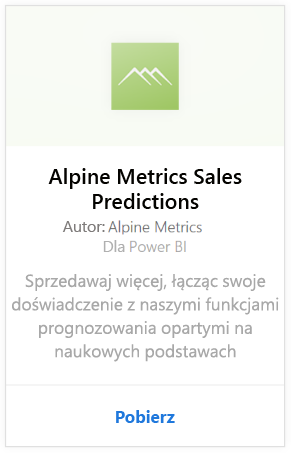
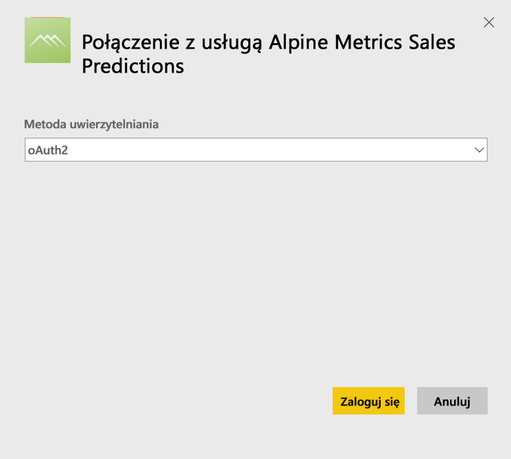
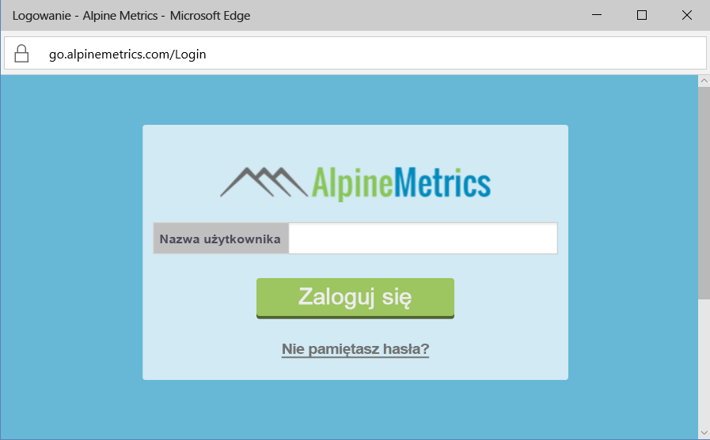
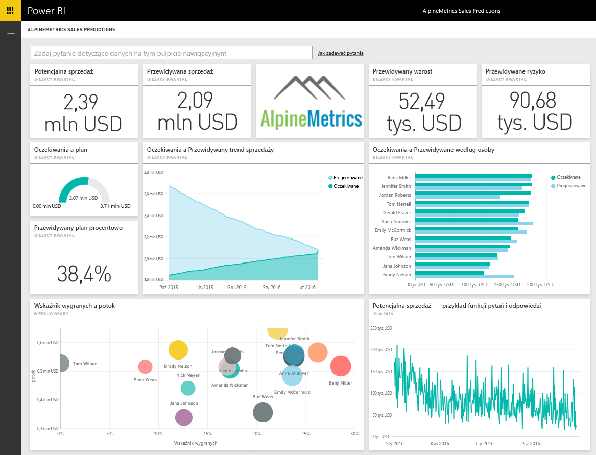

# Łączenie się z usługą Alpine Metrics Sales Predictions za pomocą usługi Power BI
Firma Alpine Metrics oferuje nowoczesną predykcyjną optymalizację procesów sprzedaży w chmurze oraz na żądanie dla dużych i małych organizacji handlowych. Pakiet zawartości usługi Alpine Metrics Sales Predictions dla usługi Power BI obejmuje takie metryki jak potencjalna i przewidywana sprzedaż i ryzyko, dzięki czemu masz lepszy wgląd w przyszłość firmy. 

Połącz się z [pakietem zawartości Alpine Metrics Sales Predictions](https://app.powerbi.com/getdata/services/alpine-metrics) dla usługi Power BI.

## Jak nawiązać połączenie
1. Wybierz pozycję Pobierz dane w dolnej części okienka nawigacji po lewej stronie.  
   
    
2. W polu **Usługi** wybierz pozycję **Pobierz**.  
   
    
3. Wybierz pozycję **AlpineMetrics Sales Predictions**, a następnie pozycję **Pobierz**.  
   
    
4. Wybierz pozycję **OAuth 2**, a następnie pozycję **Zaloguj**. Po wyświetleniu monitu podaj poświadczenia AlpineMetrics.
   
    
   
    
5. Po nawiązaniu połączenia automatycznie zostanie załadowany pulpit nawigacyjny, raport i zestaw danych. Po zakończeniu kafelki zostaną zaktualizowane przy użyciu danych pochodzących z konta.
   
    

**Co teraz?**

* Spróbuj [zadać pytanie w polu funkcji Pytania i odpowiedzi](power-bi-q-and-a.md) w górnej części pulpitu nawigacyjnego
* [Zmień kafelki](service-dashboard-edit-tile.md) na pulpicie nawigacyjnym.
* [Wybierz kafelek](service-dashboard-tiles.md), aby otworzyć raport źródłowy.
* Zestaw danych zostanie ustawiony na codzienne odświeżanie, ale możesz zmienić harmonogram odświeżania lub spróbować odświeżyć go na żądanie przy użyciu opcji **Odśwież teraz**

## Zawartość pakietu
Pakiet zawartości obejmuje dane z następujących tabel:  

    - Account (Konto)    
    - Business (Firma)    
    - Country (Kraj)    
    - Industry (Branża)    
    - Opportunity (Możliwość)  
    - Person (Osoba)  
    - Prediction (Prognoza)    
    - Prediction History (Historia prognozowania)    
    - Product (Produkt)  
    - Region    

## Wymagania systemowe
Aby utworzyć wystąpienia tego pakietu zawartości, wymagane jest konto Alpine Metrics z uprawnieniami do powyższych tabel.

## Następne kroki
[Wprowadzenie do usługi Power BI](service-get-started.md)

[Power BI — podstawowe pojęcia](service-basic-concepts.md)

