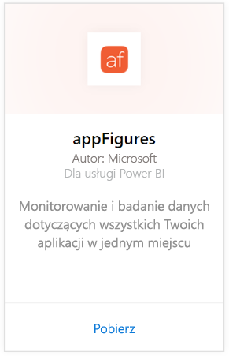
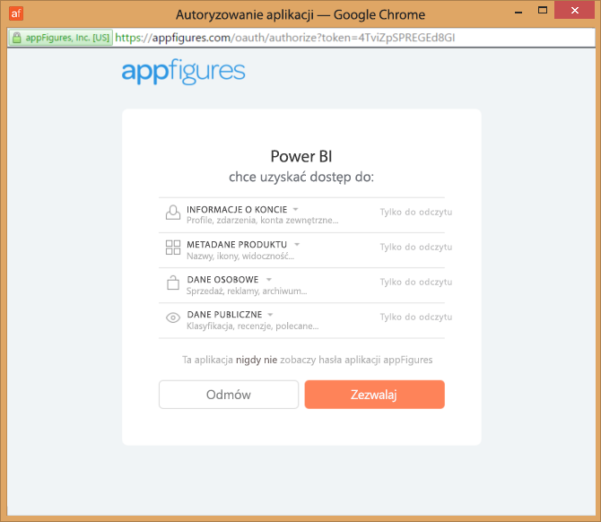
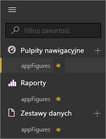
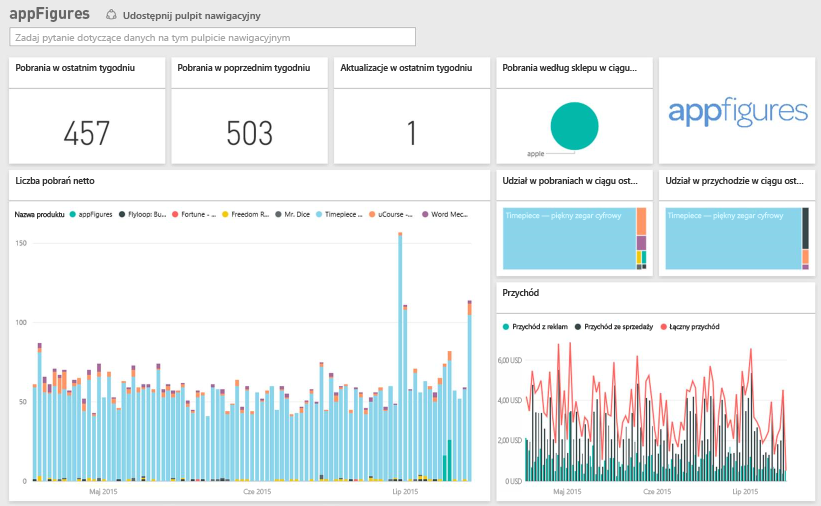
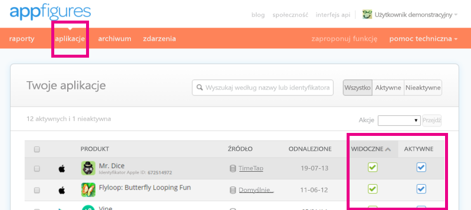

# Łączenie się z usługą appFigures za pomocą usługi Power BI
Śledzenie ważnych statystyk dotyczących aplikacji jest bardzo proste dzięki usłudze Power BI i pakietowi zawartości appFigures. Usługa Power BI pobiera dane, w tym informacje o sprzedaży aplikacji, pobraniach i statystykach dotyczących reklam, a następnie tworzy domyślny pulpit nawigacyjny i powiązane raporty w oparciu o te dane.

Połącz się z [pakietem zawartości appFigures](https://app.powerbi.com/getdata/services/appfigures) lub przeczytaj więcej na temat [integracji usługi appFigures](https://powerbi.microsoft.com/integrations/appfigures) z usługą Power BI.

## Jak nawiązać połączenie
1. Wybierz pozycję **Pobierz dane** w dolnej części okienka nawigacji po lewej stronie.
   
   
2. W polu **Usługi** wybierz pozycję **Pobierz**.
   
   
3. Wybierz pozycję **appFigures** \> **Pobierz**.
   
   
4. Jako **metodę uwierzytelniania** wybierz opcję **oAuth2** \> **Zaloguj**. Po wyświetleniu monitu wprowadź swoje poświadczenia appFigures i postępuj zgodnie z procesem uwierzytelniania appFigures.
   
   Przy pierwszym połączeniu usługa Power BI wyświetla monit o pozwolenie na dostęp tylko do odczytu do Twojego konta. Kliknij przycisk **Zezwalaj**, aby rozpocząć proces importowania. Może to zająć kilka minut w zależności od ilości danych na Twoim koncie.
   
   
5. Po zaimportowaniu danych przez usługę Power BI zobaczysz nowy pulpit nawigacyjny, raport i zestaw danych w okienku nawigacji po lewej stronie. Nowe elementy są oznaczone żółtą gwiazdką \*:
   
    
6. Wybierz pulpit nawigacyjny usługi appFigures. Jest to domyślny pulpit nawigacyjny utworzony przez usługę Power BI do wyświetlania Twoich danych. Możesz modyfikować pulpit nawigacyjny, aby wyświetlać dane w dowolny sposób.
   
    

**Co teraz?**

* Spróbuj [zadać pytanie w polu funkcji Pytania i odpowiedzi](power-bi-q-and-a.md) w górnej części pulpitu nawigacyjnego
* [Zmień kafelki](service-dashboard-edit-tile.md) na pulpicie nawigacyjnym.
* [Wybierz kafelek](service-dashboard-tiles.md), aby otworzyć raport źródłowy.
* Zestaw danych zostanie ustawiony na codzienne odświeżanie, ale możesz zmienić harmonogram odświeżania lub spróbować odświeżyć go na żądanie przy użyciu opcji **Odśwież teraz**

## Zawartość pakietu
W usłudze Power BI są dostępne następujące dane pochodzące z usługi appFigures.

| **Nazwa tabeli** | **Opis** |
| --- | --- |
| Kraje |Ta tabela zawiera informacje o nazwie kraju. |
| Daty |Ta tabela zawiera daty od dzisiejszej do najwcześniejszej daty publikacji aplikacji, które są aktywne i widoczne na Twoim koncie appFigures. |
| Zdarzenia |Ta tabela zawiera codzienne informacje o pobraniach, sprzedaży i reklamach dotyczące każdej aplikacji według kraju. Należy pamiętać, że w jednej tabeli znajdują się zarówno informacje o aplikacji, jak i o zakupach w aplikacji — możesz użyć kolumny <strong>Typ</strong>, aby je rozróżnić. |
| Inapps |Ta tabela zawiera dane o różnych typach zakupów w aplikacji, które są skojarzone z aktywnymi, widocznymi aplikacjami na Twoim koncie appFigures. |
| Produkty |Ta tabela zawiera dane o różnych aplikacjach, które są aktywne i widoczne na Twoim koncie appFigures. |

## Rozwiązywanie problemów
Jeśli dane z niektórych aplikacji nie są wyświetlane w usłudze Power BI, upewnij się, że te aplikacje są widoczne i aktywne na karcie **Aplikacje** w witrynie appFigures.

## Następne kroki
* [Wprowadzenie do usługi Power BI](service-get-started.md)
* [Pobieranie danych w usłudze Power BI](service-get-data.md)

