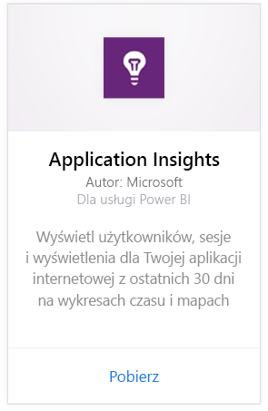
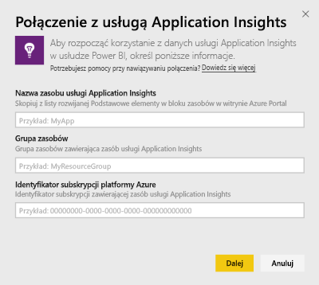
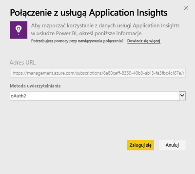
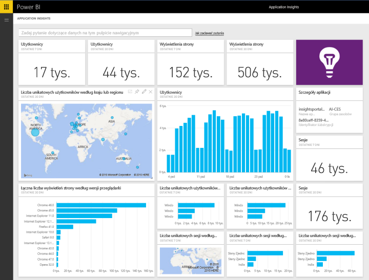
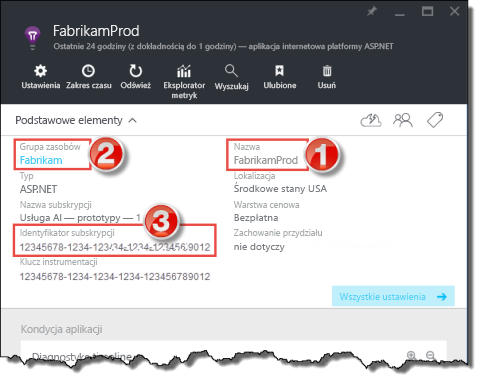
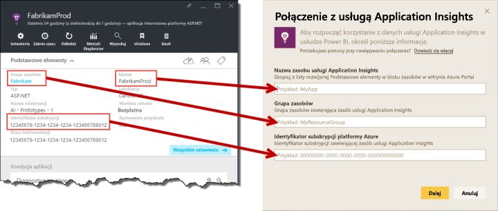

# Łączenie się z usługą Application Insights za pomocą usługi Power BI
Usługa Power BI umożliwia tworzenie zaawansowanych niestandardowych pulpitów nawigacyjnych z telemetrii usługi [Application Insights](https://azure.microsoft.com/documentation/articles/app-insights-overview/). Dostępne są nowe sposoby wykorzystania telemetrii aplikacji. Możesz łączyć metryki z wielu aplikacji lub usług składowych na jednym pulpicie nawigacyjnym. Ta pierwsza wersja pakietu zawartości usługi Power BI dla usługi Application Insights zawiera widgety dla typowych metryk związanych z użyciem, takich jak aktywni użytkownicy, widok strony, sesje, przeglądarka i wersja systemu operacyjnego oraz rozkład geograficzny użytkowników na mapie.

Połącz się z [pakietem zawartości Application Insights dla usługi Power BI](https://app.powerbi.com/getdata/services/application-insights).

>[!NOTE]
>W celu nawiązania połączenia wymagany jest dostęp do bloku przeglądu usługi Application Insights dla aplikacji w Portalu Azure w wersji zapoznawczej. Więcej szczegółowych informacji na temat wymagań znajduje się poniżej.

## Jak nawiązać połączenie
1. Wybierz pozycję **Pobierz dane** w dolnej części okienka nawigacji po lewej stronie.
   
    
2. W polu **Usługi** wybierz pozycję **Pobierz**.
   
    
3. Wybierz pozycję **Application Insights** > **Pobierz**.
   
    
4. Podaj szczegółowe informacje dotyczące aplikacji, z którą chcesz nawiązać połączenie, w tym dane, takie jak **Nazwa zasobu usługi Application Insights**, **Grupa zasobów** i **Identyfikator subskrypcji**. Zobacz [Znajdowanie parametrów usługi Application Insights](#FindingAppInsightsParams) poniżej, aby uzyskać więcej informacji.
   
        
5. Wybierz pozycję **Zaloguj** i postępuj zgodnie z instrukcjami na ekranie, aby nawiązać połączenie.
   
    
6. Proces importowania rozpocznie się automatycznie. Po zakończeniu zostanie wyświetlone powiadomienie, a w okienku nawigacji oznaczonym gwiazdką pojawi się nowy pulpit nawigacyjny, raport i zestaw danych.  Wybierz pulpit nawigacyjny, aby wyświetlić zaimportowane dane.
   
    

**Co teraz?**

* Spróbuj [zadać pytanie w polu funkcji Pytania i odpowiedzi](power-bi-q-and-a.md) w górnej części pulpitu nawigacyjnego
* [Zmień kafelki](service-dashboard-edit-tile.md) na pulpicie nawigacyjnym.
* [Wybierz kafelek](service-dashboard-tiles.md), aby otworzyć raport źródłowy.
* Zestaw danych zostanie ustawiony na codzienne odświeżanie, ale możesz zmienić harmonogram odświeżania lub spróbować odświeżyć go na żądanie przy użyciu opcji **Odśwież teraz**

## Zawartość pakietu
Pakiet zawartości Application Insights obejmuje następujące tabele i metryki:  

    ´´´
    - ApplicationDetails  
    - UniqueUsersLast7Days   
    - UniqueUsersLast30Days   
    - UniqueUsersDailyLast30Days  
    - UniqueUsersByCountryLast7Days  
    - UniqueUsersByCountryLast30Days   
    - PageViewsDailyLast30Days   
    - SessionsLast7Days   
    - SessionsLast30Days  
    - PageViewsByBrowserVersionDailyLast30Days   
    - UniqueUsersByOperatingSystemLast7Days   
    - UniqueUsersByOperatingSystemLast30Days    
    - SessionsDailyLast30Days   
    - SessionsByCountryLast7Days   
    - SessionsByCountryLast30Days   
    - PageViewsByCountryDailyLast30Days  
    ´´´ 

## Znajdowanie parametrów
Parametry, takie jak Nazwa zasobu, Grupa zasobów i Identyfikator subskrypcji, można znaleźć w witrynie Azure Portal. Po wybraniu pozycji Nazwa zostanie otwarty widok szczegółowy. Wszystkie potrzebne elementy będzie można znaleźć na liście rozwijanej Podstawowe elementy.

Skopiuj i wklej te dane do pól w usłudze Power BI:

## Następne kroki
[Wprowadzenie do usługi Power BI](service-get-started.md)

[Pobieranie danych w usłudze Power BI](service-get-data.md)

