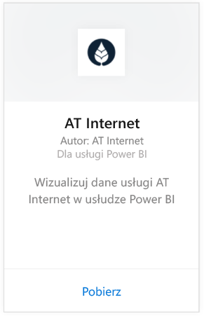
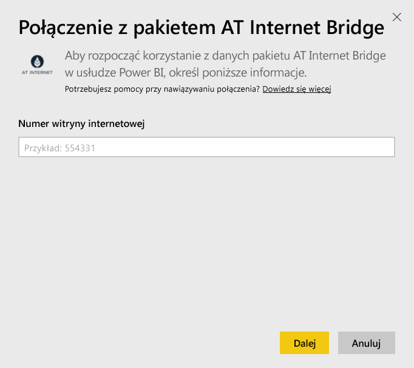
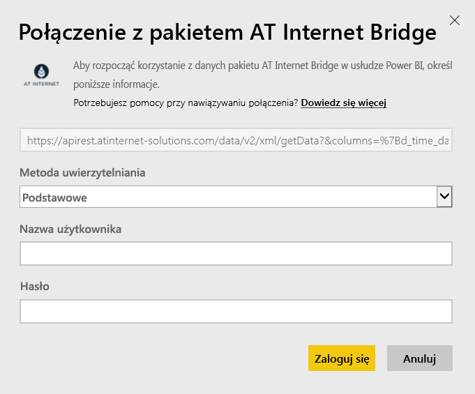

# Łączenie się z pakietem zawartości AT Internet Bridge za pomocą usługi Power BI
Usługa AT Internet pozwala uzyskać natychmiastową wartość z danych z wykorzystaniem zunifikowanej cyfrowej platformy analitycznej Analytics Suite. Pakiet zawartości AT Internet Bridge dla usługi Power BI zawiera dane dotyczące wizyt, źródeł, lokalizacji i urządzeń dla witryny.

Połącz się z [pakietem zawartości AT Internet Bridge](https://app.powerbi.com/getdata/services/at-internet-bridge) dla usługi Power BI.

## Jak nawiązać połączenie
1. Wybierz pozycję **Pobierz dane** w dolnej części okienka nawigacji po lewej stronie.
   
    
2. W polu **Usługi** wybierz pozycję **Pobierz**.
   
    
3. Wybierz pozycję **AT Internet Bridge** \> **Pobierz**.
   
   
4. Określ numer witryny internetowej AT, z którą chcesz nawiązać połączenie.
   
   
5. Wybierz opcję **Basic** (podstawowy) jako mechanizm uwierzytelniania, wprowadź nazwę użytkownika i hasło usługi AT Internet, a następnie kliknij przycisk **Zaloguj**.
   
   
6. Kliknij przycisk **Połącz**, aby rozpocząć proces importowania. Po zakończeniu tego procesu w okienku nawigacji zostaną wyświetlone nowy pulpit nawigacyjny, raport i model. Wybierz pulpit nawigacyjny, aby wyświetlić zaimportowane dane.
   
    

**Co teraz?**

* Spróbuj [zadać pytanie w polu funkcji Pytania i odpowiedzi](consumer/end-user-q-and-a.md) w górnej części pulpitu nawigacyjnego
* [Zmień kafelki](service-dashboard-edit-tile.md) na pulpicie nawigacyjnym.
* [Wybierz kafelek](consumer/end-user-tiles.md), aby otworzyć raport źródłowy.
* Dla zestawu danych jest zaplanowane codzienne odświeżanie, ale możesz zmienić harmonogram odświeżania lub odświeżyć go na żądanie przy użyciu polecenia **Odśwież teraz**

## Zawartość pakietu
Ten pakiet zawartości zawiera dane z ostatnich 45 dni w następujących tabelach:  

    - Conversion  
    - Devices  
    - Localization  
    - Sources  
    - Global Visits  

## Następne kroki
[Co to jest usługa Power BI?](power-bi-overview.md)

[Power BI — podstawowe pojęcia](consumer/end-user-basic-concepts.md)

