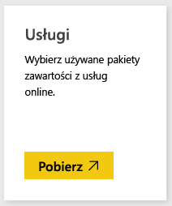
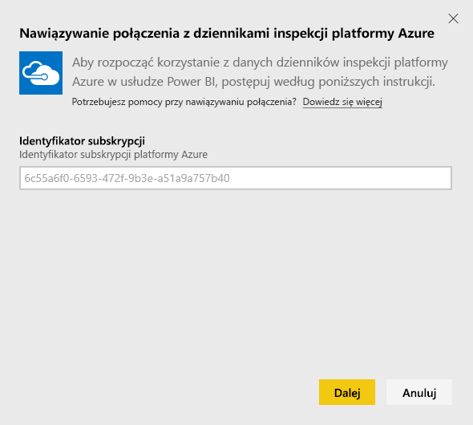
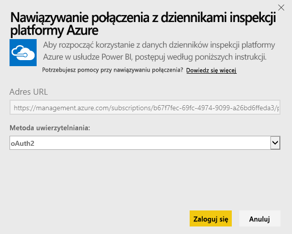

# Łączenie się z dziennikami inspekcji platformy Azure za pomocą usługi Power BI
Pakiet zawartości dzienników inspekcji platformy Azure pozwala analizować i wizualizować informacje przechowywane w dziennikach inspekcji. Usługa Power BI pobiera dane, tworzy gotowy do użycia pulpit nawigacyjny i raporty w oparciu o dane.

Połącz się z [pakietem zawartości dzienników inspekcji platformy Azure](https://app.powerbi.com/getdata/services/azure-audit-logs) lub przeczytaj więcej na temat [integracji dzienników inspekcji platformy Azure](https://powerbi.microsoft.com/integrations/azure-audit-logs) z usługą Power BI.

## Jak nawiązać połączenie
1. Wybierz pozycję **Pobierz dane** w dolnej części okienka nawigacji po lewej stronie.  
   
    
2. W polu **Usługi** wybierz pozycję **Pobierz**.  
   
     
3. Wybierz pozycję **Dzienniki inspekcji platformy Azure** > **Pobierz**.  
   
   
4. Po wyświetleniu monitu wprowadź **identyfikator subskrypcji platformy Azure**. Poniżej znajdują się szczegółowe informacje dotyczące wyszukiwania [identyfikatora subskrypcji](#FindingParams).   
   
    
5. W polu **Metoda uwierzytelniania** wybierz opcję **oAuth2** \> **Zaloguj**.
   
    
6. Wprowadź poświadczenia konta, aby dokończyć proces logowania.
   
    
7. Usługa Power BI pobierze dane dziennika inspekcji platformy Azure i utworzy gotowy do użycia pulpit nawigacyjny i raport. 
   
    

**Co teraz?**

* Spróbuj [zadać pytanie w polu funkcji Pytania i odpowiedzi](consumer/end-user-q-and-a.md) w górnej części pulpitu nawigacyjnego
* [Zmień kafelki](service-dashboard-edit-tile.md) na pulpicie nawigacyjnym.
* [Wybierz kafelek](consumer/end-user-tiles.md), aby otworzyć raport źródłowy.
* Dla zestawu danych jest zaplanowane codzienne odświeżanie, ale możesz zmienić harmonogram odświeżania lub odświeżyć go na żądanie przy użyciu polecenia **Odśwież teraz**

## Wymagania systemowe
Pakiet zawartości dzienników inspekcji platformy Azure wymaga dostępu do dzienników inspekcji w witrynie Azure Portal. Więcej szczegółów można znaleźć [tutaj](/azure/azure-resource-manager/resource-group-audit/).

## Znajdowanie parametrów
Istnieją dwa sposoby na proste odnalezienie identyfikatora subskrypcji.

1. Z witryny https://portal.azure.com -&gt; Przeglądaj -&gt; Subskrypcje -&gt; Identyfikator subskrypcji
2. Z witryny https://manage.windowsazure.com -&gt; Ustawienia -&gt; Identyfikator subskrypcji

Identyfikator subskrypcji będzie długim zestawem cyfr i znaków, podobnym do przykładu w kroku \#4 powyżej. 

## Rozwiązywanie problemów
Jeśli występuje błąd poświadczeń lub błąd podczas próby odświeżania z powodu nieprawidłowych poświadczeń, spróbuj usunąć wszystkie wystąpienia pakietu zawartości dzienników inspekcji platformy Azure i połączyć się ponownie.

## Następne kroki
[Co to jest usługa Power BI?](power-bi-overview.md)  
[Power BI — podstawowe pojęcia](consumer/end-user-basic-concepts.md)  

