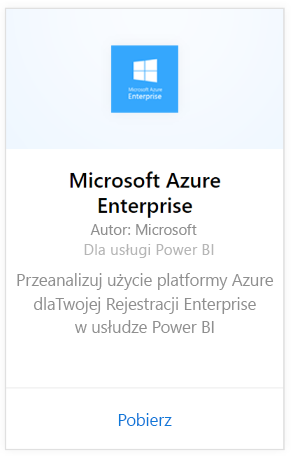
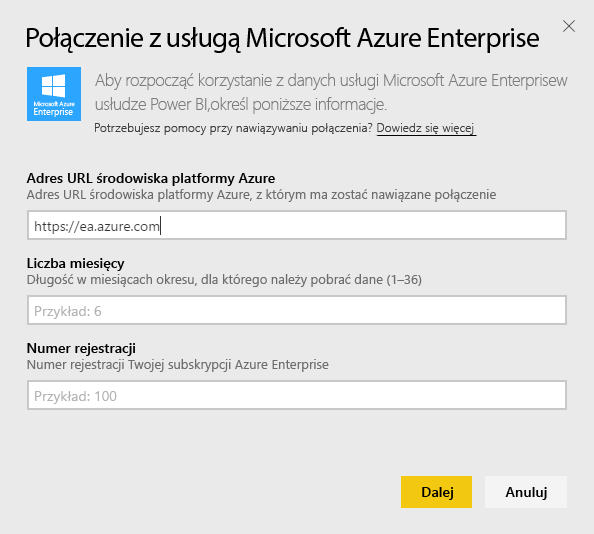
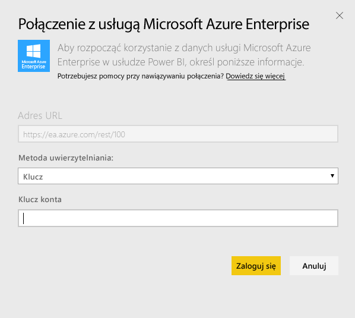
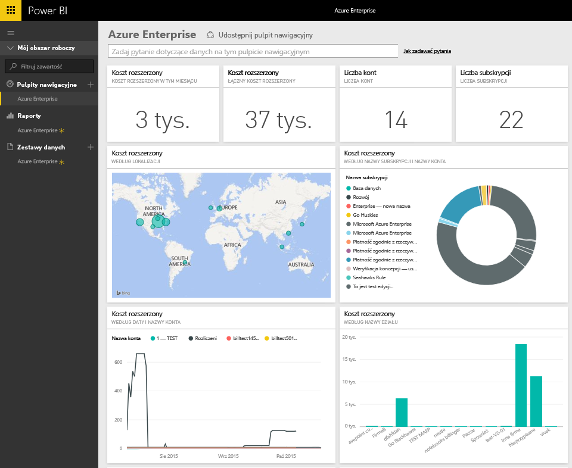
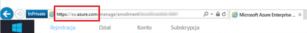
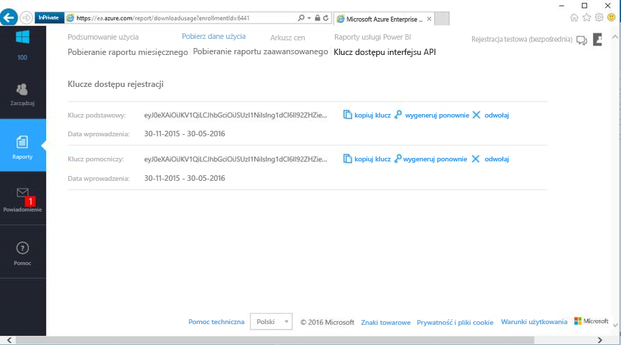

# Łączenie się z usługą Microsoft Azure Enterprise za pomocą usługi Power BI
Eksploruj i monitoruj dane aplikacji Microsoft Azure Enterprise w usłudze Power BI przy użyciu pakietu zawartości Power BI. Dane będą odświeżane automatycznie raz dziennie.

Połącz się z [pakietem zawartości Microsoft Azure Enterprise](https://app.powerbi.com/getdata/services/azure-enterprise) dla usługi Power BI.

## Jak nawiązać połączenie
1. Wybierz pozycję **Pobierz dane** w dolnej części okienka nawigacji po lewej stronie.
   
    
2. W polu **Usługi** wybierz pozycję **Pobierz**.
   
   
3. Wybierz pozycję **Microsoft Azure Enterprise** \> **Pobierz**.
   
   
4. Podaj adres URL środowiska platformy Azure, liczbę miesięcy, dla której chcesz zaimportować dane, oraz numer rejestracji w usłudze Azure Enterprise. Adres URL środowiska platformy Azure to `https://ea.azure.com` lub `https://ea.windowsazure.cn`. Poniżej znajdują się szczegółowe informacje dotyczące [wyszukiwania tych parametrów](#FindingParams).
   
    
5. Podaj klucz dostępu w celu nawiązania połączenia. Klucz rejestracji można znaleźć w witrynie Azure EA Portal.
   
    
6. Proces importowania rozpocznie się automatycznie. Po zakończeniu nowy pulpit nawigacyjny, raport i model zostaną wyświetlone w okienku nawigacji. Wybierz pulpit nawigacyjny, aby wyświetlić zaimportowane dane.
   
   

**Co teraz?**

* Spróbuj [zadać pytanie w polu funkcji Pytania i odpowiedzi](power-bi-q-and-a.md) w górnej części pulpitu nawigacyjnego
* [Zmień kafelki](service-dashboard-edit-tile.md) na pulpicie nawigacyjnym.
* [Wybierz kafelek](service-dashboard-tiles.md), aby otworzyć raport źródłowy.
* Zestaw danych zostanie ustawiony na codzienne odświeżanie, ale możesz zmienić harmonogram odświeżania lub spróbować odświeżyć go na żądanie przy użyciu opcji **Odśwież teraz**

## Zawartość pakietu
Pakiet zawartości Azure Enterprise obejmuje miesięczne dane raportowania dotyczące zakresu miesięcy, które są podawane podczas przepływu połączenia. Zakres to okno ruchome, więc uwzględnione daty będą aktualizowane podczas odświeżania zestawu danych.

## Wymagania systemowe
Pakiet zawartości wymaga dostępu do funkcji Enterprise w witrynie Azure Portal.

## Znajdowanie parametrów
Raportowanie w usłudze Power BI jest dostępne dla klientów pośrednich, partnerów i klientów bezpośrednich EA, którzy mają możliwość wyświetlania informacji dotyczących rozliczeń. Przeczytaj poniższe informacje dotyczące znajdowania wszystkich wartości wymaganych przez przepływ połączenia.

**Adres URL środowiska platformy Azure**

* Ta wartość to zwykle https://ea.azure.com, jednak możesz sprawdzić adres URL po zalogowaniu się w celu potwierdzenia.
  
    

**Liczba miesięcy**

* Musi to być wartość z zakresu od 1 do 36 reprezentująca liczbę miesięcy danych (od bieżącego dnia), które chcesz zaimportować.

**Numer rejestracji**

* Jest to numer rejestracji w usłudze Azure Enterprise, który można znaleźć na ekranie głównym witryny [Azure Enterprise Portal](https://ea.azure.com/) w obszarze „Szczegóły rejestracji”.
  
    

**Klucz dostępu**

* Klucz można znaleźć w witrynie Azure Enterprise Portal, w obszarze „Pobierz dane użycia” > „Klucz dostępu interfejsu API”
  
    

**Dodatkowa pomoc**

* Aby uzyskać dodatkową pomoc w konfigurowaniu pakietu Power BI w usłudze Azure Enterprise, zaloguj się w witrynie Azure Enterprise Portal w celu wyświetlenia pliku pomocy interfejsu API w obszarze „Pomoc” oraz dodatkowych instrukcji w obszarze Raporty > Pobierz dane użycia > Klucz dostępu interfejsu API.

## Następne kroki
[Wprowadzenie do usługi Power BI](service-get-started.md)

[Pobieranie danych w usłudze Power BI](service-get-data.md)

