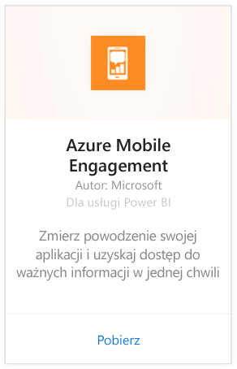
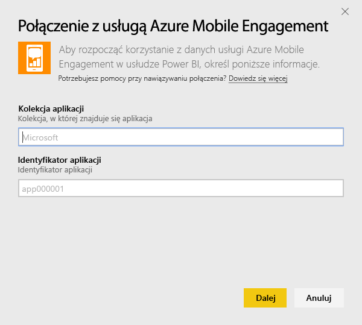
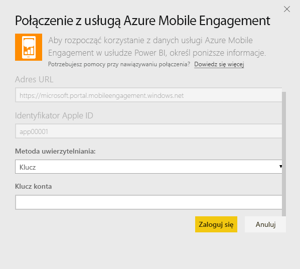
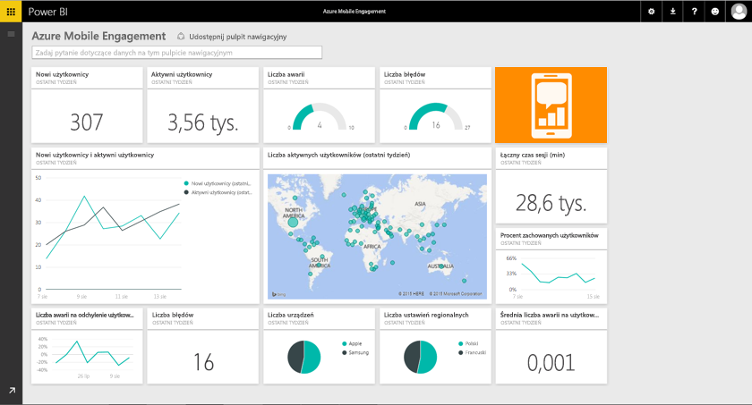

# Łączenie się z pakietem zawartości Azure Mobile Engagement przy użyciu usługi Power BI
Pakiet zawartości Azure Mobile Engagement dla usługi Power BI pozwala szybko uzyskać szczegółowe informacje dotyczące danych aplikacji.

Połącz się z [pakietem zawartości Azure Mobile Engagement](https://app.powerbi.com/groups/me/getdata/services/azme) dla usługi Power BI.

## Jak nawiązać połączenie
1. Wybierz pozycję **Pobierz dane** w dolnej części okienka nawigacji po lewej stronie.
   
    
2. W polu **Usługi** wybierz pozycję **Pobierz**.
   
    
3. Wybierz pozycję **Azure Mobile Engagement** \> **Pobierz**.
   
     
4. Określ kolekcję aplikacji i nazwę aplikacji. Informacje te można znaleźć w danych konta usługi Azure Mobile Engagement.
   
     
5. Podaj klucz jako metodę uwierzytelniania, a następnie kliknij przycisk Zaloguj.
   
    
6. Po zaimportowaniu danych przez usługę Power BI zobaczysz nowy pulpit nawigacyjny, raport i zestaw danych w okienku nawigacji po lewej stronie. Nowe elementy są oznaczone żółtą gwiazdką \*, która zniknie po wybraniu:
   
    

## Co teraz?

* Spróbuj [zadać pytanie w polu funkcji Pytania i odpowiedzi](consumer/end-user-q-and-a.md) w górnej części pulpitu nawigacyjnego
* [Zmień kafelki](service-dashboard-edit-tile.md) na pulpicie nawigacyjnym.
* [Wybierz kafelek](consumer/end-user-tiles.md), aby otworzyć raport źródłowy.
* Dla zestawu danych jest zaplanowane codzienne odświeżanie, ale możesz zmienić harmonogram odświeżania lub odświeżyć go na żądanie przy użyciu polecenia **Odśwież teraz**

## Następne kroki
[Wprowadzenie do usługi Power BI](service-get-started.md)

[Pobieranie danych w usłudze Power BI](service-get-data.md)

