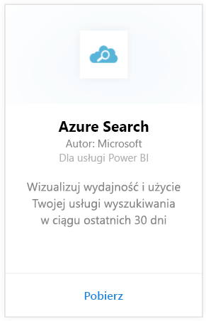
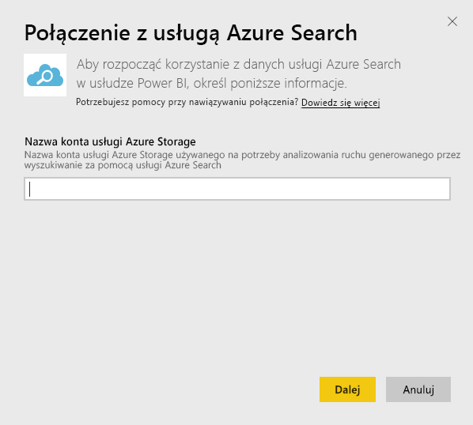
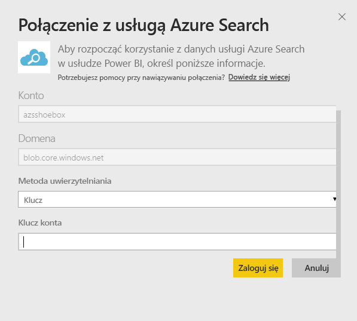
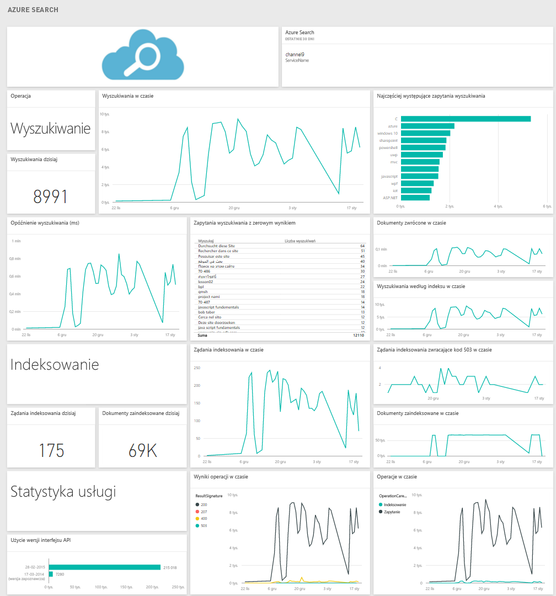

# Łączenie się z usługą Azure Search za pomocą usługi Power BI
Usługa Azure Search Traffic Analytics pozwala na monitorowanie i zrozumienie ruchu w usłudze Azure Search. Pakiet zawartości Azure Search dla usługi Power BI dostarcza szczegółowe informacje na temat danych wyszukiwania, w tym wyszukiwania, indeksowania, statystyk usługi i opóźnienia w ciągu ostatnich 30 dni. Więcej szczegółów można znaleźć we [wpisie na blogu dotyczącym platformy Azure](https://azure.microsoft.com/en-us/blog/analyzing-your-azure-search-traffic/).

Połącz się z [pakietem zawartości Azure Search](https://app.powerbi.com/getdata/services/azure-search) dla usługi Power BI.

## Jak nawiązać połączenie
1. Wybierz pozycję **Pobierz dane** w dolnej części okienka nawigacji po lewej stronie.
   
    
2. W polu **Usługi** wybierz pozycję **Pobierz**.
   
    
3. Wybierz pozycję **Azure Search** \> **Pobierz**.
   
   
4. Podaj nazwę konta magazynu tabeli, na którym jest przechowywana analiza usługi Azure Search.
   
   
5. Jako mechanizm uwierzytelniania wybierz **Klucz** i podaj swój klucz konta magazynu. Kliknij przycisk **Zaloguj** i rozpocznij proces ładowania.
   
   
6. Po zakończeniu ładowania nowy pulpit nawigacyjny, raport i model zostanie wyświetlony w okienku nawigacji. Wybierz pulpit nawigacyjny, aby wyświetlić zaimportowane dane.
   
    

**Co teraz?**

* Spróbuj [zadać pytanie w polu funkcji Pytania i odpowiedzi](power-bi-q-and-a.md) w górnej części pulpitu nawigacyjnego
* [Zmień kafelki](service-dashboard-edit-tile.md) na pulpicie nawigacyjnym.
* [Wybierz kafelek](service-dashboard-tiles.md), aby otworzyć raport źródłowy.
* Zestaw danych zostanie ustawiony na codzienne odświeżanie, ale możesz zmienić harmonogram odświeżania lub spróbować odświeżyć go na żądanie przy użyciu opcji **Odśwież teraz**

## Wymagania systemowe
Pakiet zawartości Azure Search wymaga, aby usługa Azure Search Traffic Analytics była włączona na koncie.

## Rozwiązywanie problemów
Upewnij się, że nazwa konta magazynu została poprawnie wprowadzona razem z kluczem pełnego dostępu. Nazwa konta magazynu powinna zgadzać się z kontem skonfigurowanym w usłudze Azure Search Traffic Analytics.

## Następne kroki
[Wprowadzenie do usługi Power BI](service-get-started.md)

[Power BI — podstawowe pojęcia](service-basic-concepts.md)

