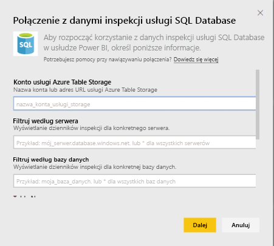
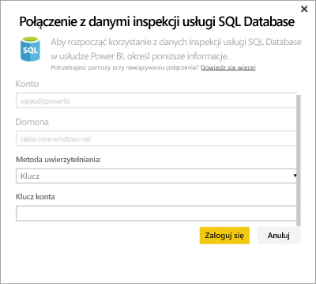
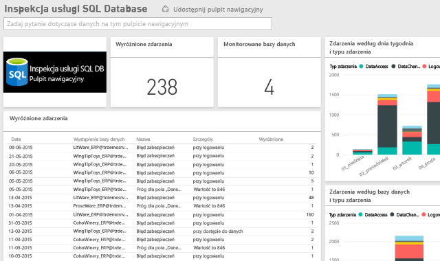

# Pakiet zawartości Inspekcja bazy danych SQL dla usługi Power BI
Pakiet zawartości usługi Power BI dla platformy Azure [Inspekcja bazy danych SQL](http://azure.microsoft.com/documentation/articles/sql-database-auditing-get-started/) umożliwia zrozumienie aktywności bazy danych oraz uzyskanie informacji dotyczących rozbieżności i anomalii, które mogą wskazywać na problemy biznesowe lub potencjalne naruszenia zabezpieczeń. 

Nawiąż połączenie z [pakietem zawartości Inspekcja bazy danych SQL](https://app.powerbi.com/getdata/services/sql-db-auditing) dla usługi Power BI.

>[!NOTE]
>Pakiet zawartości importuje dane ze wszystkich tabel, które zawierają frazę „AuditLogs” w swojej nazwie, a następnie dołącza je do jednej tabeli modelu danych o nazwie „AuditLogs”. Ostatnie 250 000 zdarzeń zostanie dołączonych, a dane będą odświeżane codziennie.

## Jak nawiązać połączenie
1. Wybierz pozycję **Pobierz dane** w dolnej części okienka nawigacji po lewej stronie.
   
    
2. W polu Usługi wybierz polecenie Pobierz.
   
    
3. Wybierz pozycję **Inspekcja bazy danych SQL** \> **Pobierz**.
   
   
4. W oknie nawiązywania połączenia z inspekcją bazy danych SQL:
   
   - Wprowadź nazwę konta usługi Azure Table Storage lub adres URL do miejsca, w którym przechowywane są dzienniki.
   
   - Wprowadź nazwę odpowiedniego serwera SQL. Wprowadź „\*”, aby załadować dzienniki inspekcji dla wszystkich serwerów.
   
   - Wprowadź nazwę odpowiedniej bazy danych SQL. Wprowadź „\*”, aby załadować dzienniki inspekcji dla wszystkich baz danych.
   
   - Wprowadź nazwę tabeli platformy Azure, która zawiera odpowiednie dzienniki. Wprowadź „\*”, aby załadować dzienniki inspekcji ze wszystkich tabel zawierających frazę „AuditLogs” w nazwie.
   
   >[!IMPORTANT]
   >Ze względu na wydajność zaleca się, aby zawsze określać jawną nazwę tabeli, nawet jeśli wszystkie dzienniki inspekcji są przechowywane w jednej tabeli.
   
   - Wprowadź datę rozpoczęcia dla odpowiednich dzienników inspekcji. Wprowadź „\*”, aby załadować dzienniki inspekcji bez dolnego limitu czasu lub „1d”, aby załadować dzienniki inspekcji z ostatniego dnia.
   
   - Wprowadź datę zakończenia dla odpowiednich dzienników inspekcji. Wprowadź „\*”, aby załadować dzienniki inspekcji bez górnego limitu czasu.
   
   
5. Jako metodę uwierzytelniania wybierz **Klucz**, wprowadź swój **Klucz konta** \> **Zaloguj się**.
   
   
6. Po zaimportowaniu danych przez usługę Power BI zobaczysz nowy pulpit nawigacyjny, raport i zestaw danych w okienku nawigacji po lewej stronie. Nowe elementy są oznaczone żółtą gwiazdką \*.
   
   

**Co teraz?**

* Spróbuj [zadać pytanie w polu funkcji Pytania i odpowiedzi](consumer/end-user-q-and-a.md) w górnej części pulpitu nawigacyjnego
* [Zmień kafelki](service-dashboard-edit-tile.md) na pulpicie nawigacyjnym.
* [Wybierz kafelek](consumer/end-user-tiles.md), aby otworzyć raport źródłowy.
* Dla zestawu danych jest zaplanowane codzienne odświeżanie, ale możesz zmienić harmonogram odświeżania lub odświeżyć go na żądanie przy użyciu polecenia **Odśwież teraz**

## Następne kroki
[Pobieranie danych dla usługi Power BI](service-get-data.md)
[Co to jest usługa Power BI?](power-bi-overview.md)
