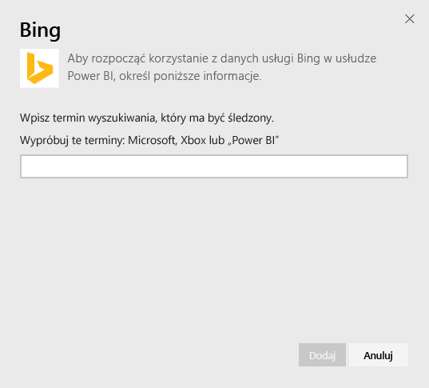
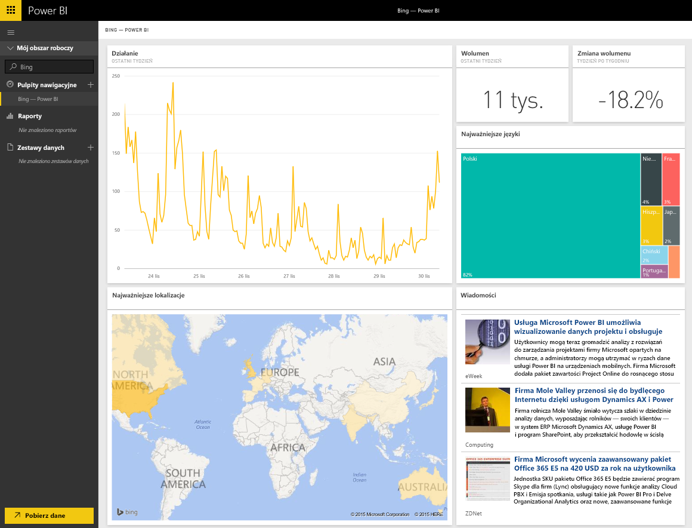

# Łączenie się z pakietem zawartości Bing za pomocą usługi Power BI
Pakiet zawartości Bing pozwala na przeglądanie analiz aktywności związanych z wyszukiwaniem danego terminu w Internecie.

Połącz się z [pakietem zawartości Bing](https://app.powerbi.com/groups/me/getdata/services/bing) dla usługi Power BI.

>[!NOTE]
>Kafelki usługi Bing są automatycznie aktualizowane mniej więcej co 5 minut, a jedynym kafelkiem, który można wybrać, jest kafelek Wiadomości umożliwiający przejście do odpowiedniego artykułu z wiadomościami. 

>[!NOTE]
>Kafelki z pakietu zawartości Bing nie są renderowane w aplikacjach mobilnych. Trwają prace nad rozwiązaniem tego problemu.

1. Wybierz pozycję **Pobierz dane** w dolnej części okienka nawigacji po lewej stronie.
   
    
2. W polu **Usługi** wybierz pozycję **Pobierz**.
   
    
3. Wybierz pozycję **Bing** > **Pobierz**.
   
    
4. W oknie dialogowym parametrów wprowadź termin wyszukiwania, który chcesz śledzić, a następnie kliknij przycisk Dodaj.
   
        
5. Po lewej stronie zostanie wyświetlona nowa pozycja na liście pulpitów nawigacyjnych o nazwie Bing oraz podany termin wyszukiwania. Warto pamiętać, że nie istnieje zestaw danych ani raport skojarzony z tym pulpitem nawigacyjnym. Ładowanie kafelków może zająć trochę czasu, ale po zakończeniu zostanie wyświetlony układ podobny do poniższego.
   
    

Po zakończeniu ładowania można rozpocząć przeglądanie danych, w tym przypinanie kafelków z tego pulpitu nawigacyjnego do innych pulpitów nawigacyjnych na koncie.

