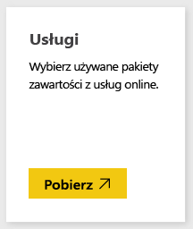
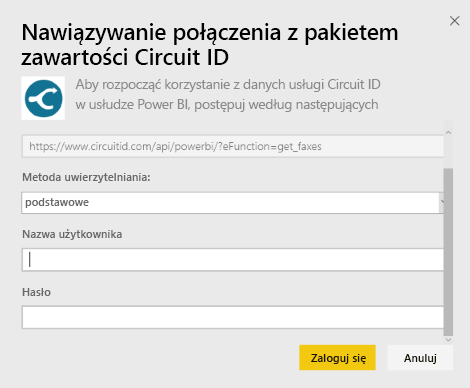
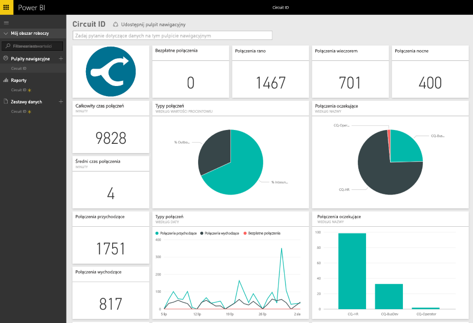

# Łączenie się z pakietem zawartości Circuit ID przy użyciu usługi Power BI
Analizowanie danych komunikacyjnych z usługi Circuit ID jest bardzo proste dzięki wykorzystaniu usługi Power BI. Usługa Power BI pobiera dane, a następnie tworzy domyślny pulpit nawigacyjny i powiązane raporty w oparciu o te dane. Po utworzeniu połączenia można eksplorować dane i dostosowywać pulpit nawigacyjny do własnych potrzeb. Dane są automatycznie odświeżane codziennie.

Połącz się z [pakietem zawartości Circuit ID](https://app.powerbi.com/getdata/services/circuitid) dla usługi Power BI.

## Jak nawiązać połączenie
1. Wybierz pozycję **Pobierz dane** w dolnej części okienka nawigacji po lewej stronie.
   
    
2. W polu **Usługi** wybierz pozycję **Pobierz**.
   
    
3. Wybierz pozycję **Circuit ID** \> **Pobierz**.
   
    
4. Jako metodę uwierzytelniania wybierz opcję Podstawowa oraz podaj nazwę użytkownika i hasło. Następnie naciśnij przycisk Zaloguj.
   
    
5. Po zaimportowaniu danych przez usługę Power BI zobaczysz nowy pulpit nawigacyjny, raport i zestaw danych w okienku nawigacji po lewej stronie. Nowe elementy są oznaczone żółtą gwiazdką.
   
    

**Co teraz?**

* Spróbuj [zadać pytanie w polu funkcji Pytania i odpowiedzi](power-bi-q-and-a.md) w górnej części pulpitu nawigacyjnego
* [Zmień kafelki](service-dashboard-edit-tile.md) na pulpicie nawigacyjnym.
* [Wybierz kafelek](service-dashboard-tiles.md), aby otworzyć raport źródłowy.
* Zestaw danych zostanie ustawiony na codzienne odświeżanie, ale możesz zmienić harmonogram odświeżania lub spróbować odświeżyć go na żądanie przy użyciu opcji **Odśwież teraz**

## Następne kroki
[Wprowadzenie do usługi Power BI](service-get-started.md)

[Pobieranie danych dla usługi Power BI](service-get-data.md)

