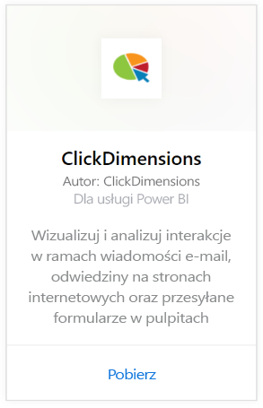
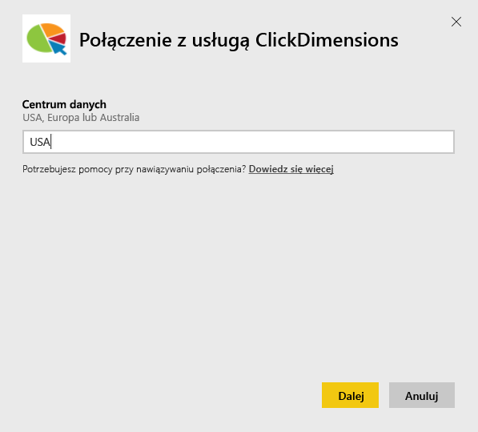
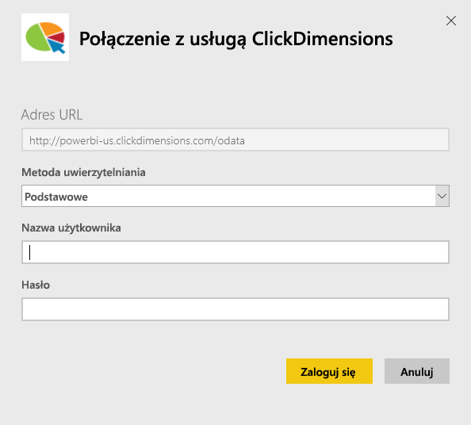
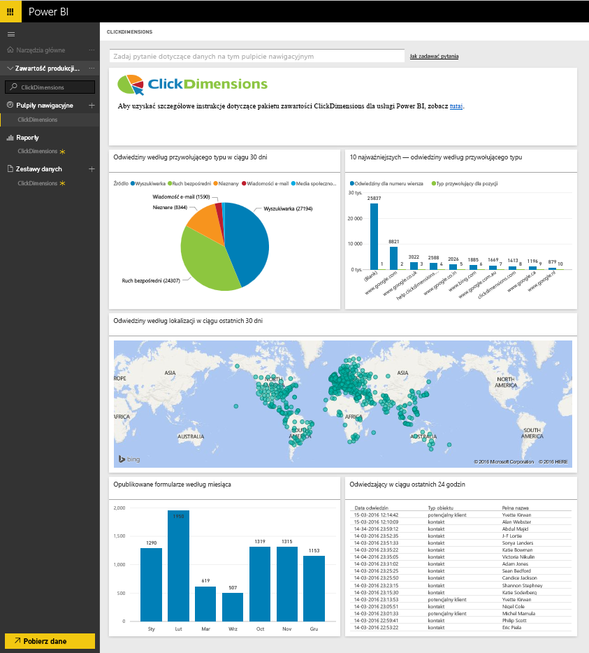
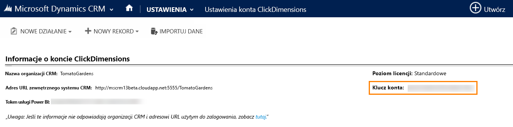
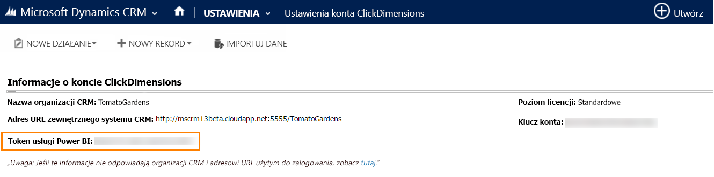

# Łączenie się z pakietem zawartości ClickDimensions za pomocą usługi Power BI
Pakiet zawartości ClickDimensions dla usługi Power BI pozwala użytkownikom wykorzystywać dane marketingowe usługi ClickDimensions w usłudze Power BI, oferując zespołom zarządzającym możliwość lepszej oceny efektów podejmowanych wysiłków sprzedażowych i marketingowych. Wizualizuj i analizuj interakcje w ramach wiadomości e-mail, odwiedziny na stronach internetowych oraz odsyłane formularze w raportach i pulpitach nawigacyjnych usługi Power BI.

Połącz się z [pakietem zawartości ClickDimensions](https://app.powerbi.com/getdata/services/click-dimensions) dla usługi Power BI.

## Jak nawiązać połączenie
1. Wybierz pozycję **Pobierz dane** w dolnej części okienka nawigacji po lewej stronie.
   
   
2. W polu **Usługi** wybierz pozycję **Pobierz**.
   
   
3. Wybierz pozycję **ClickDimensions** \>  **Pobierz**.
   
   
4. Podaj lokalizację centrum danych (USA, Europa lub Australia) i wybierz przycisk **Dalej**.
   
   
5. W polu **Metoda uwierzytelniania** wybierz opcję **Podstawowa** \> **Zaloguj**. Po wyświetleniu monitu wprowadź poświadczenia usługi ClickDimensions. Poniżej znajdują się szczegółowe informacje dotyczące [wyszukiwania tych parametrów](#FindingParams)
   
    
6. Po zatwierdzeniu proces importowania rozpocznie się automatycznie. Po zakończeniu nowy pulpit nawigacyjny, raport i model zostaną wyświetlone w okienku nawigacji. Wybierz pulpit nawigacyjny, aby wyświetlić zaimportowane dane.
   
     

**Co teraz?**

* Spróbuj [zadać pytanie w polu funkcji Pytania i odpowiedzi](consumer/end-user-q-and-a.md) w górnej części pulpitu nawigacyjnego
* [Zmień kafelki](service-dashboard-edit-tile.md) na pulpicie nawigacyjnym.
* [Wybierz kafelek](consumer/end-user-tiles.md), aby otworzyć raport źródłowy.
* Dla zestawu danych jest zaplanowane codzienne odświeżanie, ale możesz zmienić harmonogram odświeżania lub odświeżyć go na żądanie przy użyciu polecenia **Odśwież teraz**

## Wymagania systemowe
Aby nawiązać połączenie z pakietem zawartości usługi Power BI, należy podać informacje dotyczące odpowiadającego kontu centrum danych oraz zalogować się przy użyciu konta usługi ClickDimensions. Jeśli nie wiesz, jakie centrum danych masz podać, skonsultuj to z administratorem.

## Znajdowanie parametrów
Klucz konta można znaleźć w pozycji Ustawienia CRM \> Ustawienia usługi ClickDimensions. Skopiuj klucz konta z pozycji Ustawienia usługi ClickDimensions i wklej go w polu Nazwa użytkownika.  

  

Skopiuj token usługi Power BI z pozycji Ustawienia usługi ClickDimensions i wklej go w polu Hasło. Token usługi Power BI można znaleźć w pozycji Ustawienia CRM \> Ustawienia usługi ClickDimensions.  

  

## Następne kroki
[Wprowadzenie do usługi Power BI](service-get-started.md)

[Pobieranie danych w usłudze Power BI](service-get-data.md)

