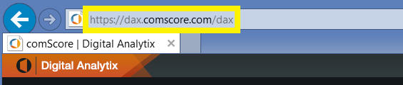

# Łączenie się z pakietem zawartości comScore Digital Analytix przy użyciu usługi Power BI
Za pomocą pakietu zawartości dla usługi Power BI możesz wizualizować i eksplorować dane usługi comScore Digital Analytix. Dane będą odświeżane automatycznie raz dziennie.

Połącz się z [pakietem zawartości comScore dla usługi Power BI.](https://app.powerbi.com/getdata/services/comscore)

>[!NOTE]
>Aby nawiązać połączenie z pakietem zawartości, potrzebne jest konto użytkownika usługi comScore DAx oraz dostęp do interfejsu API comScore. [Szczegółowe informacje](#Requirements) można znaleźć poniżej.

## Jak nawiązać połączenie
1. Wybierz pozycję Pobierz dane w dolnej części okienka nawigacji po lewej stronie.
   
   
2. W polu **Usługi** wybierz pozycję **Pobierz**.
   
   
3. Wybierz pozycję **comScore Digital Analytix** \> **Pobierz**.
   
   
4. Wprowadź centrum danych, identyfikator klienta comScore oraz witrynę, z którą chcesz nawiązać połączenie. Zobacz [Znajdowanie parametrów usługi comScore](#FindingParams) poniżej, aby uzyskać więcej informacji na temat znajdowania tych wartości.
   
   
5. Podaj nazwę użytkownika comScore i hasło, aby nawiązać połączenie. Poniżej znajdują się szczegółowe informacje dotyczące uzyskiwania tej wartości.
   
   
6. Proces importowania rozpocznie się automatycznie. Po zakończeniu nowy pulpit nawigacyjny, raport i model zostaną wyświetlone w okienku nawigacji. Wybierz pulpit nawigacyjny, aby wyświetlić zaimportowane dane.

**Co teraz?**

* Spróbuj [zadać pytanie w polu funkcji Pytania i odpowiedzi](power-bi-q-and-a.md) w górnej części pulpitu nawigacyjnego
* [Zmień kafelki](service-dashboard-edit-tile.md) na pulpicie nawigacyjnym.
* [Wybierz kafelek](service-dashboard-tiles.md), aby otworzyć raport źródłowy.
* Zestaw danych zostanie ustawiony na codzienne odświeżanie, ale możesz zmienić harmonogram odświeżania lub spróbować odświeżyć go na żądanie przy użyciu opcji **Odśwież teraz**

## Wymagania systemowe
Aby nawiązać połączenie, wymagane jest konto użytkownika usługi comScore DAx i dostęp do interfejsu API comScore DAx. Skontaktuj się z administratorem usługi comScore DAx, aby potwierdzić swoje konto.

## Znajdowanie parametrów
Poniżej zamieszczono więcej informacji o tym, jak znaleźć poszczególne parametry usługi comScore.

**Centrum danych**

Centrum danych, z którym nawiązywane jest połączenie, zależy od używanego adresu URL usługi comScore.

Jeśli używasz adresu https://dax.comscore.com, wprowadź wartość „US”. Jeśli używasz adresu https://dax.comscore.eu, wprowadź wartość „EU”.

 

**Klient**

Klient jest tym samym parametrem, który podajesz podczas logowania się do usługi comScore DAx.

 

**Witryna**

Witryna comScore określa witrynę, której dane chcesz wyświetlić. Listę witryn można znaleźć z poziomu konta usługi comScore.

## Następne kroki
[Wprowadzenie do usługi Power BI](service-get-started.md)

[Pobieranie danych w usłudze Power BI](service-get-data.md)

