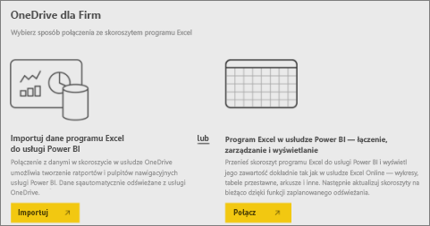

# Łączenie się z plikami przechowywanymi w usłudze OneDrive dla obszaru roboczego aplikacji Power BI
Po [utworzeniu obszaru roboczego aplikacji w usłudze Power BI](consumer/end-user-create-apps.md) można przechowywać pliki programu Excel, pliki CSV oraz pliki programu Power BI Desktop w usłudze OneDrive dla Firm dla obszaru roboczego aplikacji Power BI. Nadal można aktualizować pliki przechowywane w usłudze OneDrive, a te aktualizacje są automatycznie odzwierciedlane w raportach i pulpitach nawigacyjnych usługi Power BI na podstawie plików. 

> [!NOTE]
> Wersja zapoznawcza nowego środowiska obszarów roboczych zmieni relację między obszarami roboczymi usługi Power BI a grupami usługi Office 365. Nie będziesz automatycznie tworzyć grupy usługi Office 365 przy każdym tworzeniu jednego z nowych obszarów roboczych. Przeczytaj o [tworzeniu nowych obszarów roboczych (wersja zapoznawcza)](service-create-the-new-workspaces.md)

Dodawanie plików do obszaru roboczego aplikacji jest procesem dwuetapowym: 

1. Najpierw [przekaż pliki do usługi OneDrive dla Firm](service-connect-to-files-in-app-workspace-onedrive-for-business.md#1-upload-files-to-the-onedrive-for-business-for-your-app-workspace) dla obszaru roboczego aplikacji.
2. Następnie [połącz się z tymi plikami w usłudze Power BI](service-connect-to-files-in-app-workspace-onedrive-for-business.md#2-import-excel-files-as-datasets-or-as-excel-online-workbooks).

> [!NOTE]
> Obszary robocze aplikacji są dostępne tylko w usłudze [Power BI Pro](service-features-license-type.md).
> 
> 

## 1 Przekaż pliki do usługi OneDrive dla Firm dla obszaru roboczego aplikacji
1. W usłudze Power BI wybierz strzałkę obok pozycji Obszary robocze > wybierz wielokropek (**...**) obok nazwy swojego obszaru roboczego. 
   
   
2. Wybierz pozycję **Pliki**, aby otworzyć usługę OneDrive dla Firm dla obszaru roboczego aplikacji w usłudze Office 365.
   
   > [!NOTE]
   > Jeśli pozycja **Pliki** nie jest widoczna w menu obszaru roboczego aplikacji, wybierz pozycję **Elementy członkowskie**, aby otworzyć usługę OneDrive dla Firm dla obszaru roboczego aplikacji. W tym miejscu wybierz pozycję **Pliki**. Usługa Office 365 skonfiguruje lokalizację magazynu usługi OneDrive dla plików obszaru roboczego grupy aplikacji. Ten proces może trochę potrwać. 
   > 
   > 
3. W tym miejscu możesz przekazać pliki do usługi OneDrive dla Firm dla obszaru roboczego aplikacji. Wybierz pozycję **Przekaż** i przejdź do plików.
   
   

## 2 Zaimportuj pliki programu Excel jako zestawy danych lub skoroszyty usługi Excel Online
Teraz, gdy pliki znajdują się w usłudze OneDrive dla Firm dla obszaru roboczego aplikacji, możesz dokonać wyboru. Dostępne możliwości: 

* [Zaimportuj dane ze skoroszytu programu Excel jako zestaw danych](service-get-data-from-files.md) i użyj tych danych do tworzenia raportów i pulpitów nawigacyjnych, które można wyświetlić w przeglądarce internetowej oraz na urządzeniach przenośnych.
* Możesz również [połączyć się z całym skoroszytem programu Excel w usłudze Power BI](service-excel-workbook-files.md) i wyświetlić go dokładnie tak, jak jest wyświetlany w usłudze Excel Online.

### Importowanie plików z obszaru roboczego aplikacji lub łączenie się z nimi
1. W usłudze Power BI przejdź do obszaru roboczego aplikacji, aby nazwa obszaru roboczego aplikacji znajdowała się w lewym górnym rogu. 
2. Wybierz pozycję **Pobierz dane** w dolnej części okienka nawigacji po lewej stronie. 
   
   
3. W polu **Pliki** wybierz opcję **Pobierz**.
   
   
4. Wybierz opcję **OneDrive** - *nazwa_Twojego_obszaru_roboczego_aplikacji*.
   
    
5. Wybierz odpowiedni plik, a następnie wybierz pozycję **Połącz**.
   
    Na tym etapie należy podjąć decyzję, czy chcesz [zaimportować dane ze skoroszytu programu Excel](service-get-data-from-files.md), czy [połączyć się z całym skoroszytem programu Excel](service-excel-workbook-files.md).
6. Wybierz opcję **Importuj** lub **Połącz**.
   
    
7. Jeśli zostanie wybrana opcja **Importuj**, skoroszyt zostanie wyświetlony na karcie **Zestawy danych**. 
   
    
   
    W przypadku wybrania opcji **Połącz** skoroszyt będzie dostępny na karcie **Skoroszyty**.
   
    

## Następne kroki
* [Tworzenie aplikacji i obszarów roboczych aplikacji w usłudze Power BI](consumer/end-user-create-apps.md)
* [Importowanie danych ze skoroszytów programu Excel](service-get-data-from-files.md)
* [Łączenie z całymi skoroszytami programu Excel](service-excel-workbook-files.md)
* Masz więcej pytań? [Odwiedź społeczność usługi Power BI](http://community.powerbi.com/)
* Chcesz przesłać opinię? Odwiedź witrynę [Power BI Ideas (Pomysły na ulepszenie usługi Power BI)](https://ideas.powerbi.com/forums/265200-power-bi)

