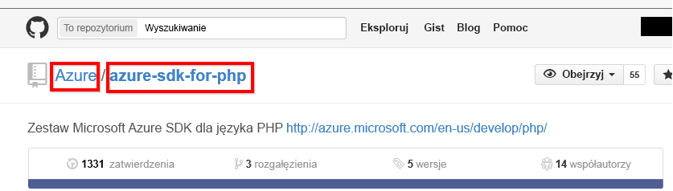

# Łączenie z usługą GitHub przy użyciu usługi Power BI
Pakiet zawartości usługi GitHub dla usługi Power BI pozwala uzyskać wgląd w dane dotyczące problemów, zmian zawartości, żądań ściągnięcia i aktywnych użytkowników w repozytorium GitHub.

Połącz się z [pakietem zawartości usługi GitHub](https://app.powerbi.com/getdata/services/github) lub dowiedz się więcej na temat [integracji usługi GitHub](https://powerbi.microsoft.com/integrations/github) z usługą Power BI.

>[!NOTE]
>Pakiet zawartości wymaga, aby konto usługi GitHub miało dostęp do repozytorium. Więcej szczegółowych informacji na temat wymagań znajduje się poniżej.

## Jak nawiązać połączenie
1. Wybierz pozycję **Pobierz dane** w dolnej części okienka nawigacji po lewej stronie.
   
    
2. W polu **Usługi** wybierz pozycję **Pobierz**.
   
    
3. Wybierz pozycję **GitHub** \> **Pobierz**.
   
   
4. Podaj nazwę i właściciela repozytorium. Poniżej znajdują się szczegółowe informacje dotyczące [wyszukiwania tych parametrów](#FindingParams).
   
   
5. Wprowadź swoje poświadczenia usługi GitHub (można pominąć ten krok, jeśli już zalogowano się w przeglądarce). 
6. Jako **metodę uwierzytelniania** wybierz opcję **oAuth2** \> **Zaloguj**. 
7. Postępuj zgodnie z instrukcjami dotyczącymi uwierzytelniania w usłudze Github. Przyznaj pakietowi zawartości usługi GitHub dla usługi Power BI dostęp do danych GitHub.
   
   
   
   Umożliwia to połączenie usług Power BI i GitHub oraz pozwala usłudze Power BI połączyć się z danymi.  Dane są odświeżane raz dziennie.
8. Po nawiązaniu połączenia z repozytorium usługa Power BI zaimportuje dane. W okienku nawigacji po lewej stronie zobaczysz nowy [pulpit nawigacyjny usługi GitHub](https://powerbi.microsoft.com/integrations/github), raport i zestaw danych. Nowe elementy są oznaczone żółtą gwiazdką \*.
   
   

**Co teraz?**

* Spróbuj [zadać pytanie w polu funkcji Pytania i odpowiedzi](power-bi-q-and-a.md) w górnej części pulpitu nawigacyjnego
* [Zmień kafelki](service-dashboard-edit-tile.md) na pulpicie nawigacyjnym.
* [Wybierz kafelek](service-dashboard-tiles.md), aby otworzyć raport źródłowy.
* Zestaw danych zostanie ustawiony na codzienne odświeżanie, ale możesz zmienić harmonogram odświeżania lub spróbować odświeżyć go na żądanie przy użyciu opcji **Odśwież teraz**

## Zawartość pakietu
W usłudze GitHub w Power BI są dostępne następujące dane:     

| Nazwa tabeli | Opis |
| --- | --- |
| Contributions (Zmiany zawartości) |Tabela Contributions zawiera informacje o wszystkich dodaniach, usunięciach i zatwierdzeniach dokonanych przez współautora, pogrupowane według tygodni. Dostępne informacje obejmują 100 współautorów wprowadzających najwięcej zmian. |
| Issues (Problemy) |Zawiera listę wszystkich problemów w wybranym repozytorium, a także wartości obliczeniowe, takie jak całkowity i średni czas wymagany do zamknięcia problemu, łączna liczba otwartych problemów oraz łączna liczba zamkniętych problemów. Jeśli w repozytorium nie ma żadnych problemów, ta tabela jest pusta. |
| Pull requests (Żądania ściągnięcia) |Ta tabela zawiera wszystkie żądania ściągnięcia w repozytorium oraz informacje dotyczące osób, które je zainicjowały. Zawiera ona także wartości obliczeniowe obejmujące liczbę otwartych, zamkniętych i wszystkich żądań ściągnięcia, łączny czas trwania żądań ściągnięcia i średni czas trwania żądania ściągnięcia. Jeśli w repozytorium nie ma żadnych problemów, ta tabela jest pusta. |
| Users (Użytkownicy) |Ta tabela zawiera listę użytkowników lub współautorów usługi GitHub, którzy zmienili zawartość, zgłosili problemy lub rozwiązali żądania ściągnięcia w wybranym repozytorium. |
| Milestones (Punkty kontrolne) |Zawiera wszystkie punkty kontrolne w wybranym repozytorium. |
| DateTable |Ta tabela zawiera daty z ostatnich lat, które pozwalają analizować dane usługi GitHub według dat. |
| ContributionPunchCard |Ta tabela może służyć jako karta punktowa utworzonej zawartości w wybranym repozytorium. Zawiera ona zatwierdzenia pogrupowane według dni tygodnia i godzin. Nie jest połączona z innymi tabelami w modelu. |
| RepoDetails |Ta tabela zawiera szczegółowe informacje dotyczące wybranego repozytorium. |

## Wymagania systemowe
* Konto usługi GitHub, które ma dostęp do repozytorium.  
* Przyznanie uprawnienia aplikacji usługi Power BI do usługi GitHub podczas pierwszego logowania. Szczegółowe informacje o odwoływaniu dostępu można znaleźć poniżej.  
* Wystarczająca liczba dostępnych wywołań interfejsu API, umożliwiających ściąganie i odświeżanie danych.  

### Cofanie autoryzacji usługi Power BI
Aby cofnąć autoryzację usługi Power BI i odłączyć ją od repozytorium GitHub, można odwołać dostęp w usłudze GitHub. Więcej informacji można znaleźć w tym temacie dotyczącym [pomocy usługi GitHub](https://help.github.com/articles/keeping-your-ssh-keys-and-application-access-tokens-safe/#reviewing-your-authorized-applications-oauth).

## Znajdowanie parametrów
Właściciela i nazwę repozytorium można ustalić, patrząc na repozytorium w usłudze GitHub:

Pierwsza część — „Azure” — oznacza właściciela, a druga — „azure-sdk-for-php” — oznacza samo repozytorium.  Te dwa elementy są widoczne w adresie URL repozytorium:

    <https://github.com/Azure/azure-sdk-for-php> .

## Rozwiązywanie problemów
W razie potrzeby możesz zweryfikować swoje poświadczenia usługi GitHub.  

1. W innym oknie przeglądarki przejdź do witryny internetowej usługi GitHub i zaloguj się do usługi GitHub. W prawym górnym rogu witryny GitHub widać, że udało się zalogować.    
2. W witrynie GitHub przejdź do adresu URL repozytorium, które ma być dostępne w usłudze Power BI, na przykład: https://github.com/dotnet/corefx.  
3. Wróć do usługi Power BI i spróbuj połączyć się z usługą GitHub. W oknie dialogowym Konfigurowanie usługi GitHub wpisz nazwę i właściciela repozytorium.  

## Następne kroki
* [Wprowadzenie do usługi Power BI](service-get-started.md)
* [Pobieranie danych](service-get-data.md)

