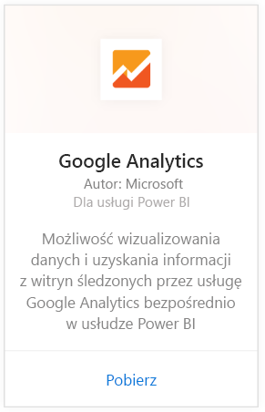
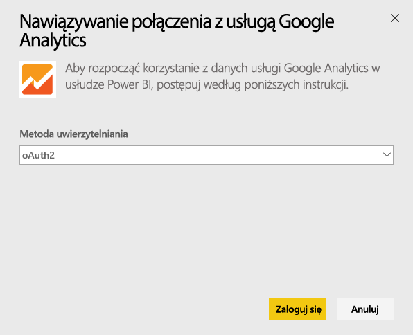
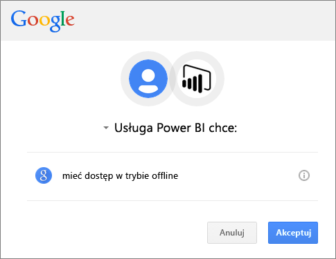
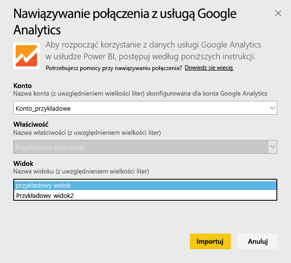
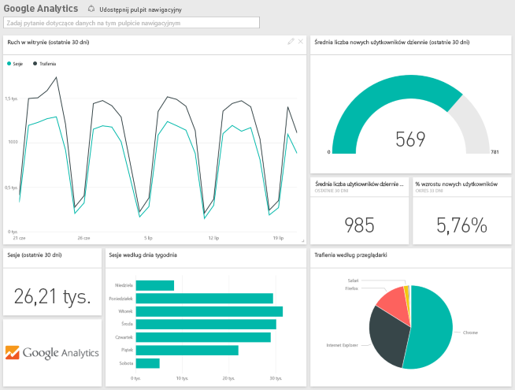
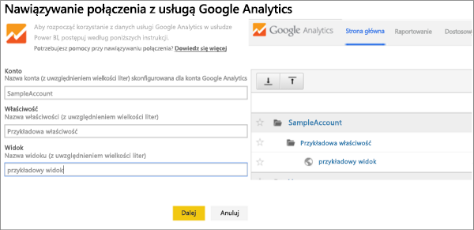

# Nawiązywanie połączenia z usługą Google Analytics za pomocą usługi Power BI
Nawiązywanie połączenia z usługą Google Analytics za pośrednictwem usługi Power BI należy zacząć od połączenia się ze swoim kontem usługi Google Analytics. Zostanie wyświetlony pulpit nawigacyjny usługi Power BI oraz zestaw raportów zawierających informacje o ruchu w witrynie oraz wymiarach użytkownika. Możesz korzystać z pulpitu nawigacyjnego i raportów, ale nie możesz zapisywać zmian. Dane będą odświeżane automatycznie raz dziennie.

Połącz się z usługą [Google Analytics](https://app.powerbi.com/getdata/services/google-analytics) dla usługi Power BI. Dowiedz się więcej na temat [integracji usługi Google Analytics](https://powerbi.microsoft.com/integrations/google-analytics) z usługą Power BI.

Zacznij od [łącznika usługi Google Analytics](service-google-analytics-connector.md) w programie Power BI Desktop, aby tworzyć niestandardowe pulpity nawigacyjne i raporty. Po prostu połącz się ze swoim kontem usługi Google Analytics i twórz niestandardowe raporty, które możesz opublikować w usłudze Power BI.

## Jak nawiązać połączenie
[!INCLUDE [powerbi-service-apps-get-more-apps](./includes/powerbi-service-apps-get-more-apps.md)]

1. Wybierz pozycję **Google Analytics** \> **Pobierz**.
   
   
2. Po wyświetleniu monitu wprowadź poświadczenia usługi Google Analytics. Wybierz opcję **oAuth 2** jako mechanizm uwierzytelniania i kliknij przycisk **Zaloguj**. Wykonaj procedurę uwierzytelniania Google, co może obejmować uwierzytelnianie dwuskładnikowe, jeśli zostało skonfigurowane.
   
   
3. Kliknij przycisk **Akceptuj**, aby zezwolić usłudze Power BI na dostęp do danych usługi Google Analytics.
   
   
4. Usługa Power BI połączy się z określonym widokiem usługi Google Analytics. Wybierz nazwę konta, nazwę właściwości i nazwę widoku, z którymi chcesz nawiązać połączenie. Te informacje można znaleźć na swoim koncie usługi Google Analytics — w lewym górnym rogu lub na karcie **Strona główna**. Szczegółowe informacje można znaleźć poniżej. 
   
   
5. Kliknij przycisk **Połącz**, aby rozpocząć proces importowania. 

## Wyświetlanie pulpitu nawigacyjnego i raportów usługi Google Analytics
[!INCLUDE [powerbi-service-apps-open-app](./includes/powerbi-service-apps-open-app.md)]

      

[!INCLUDE [powerbi-service-apps-open-app](./includes/powerbi-service-apps-what-now.md)]

## Wymagania systemowe
Aby nawiązać połączenie z usługi Power BI, trzeba mieć konto usługi [Google Analytics](https://www.google.com/analytics/). W przypadku kont Google, z którymi nie połączona konta usługi Google Analytics, będzie wyświetlany błąd uwierzytelniania.

## Rozwiązywanie problemów
**Poświadczenia** Jeśli masz wiele kont Google, w trakcie połączenia użyj okna przeglądarki w trybie incognito lub w trybie prywatnym, aby mieć pewność, że zostanie użyte prawidłowe konto.

Jeśli jest wyświetlany komunikat o błędzie informujący, że Twoje poświadczenia są nieprawidłowe, mimo że udało Ci się zalogować na konto Google, sprawdź, czy na pewno masz konto usługi [Google Analytics](https://www.google.com/analytics/).

**Parametry** Obecnie dla parametrów są wymagane nazwy unikatowe. Jeśli zostanie wyświetlony komunikat o błędzie informujący, że wybrana wartość jest zduplikowana, wybierz inną wartość lub zmień nazwy w usłudze Google Analytics, aby były unikatowe. Aktywnie pracujemy nad rozwiązaniem tego problemu.

>[!NOTE]
>W nazwach parametrów jest rozróżniana wielkość liter. Wprowadź je dokładnie tak, jak są wyświetlane na koncie usługi Google Analytics.

Problemy nadal występują? Otwórz bilet pomocy technicznej, aby skontaktować się z zespołem usługi Power BI:

* W aplikacji Power BI wybierz kolejno znak zapytania \> **Skontaktuj się z pomocą techniczną**.
* W witrynie pomocy technicznej usługi Power BI (gdzie czytasz ten artykuł) wybierz pozycję **Skontaktuj się z pomocą techniczną** w prawej części strony.

## Następne kroki
* [Czym są aplikacje w usłudze Power BI?](service-install-use-apps.md)
* [Pobieranie danych w usłudze Power BI](service-get-data.md)
* Masz więcej pytań? [Zadaj pytanie społeczności usługi Power BI](http://community.powerbi.com/)

