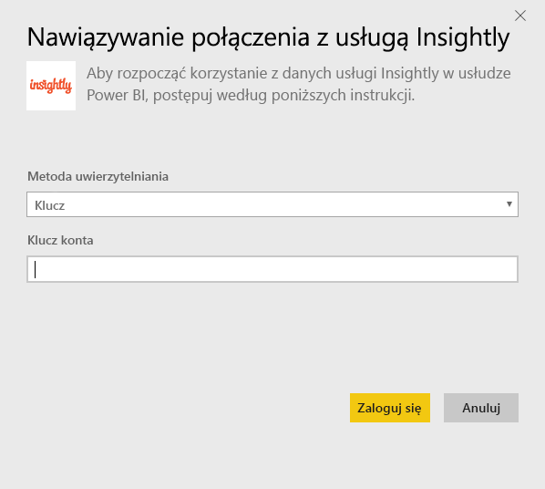
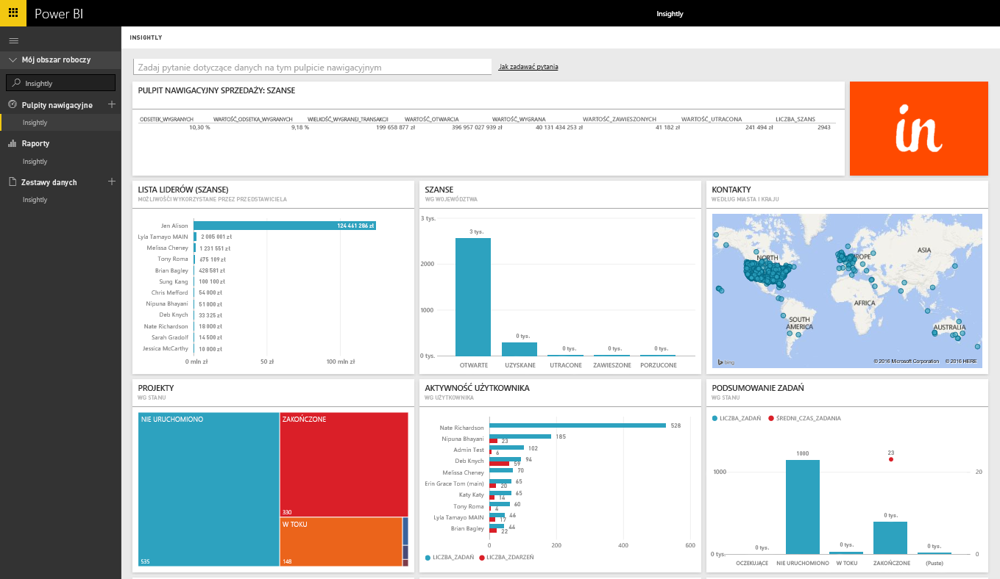
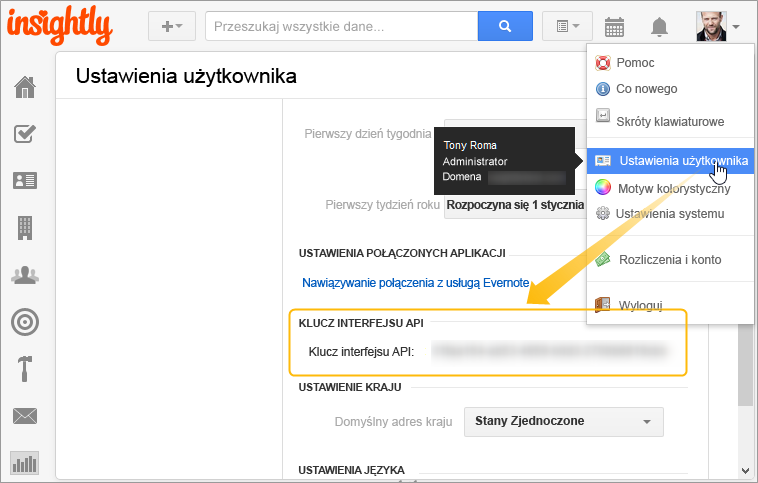

# Nawiązywanie połączenia z usługą Insightly za pomocą usługi Power BI
Wizualizuj i udostępniaj swoje dane rozwiązania Insightly CRM w usłudze Power BI za pomocą pakietu zawartości usługi Insightly. Połącz się z usługą Power BI za pomocą klucza interfejsu API usługi Insightly, aby wyświetlić i skompilować raporty i pulpity nawigacyjne na podstawie danych programu CRM. Za pomocą usługi Power BI możesz analizować swoje dane przy użyciu nowych sposobów, tworzyć zaawansowane wykresy oraz wyświetlać kontakty, potencjalnych klientów i organizacje na mapie.

Połącz się z [pakietem zawartości usługi Insightly](https://app.powerbi.com/getdata/services/insightly) dla usługi Power BI.

## Jak nawiązać połączenie
1. Wybierz pozycję **Pobierz dane** w dolnej części okienka nawigacji po lewej stronie.
   
   
2. W polu **Usługi** wybierz pozycję **Pobierz**.
   
   
3. Wybierz pozycję **Insightly** \> **Pobierz**.
   
   
4. Wybierz pozycję **Klucz** jako typ uwierzytelniania i podaj swój klucz interfejsu API usługi Insight, a następnie wybierz pozycję **Zaloguj**. Poniżej znajdują się szczegółowe informacje o tym, [jak znaleźć tę wartość](#FindingParams).
   
   
5. Po zatwierdzeniu proces importowania rozpocznie się automatycznie. Po zakończeniu nowy pulpit nawigacyjny, raport i model zostaną wyświetlone w okienku nawigacji. Wybierz pulpit nawigacyjny, aby wyświetlić zaimportowane dane.
   
     

**Co teraz?**

* Spróbuj [zadać pytanie w polu funkcji Pytania i odpowiedzi](consumer/end-user-q-and-a.md) w górnej części pulpitu nawigacyjnego
* [Zmień kafelki](service-dashboard-edit-tile.md) na pulpicie nawigacyjnym.
* [Wybierz kafelek](consumer/end-user-tiles.md), aby otworzyć raport źródłowy.
* Dla zestawu danych jest zaplanowane codzienne odświeżanie, ale możesz zmienić harmonogram odświeżania lub odświeżyć go na żądanie przy użyciu polecenia **Odśwież teraz**

## Zawartość pakietu
Pakiet zawartości obejmuje następujące tabele z polami z odpowiednich rekordów:

| Tabele |  |  |  |
| --- | --- | --- | --- |
| Kontakty |Szanse sprzedaży |Etapy potoku |Data zakończenia zadania |
| Pola niestandardowe |Data zamknięcia szansy sprzedaży |Data zakończenia projektu |Zadania |
| Zdarzenia |Data prognozy szansy sprzedaży |Projekty |Zespoły/członkowie |
| Potencjalni klienci |Organizacje |Tagi |Użytkownicy |

Wiele tabel i raportów zawiera też unikatowe pola obliczeniowe, takie jak:  

* Tabele ze „zgrupowanymi” datami zamknięcia prognozowanych szans sprzedaży, rzeczywistymi datami zamknięcia szansy sprzedaży, datami zamknięcia projektów i datami zakończenia zadań do analizy według miesiąca, kwartału lub roku.  
* Pole wartości ważonej dla szans sprzedaży (wartość szansy sprzedaży * prawdopodobieństwo wygranej).  
* Pola średniego i łącznego czasu trwania dla zadań na podstawie dat rozpoczęcia i zakończenia.  
* Raporty z polami obliczeniowymi dla współczynnika wygranej szansy sprzedaży (liczba wygranych/łączna liczba szans sprzedaży) i wartości współczynnika wygranych (wartość wygranych/łączna wartość szans sprzedaży).  

## Wymagania systemowe
Wymagane jest konto usługi Insightly z dostępem do interfejsu API usługi Insightly. Uprawnienia dotyczące widoczności będą oparte na kluczu interfejsu API użytym do nawiązania połączenia z usługą Power BI. Wszelkie rekordy usługi Insightly, które widzisz, będą również widoczne w raportach i pulpitach nawigacyjnych usługi Power BI udostępnianych innym osobom.

## Znajdowanie parametrów
**Klucz interfejsu API**

Aby skopiować swój klucz interfejsu API z usługi Insightly, wybierz pozycję Ustawienia użytkownika w menu profilu usługi Insightly i przewiń w dół. Ten ciąg znaków zostanie użyty do połączenia Twoich danych z usługą Power BI.

## Rozwiązywanie problemów
Twoje dane są importowane za pośrednictwem interfejsu API usługi Insightly, który zawiera dzienny limit oparty na poziomie planu subskrypcji usługi Insightly. Limity są podane w sekcji Rate Limiting/Throttling Requests (Limity szybkości/żądania ograniczania) dokumentacji interfejsu API: https://api.insight.ly/v2.2/Help#!/Overview/Introduction#ratelimit

Dostępne raporty używają domyślnych pól z usługi Insightly i mogą nie zawierać Twoich dostosowań. Edytuj raport, aby wyświetlić wszystkie dostępne pola.

## Następne kroki
[Wprowadzenie do usługi Power BI](service-get-started.md)

[Pobieranie danych w usłudze Power BI](service-get-data.md)

