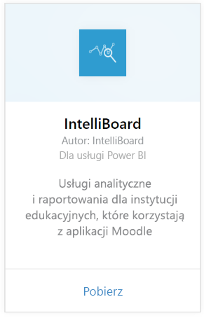

# Nawiązywanie połączenia z IntelliBoard przy użyciu usługi Power BI
IntelliBoard oferuje uproszczony dostęp do danych systemu zarządzania nauczaniem Moodle za pośrednictwem usług raportowania. Pakiet zawartości IntelliBoard dla usługi Power BI oferuje dodatkowe narzędzia analityczne, w tym metryki dotyczące kursów, zarejestrowanych użytkowników, ogólnej wydajności i aktywności systemu LMS.

Połącz się z [pakietem zawartości IntelliBoard](https://app.powerbi.com/getdata/services/intelliboard) dla usługi Power BI.

## Jak nawiązać połączenie
1. Wybierz pozycję **Pobierz dane** w dolnej części okienka nawigacji po lewej stronie.  
   
    
2. W polu **Usługi** wybierz pozycję **Pobierz**.  
   
    
3. Wybierz pozycję **IntelliBoard**, a następnie opcję **Pobierz**.  
   
    
4. Wybierz pozycję **OAuth 2**, a następnie pozycję **Zaloguj**. Po wyświetleniu monitu podaj poświadczenia IntelliBoard.
   
    
   
    
5. Po nawiązaniu połączenia automatycznie zostanie załadowany pulpit nawigacyjny, raport i zestaw danych. Po zakończeniu kafelki zostaną zaktualizowane o dane pochodzące z konta IntelliBoard.
   
    

**Co teraz?**

* Spróbuj [zadać pytanie w polu funkcji Pytania i odpowiedzi](consumer/end-user-q-and-a.md) w górnej części pulpitu nawigacyjnego
* [Zmień kafelki](service-dashboard-edit-tile.md) na pulpicie nawigacyjnym.
* [Wybierz kafelek](consumer/end-user-tiles.md), aby otworzyć raport źródłowy.
* Dla zestawu danych jest zaplanowane codzienne odświeżanie, ale możesz zmienić harmonogram odświeżania lub odświeżyć go na żądanie przy użyciu polecenia **Odśwież teraz**

## Zawartość pakietu
Pakiet zawartości obejmuje dane z następujących tabel:  

    - Działanie  
    - Agenci  
    - Autoryzacja  
    - Kraje  
    - Postępy kursów  
    - Rejestracje
    - Język  
    - Platforma  
    - Sumy  
    - Postępy użytkowników    

## Wymagania systemowe
Aby utworzyć wystąpienia tego pakietu zawartości, wymagane jest konto IntelliBoard z uprawnieniami do powyższych tabel.

## Następne kroki
[Co to jest usługa Power BI?](power-bi-overview.md)

[Power BI — podstawowe pojęcia](consumer/end-user-basic-concepts.md)

