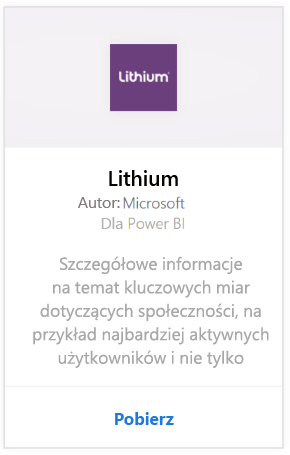
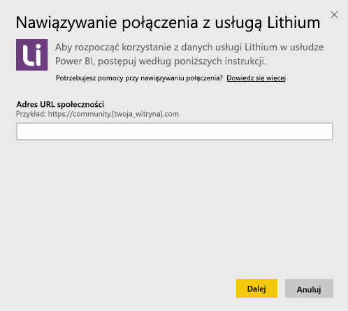
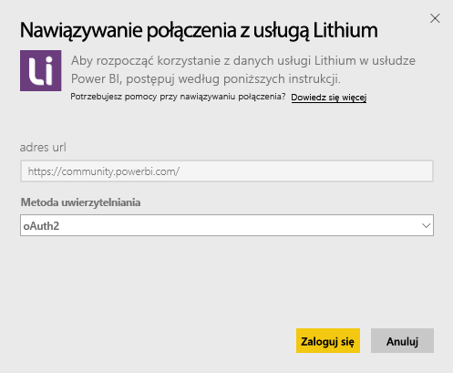
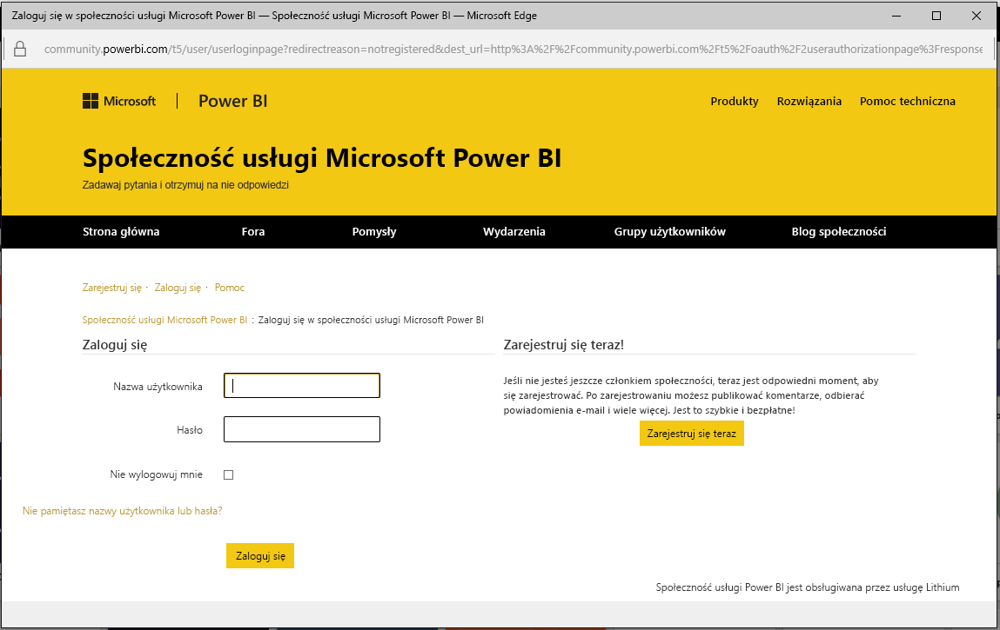
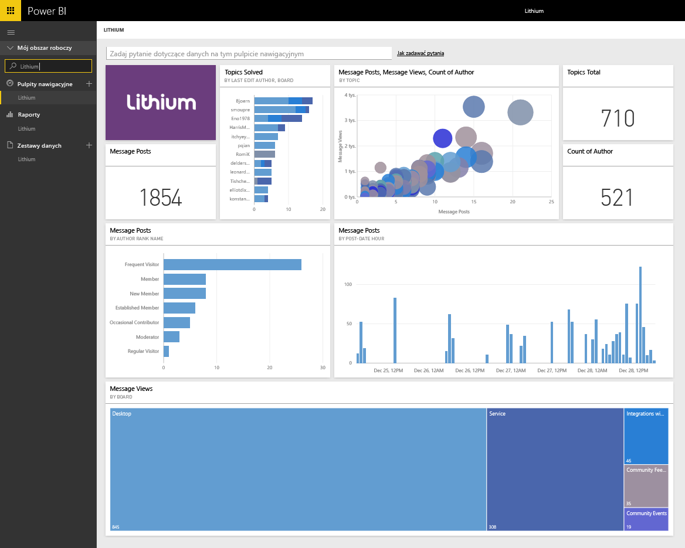

# Łączenie się z pakietem zawartości Lithium przy użyciu usługi Power BI
Usługa Lithium buduje zaufane relacje między najlepszymi na świecie markami i ich klientami, pomagając ludziom uzyskać odpowiedzi i dzielić się doświadczeniami. Łącząc pakiet zawartości Lithium z usługą Power BI, można mierzyć kluczowe metryki dotyczące społeczności online w celu poprawy sprzedaży, zmniejszania kosztów usługi i zwiększania lojalności. 

Połącz się z [pakietem zawartości Lithium](https://app.powerbi.com/getdata/services/lithium) dla usługi Power BI.

>[!NOTE]
>Pakiet zawartości usługi Power BI korzysta z interfejsu API usługi Lithium. Nadmierne wywołania interfejsu API mogą wiązać się z naliczeniem dodatkowych opłat za usługę Lithium, prosimy skontaktować się z administratorem usługi Lithium.

## Jak nawiązać połączenie
1. Wybierz pozycję **Pobierz dane** w dolnej części okienka nawigacji po lewej stronie.
   
    
2. W polu **Usługi** wybierz pozycję **Pobierz**.
   
    
3. Wybierz pozycję **Lithium** \> **Pobierz**.
   
   
4. Podaj adres URL swojej społeczności usługi Lithium. Będzie on w formie *https://community.yoursite.com*.
   
   
5. Po wyświetleniu monitu wprowadź poświadczenia usługi Lithium. Wybierz opcję **oAuth 2** jako mechanizm uwierzytelniania i kliknij przycisk **Zaloguj**, a następnie postępuj zgodnie z przepływem uwierzytelniania usługi Lithium.
   
   
   
   
6. Po zakończeniu przepływu logowania rozpocznie się proces importowania. Po zakończeniu nowy pulpit nawigacyjny, raport i model zostaną wyświetlone w okienku nawigacji. Wybierz pulpit nawigacyjny, aby wyświetlić zaimportowane dane.
   
    

**Co teraz?**

* Spróbuj [zadać pytanie w polu funkcji Pytania i odpowiedzi](power-bi-q-and-a.md) w górnej części pulpitu nawigacyjnego
* [Zmień kafelki](service-dashboard-edit-tile.md) na pulpicie nawigacyjnym.
* [Wybierz kafelek](service-dashboard-tiles.md), aby otworzyć raport źródłowy.
* Zestaw danych zostanie ustawiony na codzienne odświeżanie, ale możesz zmienić harmonogram odświeżania lub spróbować odświeżyć go na żądanie przy użyciu opcji **Odśwież teraz**

## Wymagania systemowe
Pakiet zawartości usługi Lithium wymaga społeczności usługi Lithium w wersji 15.9 lub nowszej. Skontaktuj się z administratorem Lithium, aby potwierdzić.

## Następne kroki
[Wprowadzenie do usługi Power BI](service-get-started.md)

[Power BI — podstawowe pojęcia](service-basic-concepts.md)

