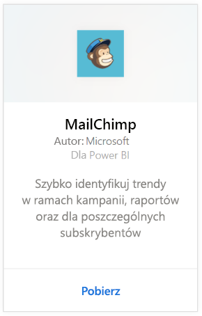
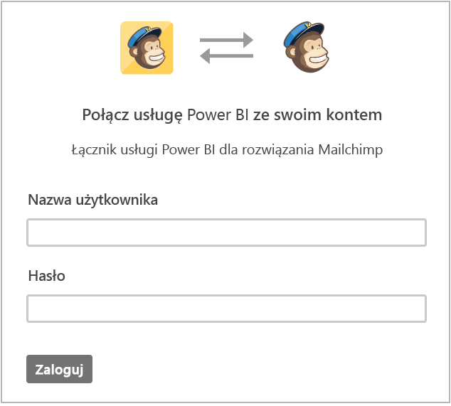
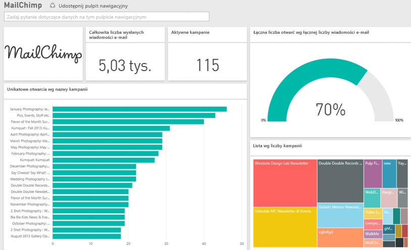

# Łączenie się z pakietem zawartości MailChimp przy użyciu usługi Power BI
Pakiet zawartości usługi Power BI pobiera dane z konta usługi MailChimp oraz generuje pulpit nawigacyjny, zestaw raportów i zestaw danych, aby umożliwić eksplorowanie danych. Pobieraj analizy, aby tworzyć [pulpity nawigacyjne usługi MailChimp](https://powerbi.microsoft.com/integrations/mailchimp) i w szybki sposób identyfikować trendy w ramach kampanii, raportów oraz dla poszczególnych subskrybentów. Dane będą odświeżane codziennie, zapewniając aktualność monitorowanych danych.

Połącz się z [pakietem zawartości MailChimp](https://app.powerbi.com/getdata/services/mailchimp) dla usługi Power BI.

## Jak nawiązać połączenie
1. Wybierz pozycję **Pobierz dane** w dolnej części okienka nawigacji po lewej stronie.
   
    
2. W polu **Usługi** wybierz pozycję **Pobierz**.
   
   
3. Wybierz pozycję **MailChimp** \> **Pobierz**.
   
   
4. Jako metodę uwierzytelniania wybierz opcję **oAuth2** \> **Zaloguj**.
   
    Po wyświetleniu monitu wprowadź swoje poświadczenia usługi MailChimp i postępuj zgodnie z procesem uwierzytelniania.
   
    Przy pierwszym połączeniu usługa Power BI wyświetli monit o zgodę na dostęp do konta w trybie tylko do odczytu. Wybierz przycisk **Zezwalaj**, aby rozpocząć proces importowania, który może zająć kilka minut w zależności od ilości danych na koncie.
   
    
5. Po zaimportowaniu danych przez usługę Power BI zobaczysz nowy pulpit nawigacyjny, raport i zestaw danych w okienku nawigacji po lewej stronie. Jest to domyślny pulpit nawigacyjny utworzony przez usługę Power BI do wyświetlania Twoich danych. Możesz modyfikować pulpit nawigacyjny, aby wyświetlać dane w dowolny sposób.
   
   

**Co teraz?**

* Spróbuj [zadać pytanie w polu funkcji Pytania i odpowiedzi](power-bi-q-and-a.md) w górnej części pulpitu nawigacyjnego
* [Zmień kafelki](service-dashboard-edit-tile.md) na pulpicie nawigacyjnym.
* [Wybierz kafelek](service-dashboard-tiles.md), aby otworzyć raport źródłowy.
* Zestaw danych zostanie ustawiony na codzienne odświeżanie, ale możesz zmienić harmonogram odświeżania lub spróbować odświeżyć go na żądanie przy użyciu opcji **Odśwież teraz**

## Następne kroki
[Wprowadzenie do usługi Power BI](service-get-started.md)

[Power BI — podstawowe pojęcia](service-basic-concepts.md)

