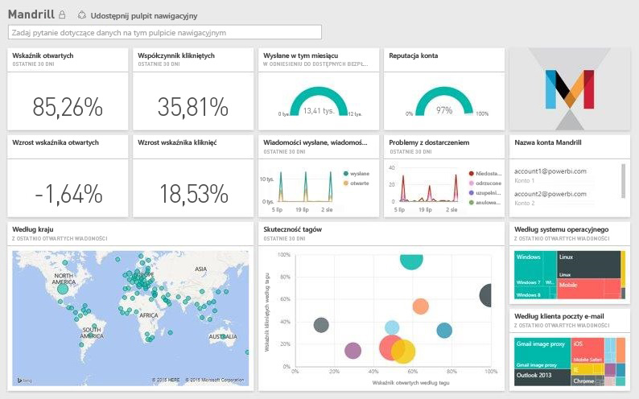

# Łączenie się z pakietem zawartości Mandrill przy użyciu usługi Power BI
Pakiet zawartości usługi Power BI pobiera dane z konta usługi Mandrill oraz generuje pulpit nawigacyjny, zestaw raportów i zestaw danych, aby umożliwić eksplorowanie danych. Analizy usługi Mandrill pozwalają szybko uzyskać szczegółowe informacje dotyczące kampanii marketingowych lub biuletynu. Dane będą odświeżane codziennie, zapewniając aktualność monitorowanych danych.

Połącz się z [pakietem zawartości Mandrill dla usługi Power BI.](http://app.powerbi.com/getdata/services/mandrill)

## Jak nawiązać połączenie
1. Wybierz pozycję **Pobierz dane** w dolnej części okienka nawigacji po lewej stronie.
   
    
2. W polu **Usługi** wybierz pozycję **Pobierz**.
   
    
3. Wybierz pozycję **Mandrill** > **Pobierz**.
   
    
4. W polu **Metoda uwierzytelniania** wybierz opcję **Klucz** i podaj klucz interfejsu API. Klucz można znaleźć na karcie **Ustawienia** pulpitu nawigacyjnego usługi Mandrill. Wybierz przycisk **Zaloguj**, aby rozpocząć proces importowania, który może zająć kilka minut w zależności od ilości danych na koncie.
   
    
5. Po zaimportowaniu danych przez usługę Power BI zobaczysz nowy pulpit nawigacyjny, raport i zestaw danych w okienku nawigacji po lewej stronie. Jest to domyślny pulpit nawigacyjny utworzony przez usługę Power BI do wyświetlania Twoich danych.
   
    

**Co teraz?**

* Spróbuj [zadać pytanie w polu funkcji Pytania i odpowiedzi](consumer/end-user-q-and-a.md) w górnej części pulpitu nawigacyjnego
* [Zmień kafelki](service-dashboard-edit-tile.md) na pulpicie nawigacyjnym.
* [Wybierz kafelek](consumer/end-user-tiles.md), aby otworzyć raport źródłowy.
* Dla zestawu danych jest zaplanowane codzienne odświeżanie, ale możesz zmienić harmonogram odświeżania lub odświeżyć go na żądanie przy użyciu polecenia **Odśwież teraz**

## Następne kroki
[Co to jest usługa Power BI?](power-bi-overview.md)

[Power BI — podstawowe pojęcia](consumer/end-user-basic-concepts.md)

