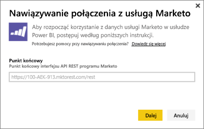
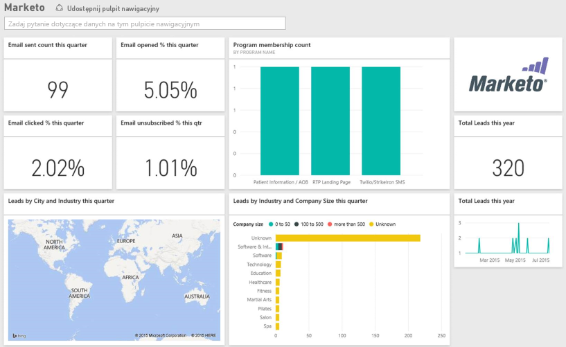

# Nawiązywanie połączenia z usługą Marketo przy użyciu usługi Power BI
Pakiet zawartości usługi Power BI dla usługi Marketo pozwala uzyskać wgląd w przechowywane na koncie Marketo dane dotyczące potencjalnych klientów i ich działań. Po utworzeniu połączenia pobierane są dane, na podstawie których automatycznie tworzony jest pulpit nawigacyjny i powiązane raporty.

Połącz się z [pakietem zawartości Marketo](https://app.powerbi.com/getdata/services/marketo) dla usługi Power BI.

## Jak nawiązać połączenie
1. Wybierz pozycję **Pobierz dane** w dolnej części okienka nawigacji po lewej stronie.
   
   
2. W polu **Usługi** wybierz pozycję **Pobierz**.
   
    
3. Wybierz pozycję **Marketo** \> **Pobierz**.
   
   
4. Wprowadź punkt końcowy REST usługi Marketo udostępniony przez firmę Marketo lub administratora usługi Marketo, a następnie wybierz przycisk Dalej.
   
   
   
   Dowiedz się więcej o punkcie końcowym REST usługi Marketo: [http://developers.marketo.com/documentation/rest/endpoint-url/ ](http://developers.marketo.com/documentation/rest/endpoint-url/).
5. Przy użyciu metody uwierzytelniania **Podstawowa** wprowadź identyfikator klienta jako **nazwę użytkownika** i klucz tajny klienta jako **hasło**. Identyfikator klienta i klucz tajny klienta można uzyskać w firmie Marketo lub od administratora usługi Marketo ([http://developers.marketo.com/documentation/rest/custom-service/](http://developers.marketo.com/documentation/rest/custom-service/)). 
   
   
   
   Dzięki temu można korzystać z [danych analitycznych Marketo](https://powerbi.microsoft.com/integrations/marketo) za pomocą pakietu zawartości *Marketo dla usługi Power BI* i analizować dane w usłudze Power BI. Dane są odświeżane raz dziennie.
6. Po nawiązaniu połączenia z kontem Marketo zostanie załadowany pulpit nawigacyjny z wszystkimi danymi:
   
   

**Co teraz?**

* Spróbuj [zadać pytanie w polu funkcji Pytania i odpowiedzi](power-bi-q-and-a.md) w górnej części pulpitu nawigacyjnego
* [Zmień kafelki](service-dashboard-edit-tile.md) na pulpicie nawigacyjnym.
* [Wybierz kafelek](service-dashboard-tiles.md), aby otworzyć raport źródłowy.
* Zestaw danych zostanie ustawiony na codzienne odświeżanie, ale możesz zmienić harmonogram odświeżania lub spróbować odświeżyć go na żądanie przy użyciu opcji **Odśwież teraz**

## Zawartość pakietu
Usługa Marketo w usłudze Power BI udostępnia następujące dane dotyczące działań z ostatniego roku:

| Nazwa tabeli | Opis |
| --- | --- |
| EmailActivities |Dane wiadomości e-mail wysłanych do potencjalnych klientów/kontaktów ze szczegółami dotyczącymi urządzeń, kategorii, liczby i wartości procentowej zwróconych, klikniętych oraz otwartych wiadomości, a także nazwy programu. Wyświetlany w usłudze Power BI raport o dostarczeniu wiadomości e-mail zawiera nieprzetworzone dane, bez stosowania dodatkowej logiki. Z tego względu wyniki udostępniane przez klienta Marketo mogą różnić się od informacji widocznych w usłudze Power BI. |
| ProgramActivites |Dane programów, których stan zmienił się. Obejmuje to szczegóły, takie jak przyczyna, sukces, liczba i wartość procentowa pozyskań programu oraz liczba i wartość procentowa sukcesów programu. |
| WebPageActivities |Dane o wizytach użytkowników na stronach internetowych, w tym: agent wyszukiwania, agent użytkownika, strona internetowa i godzina. |
| Datetable |Dane z ostatniego roku do daty bieżącej.  Umożliwia analizowanie danych usługi Marketo według dat. |
| Leads |Informacje o potencjalnych klientach, takie jak nazwa firmy, wielkość przychodu, liczba pracowników, kraj, branża, ocena i stan. Pobieranie potencjalnych klientów odbywa się na podstawie danych dotyczących wiadomości e-mail, programów i działań na stronach internetowych. |

Wszystkie daty są podane w czasie UTC. Daty mogą się różnić w zależności od tego, w której strefie czasowej znajduje się Twoje konto (podobnie jak w kliencie usługi Marketo).

## Wymagania systemowe
* Konto usługi Marketo używane do nawiązywania połączenia z dostępem do potencjalnych klientów i działań.
* Wystarczająca liczba dostępnych wywołań interfejsu API, umożliwiających łączenie się z danymi.  Usługa Marketo udostępnia interfejs API dla każdego konta.  Po osiągnięciu limitu nie będzie możliwe załadowanie danych do usługi Power BI. 

**Szczegóły dotyczące limitów interfejsu API**

Importowanie danych z usługi Marketo powoduje użycie wywołań interfejsu API usługi Marketo. Wszyscy klienci usługi Marketo mają dzienny limit 10 000 wywołań interfejsu API, które są dostępne dla wszystkich aplikacji korzystających z interfejsów API usługi Marketo. Interfejsy API są dostępne dla różnych integracji, w tym dla usługi Power BI. Aby uzyskać więcej informacji na temat interfejsów API, zobacz: <http://developers.marketo.com/documentation/rest/>.

Liczba wywołań interfejsu API używanych przez usługę Power BI zależy od ilości danych na koncie usługi Marketo. Usługa Power BI importuje wszystkie działania i potencjalnych klientów z ostatniego roku. Poniżej przedstawiono przykładowe dane z usługi Marketo wraz z liczbami wywołań interfejsu API używanych przez usługę Power BI podczas importowania tych danych:  

| Typ danych | Liczba wierszy | Wywołania interfejsu API |
| --- | --- | --- |
| Informacje o potencjalnych klientach |15 000 |50 |
| Działania związane z pocztą e-mail |150 000 |1000 |
| Działania związane z programami |15 000 |100 |
| Działania związane z korzystaniem z Internetu |150 000 |1000 |
| Zmiany programów |7500 |50 |
| **Suma wywołań interfejsu API** | |**2200** |

## Następne kroki
[Wprowadzenie do usługi Power BI](service-get-started.md)

[Pobieranie danych dla usługi Power BI](service-get-data.md)

[Blog usługi Power BI: monitorowanie i analizowanie danych usługi Marketo za pomocą usługi Power BI](http://blogs.msdn.com/b/powerbi/archive/2015/03/19/monitor-and-analyze-your-marketo-data-with-power-bi.aspx)

