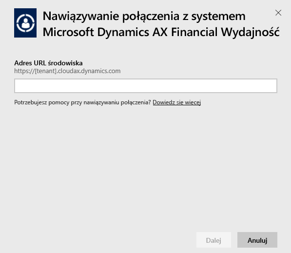
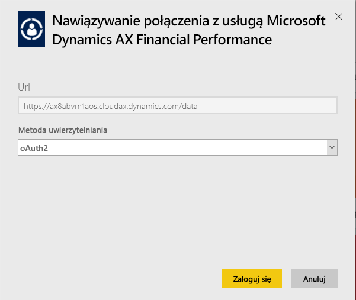
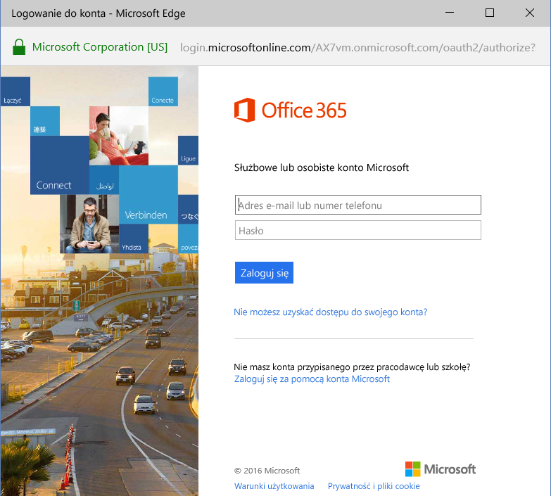
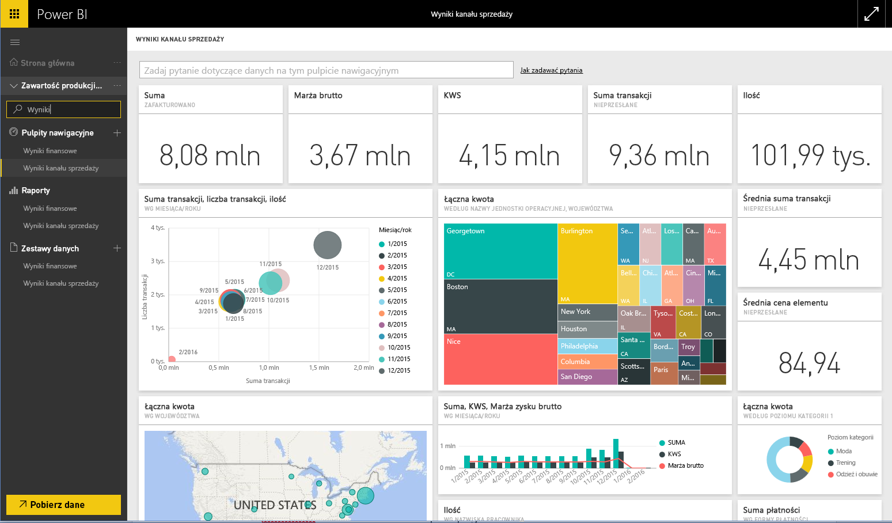

# Nawiązywanie połączenia z pakietem zawartości Microsoft Dynamics AX przy użyciu usługi Power BI
System Microsoft Dynamics AX ma trzy pakiety zawartości Power BI przeznaczone dla różnych użytkowników biznesowych. Pakiet zawartości Financial Performance, zaprojektowany specjalnie z myślą o dyrektorach finansowych, zapewnia dostęp do szczegółowych informacji dotyczących wydajności finansowej organizacji. Pakiet zawartości Retail Channel Performance jest przeznaczony dla menedżerów kanału i koncentruje się na wydajności sprzedaży, aby umożliwiać przewidywanie trendów i odkrywanie informacji opartych bezpośrednio na danych dotyczących sprzedaży detalicznej i działań komercyjnych. Pakiet Cost Management jest przeznaczony dla dyrektorów zarządzających oraz dyrektorów finansowych i zapewnia szczegółowe informacje dotyczące wydajności operacyjnej.

Nawiąż połączenie z pakietem zawartości Microsoft Dynamics AX [Retail Channel Performance](https://app.powerbi.com/getdata/services/dynamics-ax-retail-channel-performance), [Financial Performance](https://app.powerbi.com/getdata/services/dynamics-ax-financial-performance) lub [Cost Management](https://app.powerbi.com/getdata/services/dynamics-ax-cost-management) dla usługi Power BI.

## Jak nawiązać połączenie
1. Wybierz pozycję **Pobierz dane** w dolnej części okienka nawigacji po lewej stronie.
   
   
2. W polu **Usługi** wybierz pozycję **Pobierz**.
   
   
3. Wybierz jeden z pakietów zawartości Dynamics AX i wybierz opcję **Pobierz**.
   
   
4. Określ adres URL środowiska Dynamics AX 7. Poniżej znajdują się szczegółowe informacje dotyczące [wyszukiwania tych parametrów](#FindingParams).
   
   
5. Jako **metodę uwierzytelniania** wybierz opcję **oAuth2** \> **Zaloguj**. Po wyświetleniu monitu wprowadź poświadczenia Dynamics AX.
   
    
   
    
6. Po zatwierdzeniu proces importowania rozpocznie się automatycznie. Po zakończeniu nowy pulpit nawigacyjny, raport i model zostaną wyświetlone w okienku nawigacji. Wybierz pulpit nawigacyjny, aby wyświetlić zaimportowane dane.
   
     

**Co teraz?**

* Spróbuj [zadać pytanie w polu funkcji Pytania i odpowiedzi](power-bi-q-and-a.md) w górnej części pulpitu nawigacyjnego
* [Zmień kafelki](service-dashboard-edit-tile.md) na pulpicie nawigacyjnym.
* [Wybierz kafelek](service-dashboard-tiles.md), aby otworzyć raport źródłowy.
* Zestaw danych zostanie ustawiony na codzienne odświeżanie, ale możesz zmienić harmonogram odświeżania lub spróbować odświeżyć go na żądanie przy użyciu opcji **Odśwież teraz**

## Zawartość pakietu
Pakiet zawartości używa źródła Dynamics AX 7 OData do importowania danych powiązanych z wydajnością kanału sprzedaży (Retail Channel), finansową (Financial) oraz zarządzania kosztami (Cost Management).

## Wymagania systemowe
Ten pakiet zawartości wymaga adresu URL środowiska Dynamics AX 7, a użytkownik powinien mieć dostęp do źródła danych OData.

## Znajdowanie parametrów

Adres URL środowiska Dynamics AX 7 można znaleźć w przeglądarce po zalogowaniu użytkownika. Wystarczy skopiować adres URL głównego środowiska Dynamics AX do okna dialogowego usługi Power BI.

## Rozwiązywanie problemów
Ładowanie danych może zająć trochę czasu w zależności od wystąpienia. Jeśli widzisz puste raporty w usłudze Power BI, upewnij się, że masz dostęp do tabel OData wymaganych do utworzenia raportów.

## Następne kroki
[Wprowadzenie do usługi Power BI](service-get-started.md)

[Pobieranie danych w usłudze Power BI](service-get-data.md)

