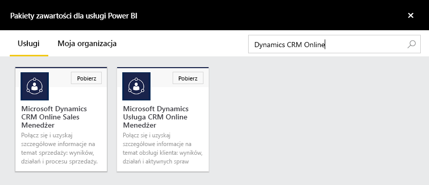
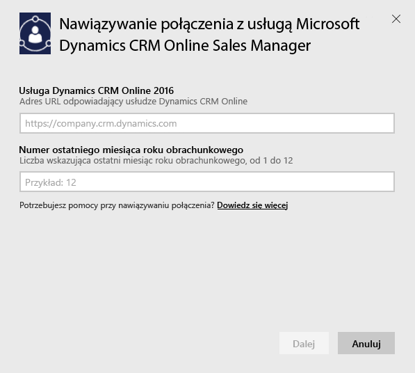

# Nawiązywanie połączenia z programem Microsoft Dynamics CRM przy użyciu usługi Power BI
Usługa Microsoft Dynamics CRM Online dla usługi Power BI umożliwia łatwy dostęp do danych i analizowanie ich. Za pomocą źródła danych OData usługa Power BI tworzy model opisowy ze wszystkimi potrzebnymi jednostkami i miarami, takimi jak na przykład klienci, działania, szanse sprzedaży, produkty, potencjalni klienci i użytkownicy. Po zainstalowaniu aplikacji możesz wyświetlić pulpit nawigacyjny i raporty w usłudze Power BI ([https://powerbi.com](https://powerbi.com)) i w aplikacjach mobilnych usługi Power BI. 

Połącz się z pakietem [Sales Manager](https://msit.powerbi.com/groups/me/getdata/services/dynamics-crm-sales-manager) lub [Service Manager](https://msit.powerbi.com/groups/me/getdata/services/dynamics-crm-customer-service) usługi Dynamics CRM Online. Dowiedz się więcej na temat [integracji usługi Dynamics CRM Online](https://powerbi.microsoft.com/integrations/microsoft-dynamicscrm) z usługą Power BI.

To połączenie wymaga usługi **Microsoft Dynamics CRM Online w wersji 2016 lub nowszej**. Więcej szczegółowych informacji na temat [wymagań](#Requirements) znajduje się poniżej.

## Jak nawiązać połączenie
[!INCLUDE [powerbi-service-apps-get-more-apps](./includes/powerbi-service-apps-get-more-apps.md)]

1. Wybierz pozycję **Microsoft Dynamics CRM Sales Manager** lub **Microsoft Dynamics CRM Service Manager** i kliknij pozycję **Połącz**.
   
   
2. Podaj adres URL usługi skojarzony z kontem.  Będzie on miał postać `https://company.crm.dynamics.com`. Więcej szczegółów można znaleźć [poniżej](#FindingParams).
   
   
3. Po wyświetleniu monitu wprowadź swoje poświadczenia (można pominąć ten krok, jeśli już zalogowano się w przeglądarce). Jako metodę uwierzytelniania wybierz protokół **oAuth2** i kliknij pozycję **Zaloguj**:
   
   
4. Po nawiązaniu połączenia zostanie wyświetlony pulpit nawigacyjny, dostosowany pod kątem pakietu Sales Manager lub Service Manager i wypełniony Twoimi danymi:
   
   

## Wyświetlanie pulpitu nawigacyjnego i raportów programu Microsoft Dynamics CRM
[!INCLUDE [powerbi-service-apps-open-app](./includes/powerbi-service-apps-open-app.md)]

[!INCLUDE [powerbi-service-apps-open-app](./includes/powerbi-service-apps-what-now.md)]

## Zawartość pakietu
W poniższych sekcjach opisano zawartość usług [Sales Manager](#Sales) i [Service Manager](#Service).

Zwróć uwagę, że wyświetlane dane są dodatkowo ograniczone w zależności od roli zabezpieczeń przypisanej do użytkownika usługi Dynamics CRM Online.

Pulpit nawigacyjny i raporty mają zapewnić raportowanie operacyjne na podstawie danych krótkookresowych, ukierunkowane na zespół lub grupę. Każde zapytanie może pobrać maksymalnie 100 tys. rekordów z usługi Dynamics CRM Online. Jeśli ten limit zostanie przekroczony z powodu dużej ilości danych w organizacji, aprowizacja nie powiedzie się, ponieważ nastąpi przerwanie odświeżania danych usługi Dynamics CRM Online. Jeśli konto jest zbyt duże, zastanów się nad nawiązaniem połączenia za pośrednictwem programu Power BI Desktop w celu utworzenia niestandardowego rozwiązania.

### Sales Manager
Pulpit nawigacyjny i raporty zawierają kluczowe metryki, takie jak:  

* Uzyskany przychód   
* Wskaźnik wygranych   
* Otwarty przychód   
* Utracony przychód   
* Oczekiwany przychód  
* Średnia wielkość transakcji i inne.  

Zawierają one również kluczowe wykresy, takie jak:  

* Trendy uzyskanego i utraconego przychodu, uzyskany przychód a oczekiwany przychód  
* Uzyskany przychód przedstawiony w różnych wymiarach, takich jak branża, region, terytorium   
* Liderzy sprzedaży według przychodu, działania   
* Najważniejsi klienci, najważniejsze wygrane/utracone transakcje    
* Trend przedstawiający nowych potencjalnych klientów, potok sprzedaży i inne.   

Te metryki i wykresy pomagają określić wydajność organizacji handlowej oraz przeanalizować potok sprzedaży w całym zespole.

Poniższa tabela zawiera listę jednostek CRM dostępnych w tej usłudze oraz szczegółowe informacje dotyczące filtrów stosowanych do poszczególnych rekordów jednostki.

| Jednostka CRM | Stosowane filtry |
| --- | --- |
| Klient |Wszyscy klienci z powiązanymi szansami sprzedaży, które zostały zmodyfikowane w ciągu ostatnich 365 dni. |
| Działanie |Wszystkie działania zmodyfikowane w ciągu ostatnich 90 dni   [modifiedon] > dziś - 90 dni |
| Jednostka biznesowa |Wszystkie jednostki biznesowe, które nie zostały wyłączone   [isdisabled] = false |
| Potencjalny klient |Wszyscy potencjalni klienci zmodyfikowani w ciągu ostatnich 180 dni   [modifiedon] > dziś - 180 dni |
| Szansa sprzedaży |Wszystkie szanse sprzedaży zmodyfikowane w ciągu ostatnich 365 dni   [modifiedon] > dziś - 365 dni |
| Produkt z szansą sprzedaży |Wszystkie produkty z szansą sprzedaży zmodyfikowane w ciągu ostatnich 365 dni   [modifiedon] > dziś - 365 dni |
| Produkt |Wszystkie aktywne produkty   [statecode] <> 1 |
| Terytorium |Wszystkie terytoria |
| Użytkownik |Wszyscy aktywni użytkownicy i niedelegowani administratorzy    [isdisabled] = false and [accessmode] <> 4 |

### Service Manager
Pulpit nawigacyjny i raporty zawierają kluczowe metryki, takie jak:  

* Procentowy wskaźnik zadowolenia klientów   
* Procentowy wskaźnik spełnienia warunków SLA   
* Procentowy wskaźnik eskalowanych przypadków   
* Średni czas obsługi   
* Łączna liczba rozwiązanych spraw  
* Łączna liczba aktywnych spraw  
* Liczba przypadków użycia artykułu z bazy wiedzy w sprawach i inne.    

Zawierają one również kluczowe wykresy, takie jak:   

* Trendy przedstawiające liczby przychodzących, rozwiązanych i eskalowanych spraw   
* Liczba spraw w różnych ujęciach, takich jak początek, lokalizacja, priorytet i typ  
* Liderzy pod względem procentowego wskaźnika zadowolenia klientów, procentowego wskaźnika spełnienia warunków SLA, działań i rozwiązanych spraw  
* Najczęściej używane oraz najczęściej wyświetlane artykuły z bazy wiedzy i inne.  
    Te metryki i wykresy pomagają określić wydajność działu pomocy technicznej w organizacji oraz przeanalizować obciążenie związane z aktywnymi sprawami w całym zespole ds. usług i w kolejkach usług.

Poniższa tabela zawiera listę jednostek CRM dostępnych w tej usłudze oraz szczegółowe informacje dotyczące filtrów stosowanych do poszczególnych rekordów jednostki.

| Jednostka CRM | Stosowane filtry |
| --- | --- |
| Klient |Wszyscy klienci z powiązanymi sprawami, które zostały zmodyfikowane w ciągu ostatnich 90 dni. |
| Działanie |Wszystkie działania zmodyfikowane w ciągu ostatnich 90 dni   [modifiedon] > dziś - 90 dni |
| Sprawa |Wszystkie sprawy zmodyfikowane w ciągu ostatnich 90 dni   [modifiedon] > dziś - 90 dni |
| Działanie związane z obsługą sprawy |Wszystkie działania związane z obsługą spraw zmodyfikowane w ciągu ostatnich 90 dni   [modifiedon] > dziś - 90 dni |
| Kontakt |Wszystkie kontakty z powiązanymi sprawami, które zostały zmodyfikowane w ciągu ostatnich 90 dni. |
| Artykuł merytoryczny |Wszystkie najnowsze wersje artykułów merytorycznych    [islatestversion] = true |
| Zdarzenie związane z artykułem merytorycznym |Wszystkie zdarzenia związane z artykułami merytorycznymi, które zostały zmodyfikowane w ciągu ostatnich 90 dni   [modifiedon] > dziś - 90 dni |
| Kolejka |Wszystkie aktywne kolejki    [statecode] = 0 |
| Element kolejki |Wszystkie elementy kolejki związane ze sprawą utworzone w ciągu ostatnich 365 dni    [createdon] > dziś - 365 dni and   [objecttypecode] = 112 |
| Użytkownik |Wszyscy aktywni użytkownicy    [isdisabled] = false |

## Wymagania systemowe
* Prawidłowe wystąpienie usługi Dynamics CRM Online 2016 lub nowszej (usługa Power BI nie będzie współdziałać z lokalną wersją oprogramowania CRM). Jeśli nie masz wersji 2016 ani nowszej:
* Administrator musi włączyć punkt końcowy OData w ustawieniach witryny.
* Na koncie musi być mniej niż 100 tys. rekordów w dowolnej tabeli. Pamiętaj, że jeśli konto ma dostęp do ponad 100 tys. rekordów, import zakończy się niepowodzeniem.

## Znajdowanie parametrów
Adres wystąpienia można znaleźć na pasku adresu URL w przeglądarce. Zwykle ma on format: `https://[instance_name].crm.dynamics.com`.

Usługa Power BI obsługuje tylko punkty końcowe programu Dynamics CRM 2016. Połączenie nie będzie działać w przypadku użycia wcześniejszych wersji usługi CRM Online. Aby nawiązać bezpośrednie połączenie z kontem, użyj programu Power BI Desktop.

## Rozwiązywanie problemów
W przypadku problemów z połączeniem, upewnij się, że:  

* adres URL wystąpienia jest poprawny (można to sprawdzić, kontaktując się z administratorem);  
* używane jest wystąpienie usługi CRM Online 2016;  
* punkt końcowy OData jest włączony.  

Ponadto spróbuj połączyć się bezpośrednio w programie Power BI Desktop przy użyciu adresu URL OData `https://[instance_name].crm.dynamics.com/api/data/v8.0/`.

Jeśli masz pewność, że korzystasz z usługi Dynamics CRM Online 2016, ale wciąż występują problemy z połączeniem, skontaktuj się z administratorem oprogramowania CRM i sprawdź, czy masz wszystkie dostępne aktualizacje.

Jeśli nie masz usługi CRM Online 2016 ani jej nowszej wersji, połącz się bezpośrednio z kontem za pomocą programu Power BI Desktop.

Jeśli zostanie wyświetlony błąd „Odświeżanie danych nie powiodło się, ponieważ zapytanie przekroczyło maksymalny limit 100000 rekordów”, rozważ nawiązanie bezpośredniego połączenia przy użyciu programu Power BI Desktop lub skorzystanie z szablonu rozwiązania CRM.

## Następne kroki
* [Czym są aplikacje w usłudze Power BI?](service-install-use-apps.md)
* [Pobieranie danych w usłudze Power BI](service-get-data.md)
* Masz więcej pytań? [Zadaj pytanie społeczności usługi Power BI](http://community.powerbi.com/)

