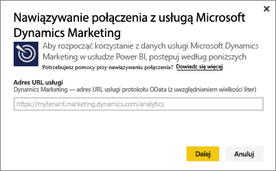
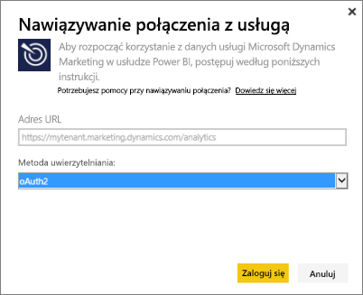
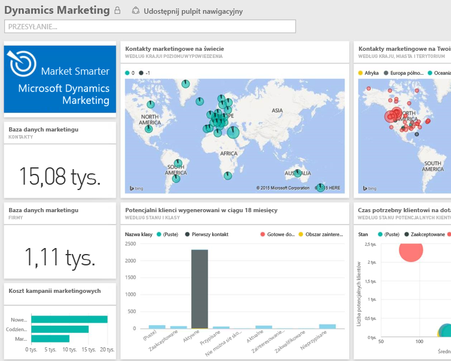

# Nawiązywanie połączenia z usługą Microsoft Dynamics Marketing przy użyciu usługi Power BI
Pakiet zawartości Microsoft Dynamics Marketing dla usługi Power BI pozwala na łatwe uzyskiwanie dostępu do danych usługi Dynamics Marketing i analizowanie ich. Ten pakiet zawartości wykorzystuje model opisowy oparty na źródle danych OData ze wszystkimi potrzebnymi jednostkami i miarami, takimi jak programy, kampanie, kontakty i firmy marketingowe, potencjalni klienci, interakcje z potencjalnymi klientami i określanie ich wyników, marketingowe wiadomości e-mail i witryny internetowe, obserwacje zachowań, budżety, transakcje finansowe, wskaźniki KPI wydajności i wiele innych. 

Nawiąż połączenie z [pakietem zawartości Dynamics Marketing](https://app.powerbi.com/getdata/services/microsoft-dynamics-marketing) dla usługi Power BI.

>[!NOTE]
>Należy określić prawidłowy adres URL źródła danych OData dla wystąpienia programu Dynamics Marketing (pakiet zawartości nie będzie działać z lokalną wersją programu CRM). Zobacz dodatkowe wymagania poniżej.

## Jak nawiązać połączenie
1. Wybierz pozycję Pobierz dane w dolnej części okienka nawigacji po lewej stronie.
   
    
2. W polu **Usługi** wybierz pozycję **Pobierz**.
   
    
3. Wybierz pozycję **Microsoft Dynamics Marketing** \> **Pobierz**.
   
   
4. Podaj adres URL źródła danych OData skojarzony z Twoim kontem.  Będzie on miał postać „`https://[instance\_name].marketing.dynamics.com/analytics.`”
   
   
5. Po wyświetleniu monitu wprowadź swoje poświadczenia (można pominąć ten krok, jeśli już zalogowano się w przeglądarce). Jako metodę uwierzytelniania wybierz protokół **oAuth2** i kliknij pozycję **Zaloguj**:
   
   
6. Po nawiązaniu połączenia zostanie wyświetlony pulpit nawigacyjny programu Dynamics Marketing wypełniony Twoimi własnymi danymi. Żółte gwiazdki oznaczają nowe elementy w okienku nawigacji po lewej stronie.
   
   

**Co teraz?**

* Spróbuj [zadać pytanie w polu funkcji Pytania i odpowiedzi](consumer/end-user-q-and-a.md) w górnej części pulpitu nawigacyjnego
* [Zmień kafelki](service-dashboard-edit-tile.md) na pulpicie nawigacyjnym.
* [Wybierz kafelek](consumer/end-user-tiles.md), aby otworzyć raport źródłowy.
* Dla zestawu danych jest zaplanowane codzienne odświeżanie, ale możesz zmienić harmonogram odświeżania lub odświeżyć go na żądanie przy użyciu polecenia **Odśwież teraz**

## Wymagania systemowe
* Należy określić prawidłowy adres URL źródła danych OData dla wystąpienia programu Dynamics Marketing (pakiet zawartości nie będzie działać z lokalną wersją programu CRM).  
* Administrator musi włączyć punkt końcowy OData w ustawieniach witryny. Adres punktu końcowego OData można znaleźć, wybierając pozycję **Narzędzia główne \> Ustawienia \> Ustawienia witryny** w sekcji **Usługa danych organizacji**.  Adres URL źródła danych OData ma format: https://[nazwa\_wystąpienia].marketing.dynamics.com/analytics  
* Konto użytkownika/tożsamość używane do uzyskiwania dostępu do usługi Microsoft Dynamics Marketing musi być takie samo, jak konto użyte do rejestracji w usłudze Power BI. Podczas logowania się do usługi Microsoft Dynamics Marketing nastąpi automatyczne zalogowanie za pomocą tej samej tożsamości, która jest używana w usłudze Power BI. Jeśli chcesz zalogować się do usługi Microsoft Dynamics Marketing za pomocą innego konta, zarejestruj się jako użytkownik usługi Power BI za pomocą tego innego konta. Mamy nadzieję, że uda nam się rozwiązać ten problem w nowej wersji.   

## Rozwiązywanie problemów
Jeśli podczas próby nawiązania połączenia z kontem programu Dynamics CRM zostanie wyświetlony komunikat „Logowanie nie powiodło się”, upewnij się, że logujesz się do usługi Power BI za pomocą tego samego konta, którego używasz w celu uzyskiwania dostępu do źródła danych OData programu CRM Online. Spróbuj także zalogować się do źródła danych w przeglądarce, aby to przetestować.

Skontaktuj się z administratorem, aby potwierdzić poprawny adres URL źródła danych OData oraz upewnić się, że punkt końcowy OData jest włączony.

Sprawdź wersję używanego programu Dynamics Marketing — w wersjach 18.0 i 18.1 wprowadzono dodatkowe poprawki. Jeśli wciąż napotykasz problemy i korzystasz ze starszej wersji, warto przeprowadzić uaktualnienie.

Jeśli nadal występują problemy, otwórz bilet pomocy technicznej, aby skontaktować się z zespołem usługi Power BI:

* W aplikacji Power BI wybierz kolejno znak zapytania \> **Skontaktuj się z pomocą techniczną**.
* W witrynie pomocy technicznej usługi Power BI (gdzie czytasz ten artykuł) wybierz pozycję **Skontaktuj się z pomocą techniczną** w prawej części strony.

## Następne kroki
[Pobieranie danych dla usługi Power BI](service-get-data.md)

[Co to jest usługa Power BI?](power-bi-overview.md)

