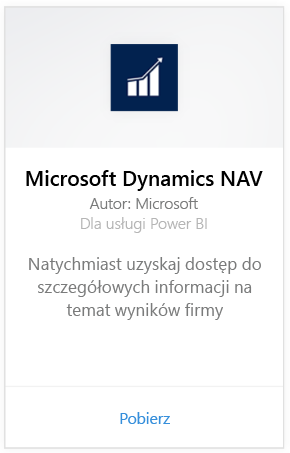
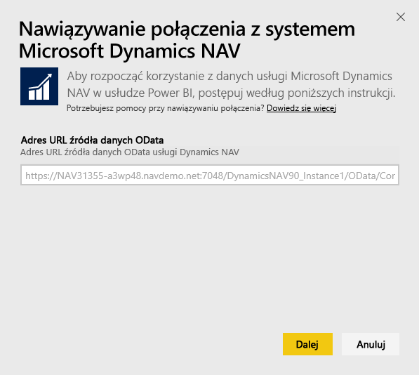
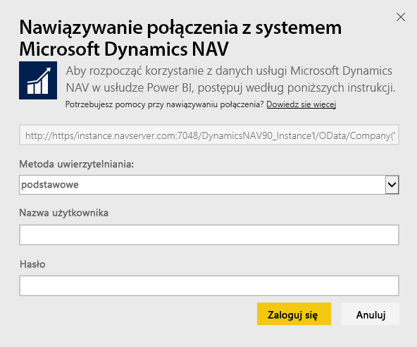
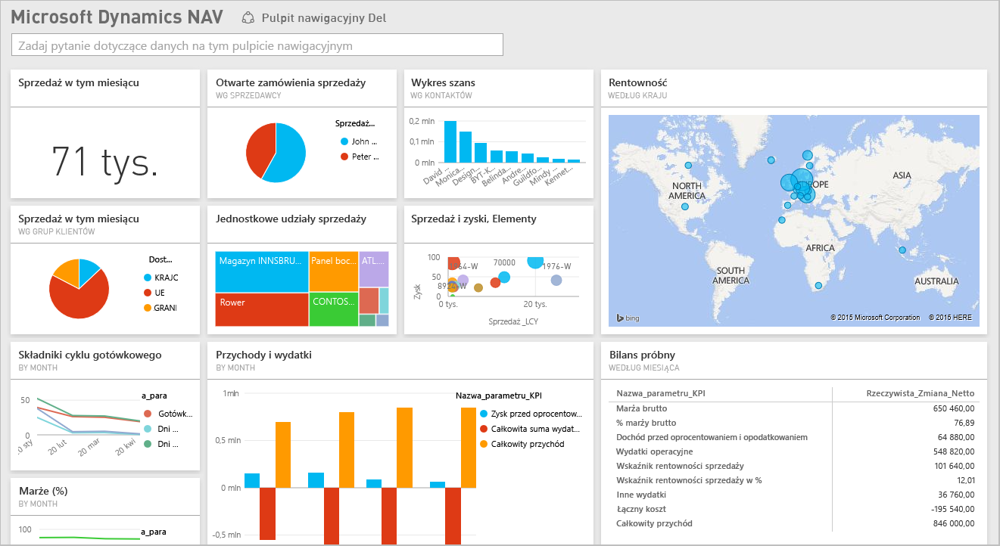

# Nawiązywanie połączenia z systemem Microsoft Dynamics NAV przy użyciu usługi Power BI
Pobieranie szczegółowych informacji o danych systemu Microsoft Dynamics NAV przy użyciu usługi Power BI jest łatwe. Usługa Power BI pobiera dane, zarówno dotyczące sprzedaży, jak i finansowe, a następnie tworzy aplikację za pomocą pulpitu nawigacyjnego i raportów opartych na tych danych. Usługa Power BI wymaga Twoich uprawnień do tabel, z których dane są pobierane, w tym przypadku dane o sprzedaży i finansach. Więcej szczegółowych informacji na temat wymagań znajduje się poniżej. Po zainstalowaniu aplikacji możesz wyświetlić pulpit nawigacyjny i raporty w usłudze Power BI ([https://powerbi.com](https://powerbi.com)) oraz w aplikacjach mobilnych usługi Power BI. 

[Połącz się z systemem Microsoft Dynamics NAV dla usługi Power BI](https://app.powerbi.com/getdata/services/microsoft-dynamics-nav) lub przeczytaj więcej na temat [integracji systemu Dynamics NAV](https://powerbi.microsoft.com/integrations/microsoft-dynamics-nav) przy użyciu usługi Power BI.

## Jak nawiązać połączenie
[!INCLUDE [powerbi-service-apps-get-more-apps](./includes/powerbi-service-apps-get-more-apps.md)]

1. Wybierz pozycję **Microsoft Dynamics NAV**, a następnie wybierz pozycję **Pobierz**.  
   
2. Po wyświetleniu monitu wprowadź adres URL usługi OData dla systemu Microsoft Dynamics NAV. Adres URL powinien być zgodny z następującym wzorcem:
   
    `https//instance.navserver.com:7048/DynamicsNAV90_Instance1/OData/Company('CRONUS%20International%20Ltd.')`
   
   * „instance.navserver.com” z Twoją nazwą serwera NAV
   * „DynamicsNAV90\_Instance1” z Twoją nazwą wystąpienia serwera NAV
   * „Company('CRONUS%20International%20Ltd.')” z nazwą Twojej firmy NAV
     
     Odnalezienie usługi internetowej powerbifinance i skopiowanie adresu URL usługi OData, ale pomijając ciąg „/powerbifinance” w adresie URL, jest łatwym sposobem uzyskiwania tego adresu URL możliwym w systemie Dynamics NAV po przejściu do usług internetowych.  
     
3. Wybierz pozycję **Podstawowa** i wprowadź swoje poświadczenia systemu Microsoft Dynamics NAV.
   
    Musisz mieć poświadczenia administratora (lub przynajmniej uprawnienia do danych sprzedaży i finansowych) dla swojego konta w systemie Microsoft Dynamics NAV.  Tylko uwierzytelnianie podstawowe (nazwa użytkownika i hasło) jest obecnie obsługiwane.
   
    
4. Usługa Power BI pobierze dane systemu Microsoft Dynamics NAV i utworzy gotowy do użycia pulpit nawigacyjny i raport.   
   

## Wyświetlanie raportów i pulpitu nawigacyjnego
[!INCLUDE [powerbi-service-apps-open-app](./includes/powerbi-service-apps-open-app.md)]

[!INCLUDE [powerbi-service-apps-open-app](./includes/powerbi-service-apps-what-now.md)]

## Zawartość pakietu
Pulpit nawigacyjny i raporty zawierają dane z następujących tabel (z uwzględnieniem wielkości liter):  

* ItemSalesAndProfit  
* ItemSalesByCustomer  
* powerbifinance  
* SalesDashboard  
* SalesOpportunities  
* SalesOrdersBySalesPerson  
* TopCustomerOverview  

## Wymagania systemowe
Aby zaimportować dane systemu Microsoft Dynamics NAV do usługi Power BI, musisz mieć uprawnienia do danych tabel sprzedaży i finansowych, skąd dane są pobierane (wymienionych powyżej). Tabele również muszą zawierać pewne dane, ponieważ import pustych tabel obecnie zakończy się niepowodzeniem.

## Rozwiązywanie problemów
Usługa Power BI korzysta z usług internetowych systemu Microsoft Dynamics NAV do pobierania danych. Jeśli masz dużą ilość danych w wystąpieniu systemu Microsoft Dynamics NAV, sugestią mającą zminimalizować wpływ na użycie usługi internetowej jest zmiana częstotliwości odświeżania odpowiednio do potrzeb. Inną sugestią jest utworzenie aplikacji przez jednego administratora i udostępnienie jej zamiast tworzenia własnej przez każdego administratora.

**„Walidacja parametru nie powiodła się, upewnij się, że wszystkie parametry są prawidłowe”**  
Jeśli po wpisaniu adresu URL systemu Microsoft Dynamics NAV zostanie wyświetlony ten błąd. Upewnij się, że są spełnione następujące wymagania:

* Adres URL dokładnie odpowiada temu wzorcowi:
  
    `https//instance.navserver.com:7048/DynamicsNAV90_Instance1/OData/Company('CRONUS%20International%20Ltd.')`
  
  * „instance.navserver.com” z Twoją nazwą serwera NAV
  * „DynamicsNAV90\_Instance1” z Twoją nazwą wystąpienia serwera NAV
  * „Company('CRONUS%20International%20Ltd.')” z nazwą Twojej firmy NAV
* Upewnij się, że wszystkie litery są małymi literami.  
* Upewnij się, że adres URL zaczyna się od „https”.  
* Na końcu adresu URL nie może znajdować się ukośnik.

**„Logowanie nie powiodło się”**  
Jeśli po zalogowaniu się przy użyciu poświadczeń systemu Microsoft Dynamics NAV otrzymasz komunikat o błędzie „Logowanie nie powiodło się”, może to oznaczać napotkanie jednego z następujących problemów:

* Konto, którego używasz, nie ma uprawnień do pobierania danych systemu Microsoft Dynamics NAV z Twojego konta. Sprawdź, czy jest to konto administratora, i spróbuj ponownie.
* Wystąpienie systemu Dynamics NAV, z którym próbujesz nawiązać połączenie, nie ma ważnego certyfikatu SSL. W takim przypadku zobaczysz bardziej szczegółowy komunikat o błędzie („nie można ustanowić relacji zaufania SSL”). Należy pamiętać, że certyfikaty z podpisem własnym nie są obsługiwane.

**„Oj”**  
Jeśli zobaczysz okno dialogowe błędu „Oj” po obsłużeniu okna dialogowego uwierzytelniania, w usłudze Power BI wystąpił problem podczas ładowania danych.

* Sprawdź, czy adres URL jest zgodny ze wzorcem określonym powyżej. Powszechnym błędem jest określenie:
  
    `https//instance.navserver.com:7048/DynamicsNAV90\_Instance1/OData`
  
    Należy jednak pamiętać o uwzględnieniu sekcji „Company('CRONUS%20International%20Ltd.')” z nazwą Twojej firmy NAV:
  
    `https//instance.navserver.com:7048/DynamicsNAV90\_Instance1/OData/Company('CRONUS%20International%20Ltd.')`

## Następne kroki
* [Czym są aplikacje w usłudze Power BI?](consumer/end-user-apps.md)
* [Pobieranie danych w usłudze Power BI](service-get-data.md)
* Masz więcej pytań? [Zadaj pytanie społeczności usługi Power BI](http://community.powerbi.com/)

