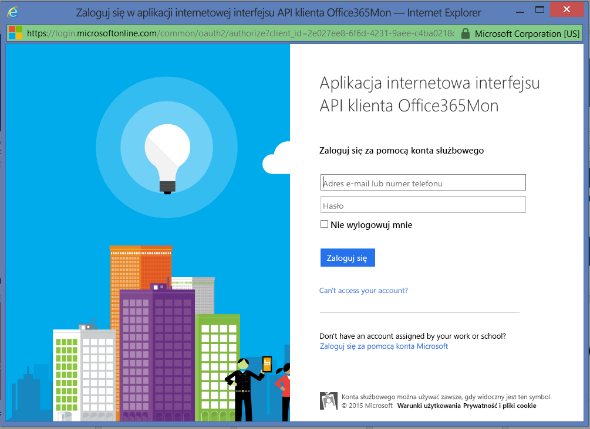

# Łączenie się z pakietem zawartości Office365Mon za pomocą usługi Power BI
Analizowanie danych wydajności dotyczących kondycji i awarii usługi Office 365 jest bardzo proste dzięki usłudze Power BI i pakietowi zawartości Office365Mon. Usługa Power BI pobiera dane, w tym dane sond kondycji i awarii, a następnie tworzy gotowy pulpit nawigacyjny i gotowe raporty na podstawie tych danych.

Połącz się z [pakietem zawartości Office365Mon](https://app.powerbi.com/groups/me/getdata/services/office365mon) dla usługi Power BI.

>[!NOTE]
>Aby nawiązać połączenie i załadować pakiet zawartości usługi Power BI, wymagane jest konto administratora Office365Mon.

## Jak nawiązać połączenie
1. Wybierz pozycję **Pobierz dane** w dolnej części okienka nawigacji po lewej stronie.
   
   
2. W polu **Usługi** wybierz pozycję **Pobierz**.
   
    
3. Wybierz pozycję **Office365Mon** \> **Pobierz**.
   
   
4. Jako metodę uwierzytelniania wybierz opcję **oAuth2** \> **Zaloguj**.
   
   Po wyświetleniu monitu wprowadź swoje poświadczenia administratora Office365Mon i postępuj zgodnie z procesem uwierzytelniania.
   
   
   
   
5. Po zaimportowaniu danych przez usługę Power BI zobaczysz nowy pulpit nawigacyjny, raport i zestaw danych w okienku nawigacji po lewej stronie. Nowe elementy są oznaczone żółtą gwiazdką \*, wybierz pozycję Office365Mon.
   
   

**Co teraz?**

* Spróbuj [zadać pytanie w polu funkcji Pytania i odpowiedzi](consumer/end-user-q-and-a.md) w górnej części pulpitu nawigacyjnego
* [Zmień kafelki](service-dashboard-edit-tile.md) na pulpicie nawigacyjnym.
* [Wybierz kafelek](consumer/end-user-tiles.md), aby otworzyć raport źródłowy.
* Dla zestawu danych jest zaplanowane codzienne odświeżanie, ale możesz zmienić harmonogram odświeżania lub odświeżyć go na żądanie przy użyciu polecenia **Odśwież teraz**

## Rozwiązywanie problemów
Jeśli po zalogowaniu się przy użyciu poświadczeń subskrypcji pakietu Office365Mon otrzymasz komunikat o błędzie **„Logowanie nie powiodło się”**, oznacza to, że konto, którego używasz, nie ma uprawnień do pobierania danych pakietu Office365Mon z Twojego konta. Sprawdź, czy jest to konto administratora, i spróbuj ponownie.

## Następne kroki
[Co to jest usługa Power BI?](power-bi-overview.md)

[Pobieranie danych dla usługi Power BI](service-get-data.md)

