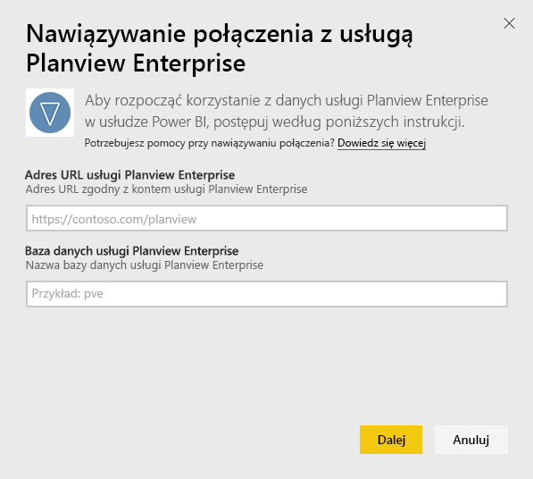

# Łączenie się z usługą Planview Enterprise przy użyciu usługi Power BI
Pakiet zawartości Planview Enterprise umożliwia wizualizowanie danych dotyczących zasobów i zarządzania pracą w całkiem nowy sposób bezpośrednio w usłudze Power BI. Użyj poświadczeń logowania usługi Planview Enterprise, aby w sposób interaktywny wyświetlić wydatki inwestycyjne w portfolio, ocenić, które z nich przekraczają budżet, a które mieszczą się w jego limitach oraz dowiedzieć się, jak realizowane projekty wpisują się w firmowe priorytety strategiczne. Ponadto można rozszerzyć gotowy do użycia pulpit nawigacyjny i raporty, aby uzyskać szczegółowe informacje, które są dla Ciebie najważniejsze.

Połącz się z [pakietem zawartości Planview Enterprise w usłudze Power BI](https://app.powerbi.com/getdata/services/planview-enterprise)

>[!NOTE]
>Aby zaimportować dane usługi Planview Enterprise do usługi Power BI, trzeba być użytkownikiem usługi Planview Enterprise z włączoną funkcją Reporting Portal Viewer. Zobacz dodatkowe wymagania poniżej.

## Jak nawiązać połączenie
1. Wybierz pozycję **Pobierz dane** w dolnej części okienka nawigacji po lewej stronie.
   
    
2. W polu **Usługi** wybierz pozycję **Pobierz**.
   
    
3. Na stronie usługi Power BI wybierz opcję **Planview Enterprise**, a następnie wybierz pozycję **Pobierz**:  
    
4. W polu tekstowym adresu URL usługi Planview Enterprise wprowadź adres URL serwera Planview Enterprise, którego chcesz używać. W polu tekstowym bazy danych usługi Planview Enterprise wprowadź nazwę bazy danych usługi Planview Enterprise, a następnie kliknij przycisk Dalej.  
    
5. Na liście Metoda uwierzytelniania wybierz opcję **Podstawowa**, jeśli nie jest jeszcze wybrana. W polach **Nazwa użytkownika** i **Hasło** wprowadź odpowiednie wartości dla konta i wybierz przycisk **Zaloguj**.  
   
6. W lewym okienku wybierz opcję Planview Enterprise z listy pulpitów nawigacyjnych.  
     Usługa Power BI zaimportuje dane usługi Planview Enterprise do pulpitu nawigacyjnego. Pamiętaj, że ładowanie danych może zająć trochę czasu.  
    

**Co teraz?**

* Spróbuj [zadać pytanie w polu funkcji Pytania i odpowiedzi](power-bi-q-and-a.md) w górnej części pulpitu nawigacyjnego
* [Zmień kafelki](service-dashboard-edit-tile.md) na pulpicie nawigacyjnym.
* [Wybierz kafelek](service-dashboard-tiles.md), aby otworzyć raport źródłowy.
* Zestaw danych zostanie ustawiony na codzienne odświeżanie, ale możesz zmienić harmonogram odświeżania lub spróbować odświeżyć go na żądanie przy użyciu opcji **Odśwież teraz**

## Wymagania systemowe
Aby zaimportować dane usługi Planview Enterprise do usługi Power BI, trzeba być użytkownikiem usługi Planview Enterprise z włączoną funkcją Reporting Portal Viewer. Zobacz dodatkowe wymagania poniżej.

W tej procedurze przyjęto, że zalogowano się już na stronie głównej usługi Microsoft Power BI przy użyciu konta usługi Power BI. Jeśli nie masz konta usługi Power BI, przejdź na stronę [powerbi.com](https://powerbi.microsoft.com/get-started/) i w sekcji **Power BI — Udostępnianie i współpraca w chmurze** wybierz pozycję **Wypróbuj bezpłatnie**. Następnie kliknij pozycję **Pobierz dane**.

## Następne kroki:

[Co to jest usługa Power BI?](power-bi-overview.md)

[Pobieranie danych dla usługi Power BI](service-get-data.md)