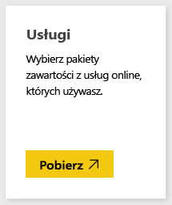
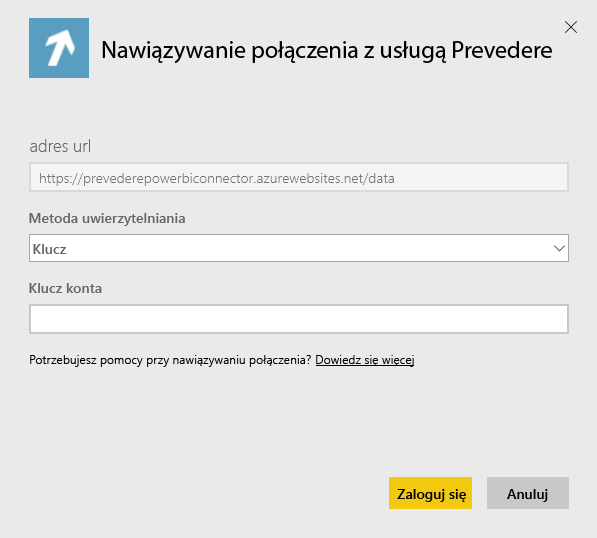
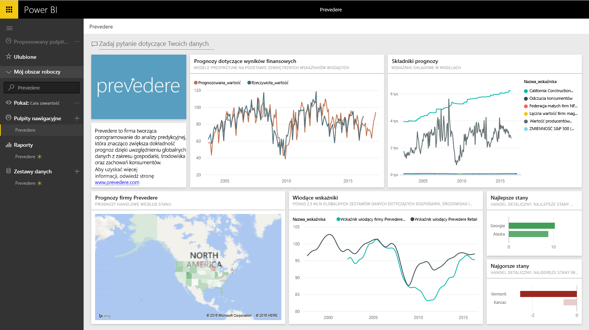

# Łączenie się z pakietem zawartości Prevedere przy użyciu usługi Power BI
Uzyskaj dostęp do wyłącznych i kluczowych informacji finansowych, które pozwolą pewnie oraz aktywnie rozwijać Twoją firmę.

Połącz się z [pakietem zawartości Prevedere](https://app.powerbi.com/getdata/services/prevedere) dla usługi Power BI.

>[!NOTE]
>Jeśli nie jesteś jeszcze użytkownikiem usługi Prevedere, skorzystaj z [klucza przykładowego](https://prevederepowerbiconnector.azurewebsites.net/static/learnmore.html), aby ją wypróbować.

## Jak nawiązać połączenie
1. Wybierz pozycję **Pobierz dane** w dolnej części okienka nawigacji po lewej stronie.
   
   
2. W polu **Usługi** wybierz pozycję **Pobierz**.
   
   
3. Wybierz pozycję **Prevedere**, a następnie pozycję **Pobierz**.
   
   
4. W polu **Metoda uwierzytelniania** wybierz opcję **Klucz** i wprowadź klucz interfejsu API usługi Prevedere.
   
    
5. Kliknij przycisk **Zaloguj**, aby rozpocząć proces importowania. Po zakończeniu tego procesu w okienku nawigacji zostaną wyświetlone nowy pulpit nawigacyjny, raport i model. Wybierz pulpit nawigacyjny, aby wyświetlić zaimportowane dane.
   
     

**Co teraz?**

* Spróbuj [zadać pytanie w polu funkcji Pytania i odpowiedzi](power-bi-q-and-a.md) w górnej części pulpitu nawigacyjnego
* [Zmień kafelki](service-dashboard-edit-tile.md) na pulpicie nawigacyjnym.
* [Wybierz kafelek](service-dashboard-tiles.md), aby otworzyć raport źródłowy.
* Zestaw danych zostanie ustawiony na codzienne odświeżanie, ale możesz zmienić harmonogram odświeżania lub spróbować odświeżyć go na żądanie przy użyciu opcji **Odśwież teraz**

## Zawartość pakietu
Pakiet zawartości pozwala uzyskać dostęp do analiz dotyczących prognoz sprzedaży detalicznej, modeli prognoz, wskaźników wyprzedzających i innych.

## Wymagania systemowe
Ten pakiet zawartości wymaga dostępu do klucza interfejsu API usługi Prevedere lub klucza przykładowego (zobacz poniżej).

## Znajdowanie parametrów

Istniejący klienci mogą uzyskać dostęp do danych przy użyciu klucza interfejsu API. Jeśli nie jesteś jeszcze naszym klientem, możesz wyświetlić przykładowe dane i analizy przy użyciu [klucza przykładowego](https://prevederepowerbiconnector.azurewebsites.net/static/learnmore.html).

## Rozwiązywanie problemów
Ładowanie danych może zająć trochę czasu w zależności od wystąpienia.

## Następne kroki
[Wprowadzenie do usługi Power BI](service-get-started.md)

[Pobieranie danych w usłudze Power BI](service-get-data.md)

