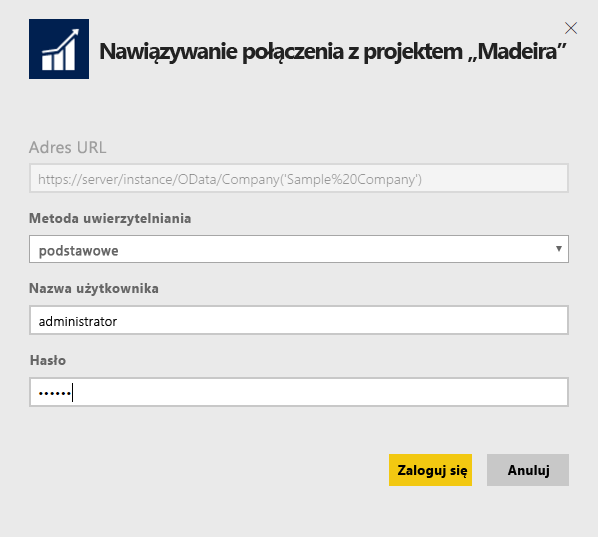
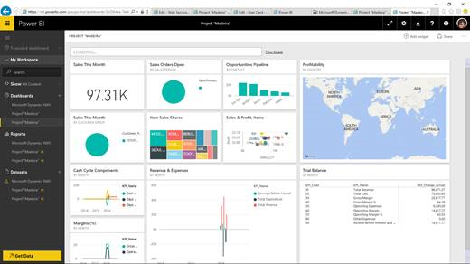

# Łączenie się z projektem Project Madeira przy użyciu usługi Power BI
Pobieranie szczegółowych informacji o danych projektu Project Madeira przy użyciu usługi Power BI i pakietu zawartości projektu Project Madeira jest łatwe. Usługa Power BI pobiera dane, zarówno dotyczące sprzedaży, jak i finansowe, a następnie tworzy gotowe pulpity nawigacyjne i raporty na podstawie tych danych.
Nawiąż połączenie z projektem Project Madeira dla usługi Power BI lub uzyskaj więcej informacji o integracji projektu Project Madeira z usługą Power BI.

>[!NOTE]
>Ten pakiet zawartości wymaga uprawnień do tabel, z których pobierane są dane, w tym przypadku dane o sprzedaży i finansach. Więcej szczegółowych informacji na temat wymagań znajduje się [poniżej](#Requirements).

Połącz się z [pakietem zawartości Project Madeira Analytics](https://app.powerbi.com/getdata/services/project-madeira) dla usługi Power BI.

## Jak nawiązać połączenie
1. Wybierz pozycję **Pobierz dane** w dolnej części okienka nawigacji po lewej stronie.  
    
2. W polu **Usługi** wybierz pozycję **Pobierz**.  
    
3. Wybierz kolejno opcje **Project Madeira** i **Pobierz**.  
    
4. Po wyświetleniu monitu wprowadź adres URL projektu Project Madeira. Adres URL musi być zgodny z następującym wzorem: https://mycronusus.projectmadeira.com:7048/NAV/OData/Company('CRONUS%20US'), z nazwą firmy w projekcie Project Madeira. Adres nie zawiera końcowego ukośnika, a połączenie musi być nawiązane za pośrednictwem protokołu https. Informacje dotyczące tego, jak znaleźć ten adres URL, znajdują się [poniżej](#FindingParams).  
   
    
5. Po wyświetleniu monitu wybierz opcję uwierzytelniania Podstawowe, wprowadź adres e-mail projektu Project Madeira jako nazwę użytkownika, a następnie wprowadź klucz dostępu usługi internetowej dla konta projektu Project Madeira jako hasło. Jeśli już wcześniej zalogowano się w projekcie Project Madeira w przeglądarce, monit o poświadczenia może nie zostać wyświetlony. Sprawdź szczegółowe informacje dotyczące generowania tego klucza dostępu [poniżej](#FindingParams).  
   
    >[!NOTE]
    >W projekcie Project Madeira musisz być superużytkownikiem.
   
    
6. Po nawiązaniu połączenia automatycznie zostanie załadowany pulpit nawigacyjny, raport i zestaw danych. Po zakończeniu kafelki zostaną zaktualizowane przy użyciu danych pochodzących z konta.  
   
    

**Co teraz?**

* Spróbuj [zadać pytanie w polu funkcji Pytania i odpowiedzi](service-q-and-a.md) w górnej części pulpitu nawigacyjnego
* [Zmień kafelki](service-dashboard-edit-tile.md) na pulpicie nawigacyjnym.
* [Wybierz kafelek](service-dashboard-tiles.md), aby otworzyć raport źródłowy.
* Zestaw danych zostanie ustawiony na codzienne odświeżanie, ale możesz zmienić harmonogram odświeżania lub spróbować odświeżyć go na żądanie przy użyciu opcji **Odśwież teraz**

## Wymagania systemowe
Aby zaimportować dane projektu Project Madeira do usługi Power BI, musisz mieć uprawnienia do danych tabel danych sprzedaży i finansowych, skąd pobierane są dane. Wszystkie tabele (z uwzględnieniem wielkości liter) wymagane dla pakietu zawartości to:  

    - ItemSalesAndProfit  
    - ItemSalesByCustomer  
    - powerbifinance  
    - SalesDashboard  
    - SalesOpportunities  
    - SalesOrdersBySalesPerson  
    - TopCustomerOverview  

## Znajdowanie parametrów
**Uzyskiwanie właściwego adresu URL** Aby łatwo uzyskać ten adres URL, przejdź do pozycji Web Services (Usługi internetowe) w projekcie Project Madeira, znajdź usługę internetową powerbifinance i skopiuj adres URL usługi Odata (kliknij ją prawym przyciskiem myszy, a następnie kliknij opcję Kopiuj skrót) z pominięciem ciągu „/powerbifinance...” w adresie URL.

**Klucze dostępu usługi internetowej** Aby użyć danych z projektu Project Madeira, konieczne jest utworzenie klucza dostępu usług internetowych dla konta użytkownika. W projekcie Project Madeira wyszukaj stronę Users (Użytkownicy), a następnie otwórz kartę konta użytkownika. W tym miejscu możesz wygenerować nowy klucz dostępu usługi internetowej i skopiować go do pola Hasło na stronie połączenia usługi Power BI.

Gdy zaczniesz używać kluczy dostępu usługi internetowej, konieczne będzie korzystanie z nich w przyszłości, więc po pojawieniu się komunikatu wybierz przycisk OK.
Podczas tworzenia klucza możesz wybrać, czy ma wygasać konkretnego dnia.

Po wybraniu przycisku OK klucz zostanie utworzony i będzie można skopiować go do pola Hasło na stronie połączenia w usłudze Power BI.

## Rozwiązywanie problemów
Pulpit nawigacyjny usługi Power BI korzysta z opublikowanych usług internetowych wymienionych powyżej i pokazuje dane z firmy pokazowej lub własnej firmy, jeśli importujesz dane z bieżącego rozwiązania finansowego. Jednak jeśli coś pójdzie nie tak, w tej sekcji znajdziesz obejścia wielu typowych problemów.

**„Walidacja parametru nie powiodła się. Upewnij się, że wszystkie parametry są prawidłowe”. **Jeśli po wprowadzeniu adresu URL projektu Project Madeira zostanie wyświetlony ten komunikat o błędzie, upewnij się, że są spełnione następujące wymagania:  

    - Adres URL jest zgodny ze wzorem https://*mycronusus*.projectmadeira.com:7048/NAV/OData/Company('*CRONUS%20US*').  
    - Usuń wszelki tekst po nazwie firmy w nawiasie.  
    - Upewnij się, że na końcu adresu URL nie znajduje się ukośnik.  
    - Upewnij się, że adres URL korzysta z bezpiecznego połączenia. Adres URL rozpoczynający się od https oznacza bezpieczne połączenie.  

**„Logowanie nie powiodło się”** Jeśli podczas logowania do pulpitu nawigacyjnego przy użyciu poświadczeń projektu Project Madeira pojawi się komunikat „Logowanie nie powiodło się”, może być to spowodowane przez jeden z następujących problemów:  

    - Konto, którego używasz, nie ma uprawnień do odczytywania danych projektu Project Madeira z Twojego konta. Sprawdź swoje konto użytkownika w projekcie Project Madeira i upewnij się, że użyto właściwego klucza dostępu usługi internetowej jako hasła, a następnie spróbuj ponownie.  
    - Wystąpienie projektu Project Madeira, z którym próbujesz nawiązać połączenie, nie ma ważnego certyfikatu SSL. W takim przypadku zobaczysz bardziej szczegółowy komunikat o błędzie („nie można ustanowić relacji zaufania SSL”). Należy pamiętać, że certyfikaty z podpisem własnym nie są obsługiwane.  

**„Niestety”** Jeśli po przejściu okna dialogowego uwierzytelnienia wyświetli się okno dialogowe z komunikatem „Niestety”, jest to najczęściej spowodowane przez problem z połączeniem z danymi pakietu zawartości. Sprawdź, czy adres URL jest zgodny ze wzorem określonym wcześniej:  
    https://*mycronusus*.projectmadeira.com:7048/NAV/OData/Company('*CRONUS%20US*')

Powszechnym błędem jest wprowadzanie pełnego adresu URL konkretnej usługi internetowej:  
    https://*mycronusus*.projectmadeira.com:7048/NAV/OData/Company('*CRONUS%20US*')/powerbifinance

Możliwe też, że brakuje nazwy firmy:   
    https://*mycronusus*.projectmadeira.com:7048/NAV/OData/

## Następne kroki
[Wprowadzenie do usługi Power BI](service-get-started.md)

[Power BI — podstawowe pojęcia](service-basic-concepts.md)

