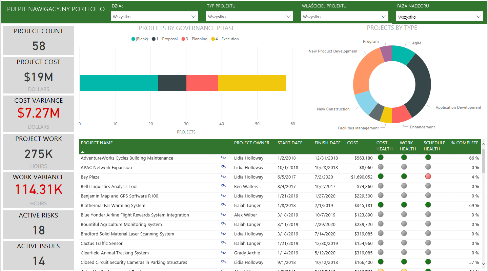
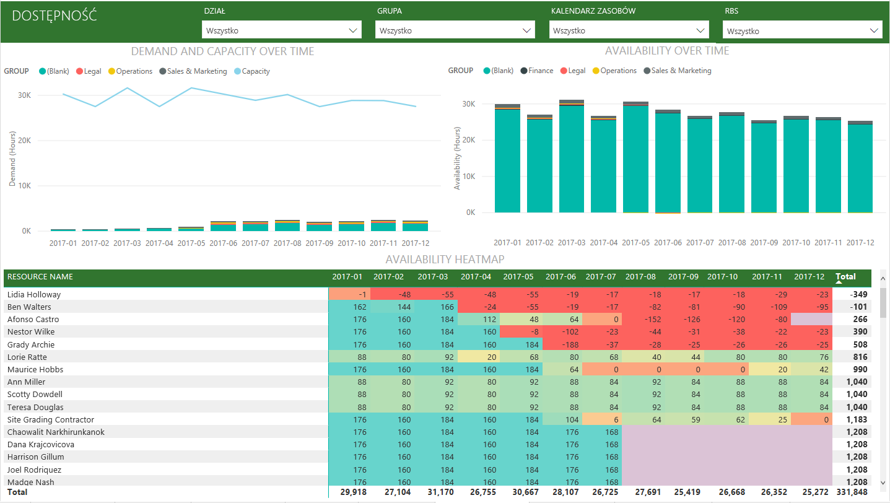
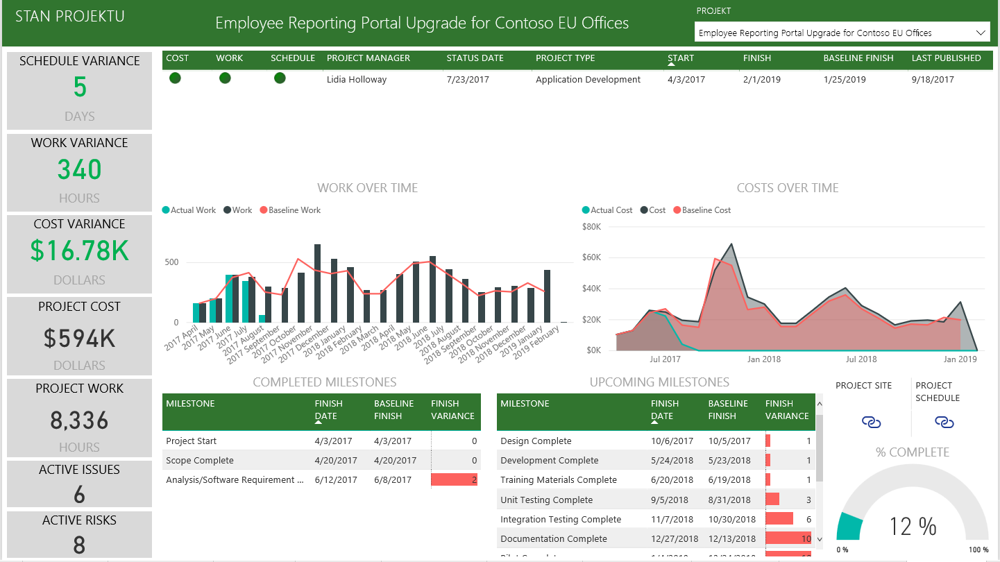

# Łączenie się z usługą Project Online przy użyciu usługi Power BI
Microsoft Project Online to elastyczne rozwiązanie online do zarządzania portfelem projektów (PPM) i codziennej pracy. Usługa Project Online pozwala organizacjom rozpocząć pracę, ustalić priorytety inwestycji projektowych i dostarczyć zamierzoną wartość biznesową. Pakiet zawartości Project Online dla usługi Power BI umożliwia uzyskiwanie szczegółowych informacji z usługi Project Online, co ułatwia zarządzanie projektami, portfelami i zasobami.

Połącz się z [pakietem zawartości Project Online](https://app.powerbi.com/getdata/services/project-online) dla usługi Power BI.

## Jak nawiązać połączenie
1. Wybierz pozycję **Pobierz dane** w dolnej części okienka nawigacji po lewej stronie.
   
    
2. W polu **Usługi** wybierz pozycję **Pobierz**.
   
   
3. Wybierz pozycję **Microsoft Project Online** \> **Pobierz**.
   
   
4. W polu tekstowym **Adres URL aplikacji Project Web App** wprowadź adres URL programu Project Web Add (PWA), z którym chcesz nawiązać połączenie i naciśnij przycisk **Dalej**. Należy pamiętać, że adres może być inny niż w podanym przykładzie, jeśli masz domenę niestandardową. W polu tekstowym **Język witryny programu PWA** wpisz liczbę, która odpowiada językowi witryny programu PWA. Wpisz pojedynczą cyfrę „1” w przypadku języka angielskiego, „2” — francuskiego, „3” — niemieckiego, „4” — portugalskiego (Brazylia), „5” — portugalskiego (Portugalia) i „6” — hiszpańskiego. 
   
    
5. Jako metodę uwierzytelniania wybierz opcję **oAuth2** \> **Zaloguj**. Po wyświetleniu monitu wprowadź swoje poświadczenia usługi Project Online i postępuj zgodnie z procesem uwierzytelniania.
   
    
    
Zwróć uwagę, że w aplikacji internetowej, z którą masz połączenie, musisz mieć uprawnienia do podglądu portfela, zarządzania portfelem lub administrowania.

6. Zostanie wyświetlone powiadomienie informujące, że trwa ładowanie danych. Proces ten może zająć trochę czasu w zależności od konta. Po zaimportowaniu danych przez usługę Power BI zobaczysz nowy pulpit nawigacyjny, 13 raportów i zestaw danych w okienku nawigacji po lewej stronie. Jest to domyślny pulpit nawigacyjny utworzony przez usługę Power BI do wyświetlania Twoich danych. Możesz modyfikować pulpit nawigacyjny, aby wyświetlać dane w dowolny sposób.

   

7. Gdy pulpit nawigacyjny i raporty będą gotowe, przejdź dalej i rozpocznij eksplorowanie danych usługi Project Online. Pakiet zawartości zawiera 13 zaawansowanych i szczegółowych raportów dotyczących omówienia portfela (6 stron raportu), omówienia zasobów (5 stron raportu) i stanu projektu (2 strony raportu). 

   
   
   
   
   

**Co teraz?**

* Spróbuj [zadać pytanie w polu funkcji Pytania i odpowiedzi](power-bi-q-and-a.md) w górnej części pulpitu nawigacyjnego
* [Zmień kafelki](service-dashboard-edit-tile.md) na pulpicie nawigacyjnym.
* [Wybierz kafelek](service-dashboard-tiles.md), aby otworzyć raport źródłowy.
* Zestaw danych zostanie ustawiony na codzienne odświeżanie, ale możesz zmienić harmonogram odświeżania lub spróbować odświeżyć go na żądanie przy użyciu opcji **Odśwież teraz**

**Rozbudowywanie pakietu zawartości**

Pobierz [plik PBIT usługi GitHub](https://github.com/OfficeDev/Project-Power-BI-Content-Packs) w celu dalszego dostosowywania i zaktualizowania pakietu zawartości

## Następne kroki
[Wprowadzenie do usługi Power BI](service-get-started.md)

[Pobieranie danych w usłudze Power BI](service-get-data.md)

