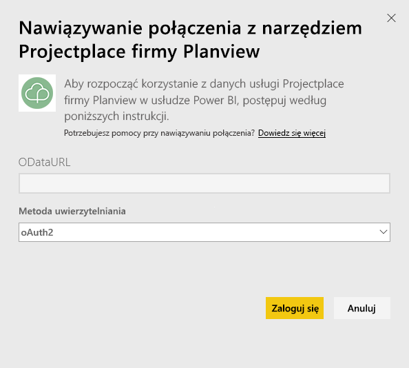

# Nawiązywanie połączenia z narzędziem Projectplace od firmy Planview przy użyciu usługi Power BI
Z pakietem zawartości Projectplace od firmy Planview możesz wizualizować dane projektu opracowywanego we współpracy, korzystając z zupełnie nowych sposobów bezpośrednio w usłudze Power BI. Użyj poświadczeń logowania narzędzia Projectplace, aby interaktywnie wyświetlić kluczowe statystyki dotyczące projektu, znaleźć najbardziej aktywnych i produktywnych członków zespołu oraz zidentyfikować karty i działania z ryzykiem w wielu projektach na koncie Projectplace. Ponadto można rozszerzyć gotowy do użycia pulpit nawigacyjny i raporty, aby uzyskać szczegółowe informacje, które są dla Ciebie najważniejsze.

[Nawiązywanie połączenia z pakietem zawartości Projectplace w usłudze Power BI](https://app.powerbi.com/getdata/services/projectplace)

>[!NOTE]
>Aby zaimportować dane Projectplace do usługi Power BI, musisz być użytkownikiem narzędzia Projectplace. Zobacz dodatkowe wymagania poniżej.

## Jak nawiązać połączenie
1. Wybierz pozycję **Pobierz dane** w dolnej części okienka nawigacji po lewej stronie.
   
    
2. W polu **Usługi** wybierz pozycję **Pobierz**.
   
    
3. Na stronie usługi Power BI wybierz opcję **Projectplace od firmy Planview**, a następnie wybierz pozycję **Pobierz**:  
   
    
4. W polu tekstowym Adres URL strumieniowego źródła danych OData wprowadź adres URL strumieniowego źródła danych OData narzędzia Projectplace, którego chcesz użyć, jak pokazano na poniższej ilustracji:
   
    
5. Na liście Metoda uwierzytelniania wybierz opcję **OAuth**, jeśli nie jest jeszcze wybrana. Wybierz opcję **Zaloguj** i postępuj zgodnie z przepływem logowania.  
   
   
6. W lewym okienku wybierz opcję **Projectplace** z listy pulpitów nawigacyjnych. Usługa Power BI zaimportuje dane Projectplace do pulpitu nawigacyjnego. Należy pamiętać, że ładowanie danych może zająć trochę czasu.  
   
    Pulpit nawigacyjny zawiera kafelki, które wyświetlają dane z bazy danych Projectplace. Na poniższej ilustracji przedstawiono przykład domyślnego pulpitu nawigacyjnego Projectplace w usłudze Power BI.
   
    

**Co teraz?**

* Spróbuj [zadać pytanie w polu funkcji Pytania i odpowiedzi](power-bi-q-and-a.md) w górnej części pulpitu nawigacyjnego
* [Zmień kafelki](service-dashboard-edit-tile.md) na pulpicie nawigacyjnym.
* [Wybierz kafelek](service-dashboard-tiles.md), aby otworzyć raport źródłowy.
* Zestaw danych zostanie ustawiony na codzienne odświeżanie, ale możesz zmienić harmonogram odświeżania lub spróbować odświeżyć go na żądanie przy użyciu opcji **Odśwież teraz**

## Wymagania systemowe
Aby zaimportować dane Projectplace do usługi Power BI, musisz być użytkownikiem narzędzia Projectplace. W tej procedurze przyjęto, że zalogowano się już na stronie głównej usługi Microsoft Power BI przy użyciu konta usługi Power BI. Jeśli nie masz konta usługi Power BI, utwórz nowe, bezpłatne konto usługi Power BI na stronie głównej usługi Power BI, a następnie kliknij opcję Pobierz dane.

## Następne kroki
[Wprowadzenie do usługi Power BI](service-get-started.md)

[Power BI — podstawowe pojęcia](service-basic-concepts.md)

