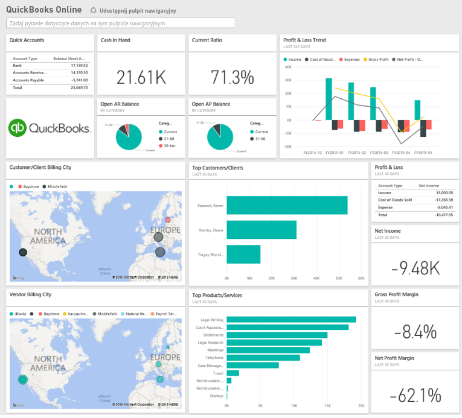

# Nawiązywanie połączenia z usługą QuickBooks Online przy użyciu usługi Power BI
Podczas nawiązywania połączenia z danymi usługi QuickBooks Online z usługi Power BI natychmiast uzyskasz pulpit nawigacyjny oraz raporty usługi Power BI zapewniające wgląd w przepływ gotówki, zyskowność, klientów i wiele innych informacji dotyczących firmy. Możesz użyć pulpitu nawigacyjnego i raportów w takiej formie lub dostosować je, aby podkreślić najważniejsze informacje. Dane są odświeżane automatycznie raz dziennie.

Nawiąż połączenie z [pakietem zawartości QuickBooks Online ](https://dxt.powerbi.com/getdata/services/quickbooks-online) dla usługi Power BI.

>[!NOTE]
>Aby zaimportować dane usługi QuickBooks Online do usługi Power BI, musisz być administratorem konta w usłudze QuickBooks Online oraz musisz zalogować się przy użyciu swoich poświadczeń administratora.

## Jak nawiązać połączenie
1. Wybierz pozycję **Pobierz dane** w dolnej części okienka nawigacji po lewej stronie.
   
    
2. W polu **Usługi** wybierz pozycję **Pobierz**.
   
    
3. Wybierz opcję **QuickBooks Online**, a następnie wybierz opcję **Pobierz**.
   
   
4. Wybierz opcję **oAuth2** jako metodę uwierzytelniania, a następnie wybierz opcję **Zaloguj**. 
5. Po wyświetleniu monitu wprowadź poświadczenia usługi QuickBooks Online i przejdź proces uwierzytelniania w usłudze QuickBooks Online. (Jeśli już wcześniej zalogowano się w usłudze QuickBooks Online w przeglądarce, monit o poświadczenia może nie zostać wyświetlony).
   >[!NOTE]
   >Musisz mieć poświadczenia administratora dla konta usługi QuickBooks Online.
6. Wybierz firmę, z którą chcesz połączyć usługę Power BI na następnym ekranie.
   
   
7. Wybierz opcję **Autoryzuj** na następnym ekranie, aby rozpocząć proces importowania. Może to zająć kilka minut w zależności od rozmiaru danych firmy. 
   
   
   
   Po zaimportowaniu danych przez usługę Power BI zobaczysz nowy pulpit nawigacyjny, raport i zestaw danych w okienku nawigacji po lewej stronie. Nowe elementy są oznaczone żółtą gwiazdką \*.
   
   
8. Wybierz pulpit nawigacyjny usługi QuickBooks Online. Jest to pulpit nawigacyjny utworzony automatycznie przez usługę Power BI w celu wyświetlenia zaimportowanych danych. Możesz modyfikować pulpit nawigacyjny, aby wyświetlać dane w dowolny sposób. 
   
   

**Co teraz?**

* Spróbuj [zadać pytanie w polu funkcji Pytania i odpowiedzi](power-bi-q-and-a.md) w górnej części pulpitu nawigacyjnego
* [Zmień kafelki](service-dashboard-edit-tile.md) na pulpicie nawigacyjnym.
* [Wybierz kafelek](service-dashboard-tiles.md), aby otworzyć raport źródłowy.
* Zestaw danych zostanie ustawiony na codzienne odświeżanie, ale możesz zmienić harmonogram odświeżania lub spróbować odświeżyć go na żądanie przy użyciu opcji **Odśwież teraz**

## Rozwiązywanie problemów
**„Niestety! Wystąpił błąd.”**

Jeśli ten komunikat zostanie wyświetlony po wybraniu opcji **Autoryzuj**:

„Niestety! Wystąpił błąd.” Zamknij to okno i spróbuj ponownie.

Aplikacja jest już subskrybowana przez innego użytkownika dla tej firmy. Skontaktuj się z [adres e-mail administratora], aby wprowadzić zmiany w tej subskrypcji.”

... oznacza to, że inny administrator w firmie już nawiązał połączenie z danymi firmy przy użyciu usługi Power BI. Poproś administratora o udostępnienie pulpitu nawigacyjnego. Obecnie tylko jeden administrator może połączyć dany zestaw danych firmowych usługi QuickBooks Online z usługą Power BI. Po utworzeniu pulpitu nawigacyjnego przez usługę Power BI administrator może udostępnić pulpit wielu współpracownikom w tej samej dzierżawie usługi Power BI.

**„Ta aplikacja nie jest skonfigurowana w sposób zezwalający na nawiązywanie połączeń z Twojego kraju”**

Obecnie usługa Power BI obsługuje wyłącznie wersje USA usługi QuickBooks Online. 

## Następne kroki
[Wprowadzenie do usługi Power BI](service-get-started.md)

[Power BI — podstawowe pojęcia](service-basic-concepts.md)

