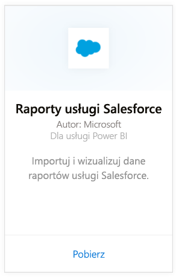
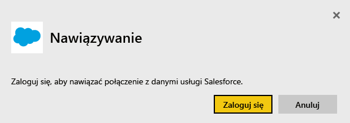
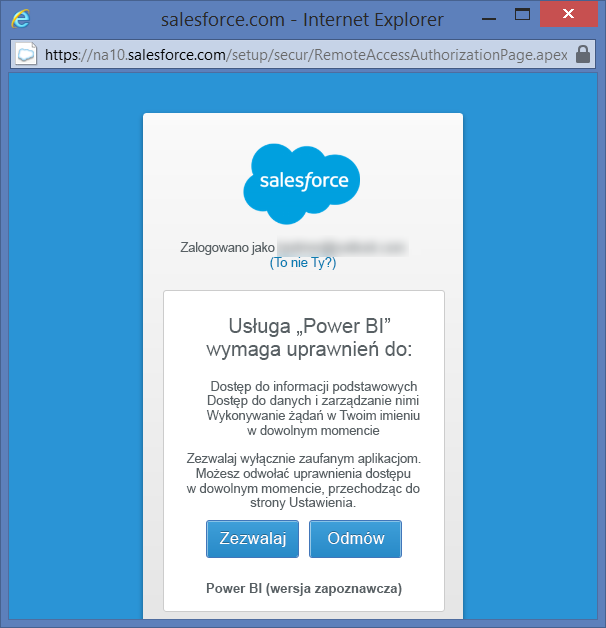
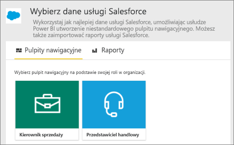
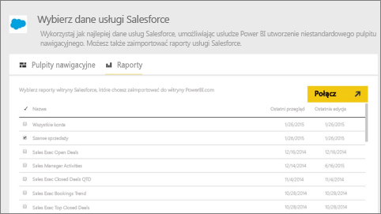
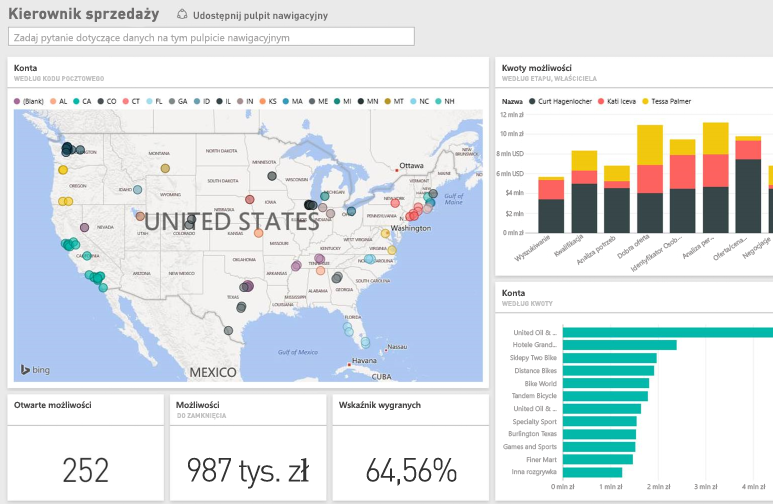

# Nawiązywanie połączenia z usługą Salesforce przy użyciu usługi Power BI
Przy użyciu usługi Power BI możesz z łatwością nawiązać połączenie z kontem Salesforce.com. Utworzenie takiego połączenia spowoduje pobranie danych i automatycznie zapewni pulpit nawigacyjny i powiązane raporty oparte na danych.

Nawiąż połączenie z [pakietem zawartości Salesforce](https://app.powerbi.com/getdata/services/salesforce) dla usługi Power BI lub przeczytaj o [integracji usługi Salesforce](https://powerbi.microsoft.com/integrations/salesforce) z usługą Power BI.

## Jak nawiązać połączenie
1. Wybierz pozycję **Pobierz dane** w dolnej części okienka nawigacji po lewej stronie.
   
    
2. W polu **Usługi** wybierz pozycję **Pobierz**.
   
    
3. Kliknij opcję **Salesforce** i wybierz opcję **Pobierz**.  
   
   
4. Wybierz opcję **Zaloguj**, aby zainicjować przepływ logowania.
   
    
5. Po wyświetleniu monitu wprowadź poświadczenia usługi Salesforce. Kliknij przycisk **Zezwalaj**, aby usługa Power BI mogła uzyskać dostęp do podstawowych informacji i danych usługi Salesforce.
   
   
6. Skonfiguruj, co chcesz zaimportować do usługi Power BI, korzystając z opcji menu rozwijanego:
   
   * **Pulpit nawigacyjny**
     
     Wybierz wstępnie zdefiniowany pulpit nawigacyjny oparty na osobie (np. **Menedżer sprzedaży**). Te pulpity nawigacyjne zapewniają konkretny zestaw standardowych danych z usługi Salesforce i nie będą obejmować pól niestandardowych.
     
     
   * **Raporty**
     
     Wybierz co najmniej jeden raport niestandardowy z konta usługi Salesforce. Raporty te będą pasować do widoków w usłudze Salesforce i mogą obejmować dane z niestandardowych pól lub obiektów.
     
     
     
     Jeśli nie widzisz żadnych raportów, dodaj lub utwórz je na koncie usługi Salesforce i spróbuj ponownie nawiązać połączenie.
7. Kliknij przycisk **Połącz**, aby rozpocząć proces importowania. Podczas importowania zobaczysz powiadomienie informujące o tym, że importowanie jest w toku. Po zakończeniu importowania zostanie wyświetlony pulpit nawigacyjny, raport i zestaw danych oparty na danych usługi Salesforce w okienku nawigacji po lewej stronie.
   
   

Możesz zmienić ten pulpit nawigacyjny, aby wyświetlać dane w dowolny sposób. Możesz zadać pytania przy użyciu funkcji pytań i odpowiedzi lub kliknąć kafelek, aby [otworzyć źródłowy raport](service-dashboard-tiles.md) i [zmienić kafelki](service-dashboard-edit-tile.md) w pulpicie nawigacyjnym.

**Co teraz?**

* Spróbuj [zadać pytanie w polu Pytania i odpowiedzi](power-bi-q-and-a.md) w górnej części pulpitu nawigacyjnego
* [Zmień kafelki](service-dashboard-edit-tile.md) na pulpicie nawigacyjnym
* [Wybierz kafelek](service-dashboard-tiles.md), aby otworzyć raport źródłowy
* Zestaw danych zostanie ustawiony na codzienne odświeżanie, ale możesz zmienić harmonogram odświeżania lub spróbować odświeżyć go na żądanie przy użyciu opcji **Odśwież teraz**

## Wymagania systemowe i zagadnienia
- Połączenie z produkcyjnym kontem usługi Salesforce z włączonym dostępem do interfejsu API
- Udzielenie uprawnień aplikacji Power BI podczas logowania
- Konto ma odpowiednią ilość wywołań interfejsu API, aby ściągać i odświeżać dane
- Do odświeżania wymagany jest ważny token uwierzytelniania. Upewnij się, że masz najwyżej 5 zaimportowanych zestawów danych usługi Salesforce, ponieważ usługa Salesforce stosuje limit 5 tokenów uwierzytelniania na aplikację
- Interfejs API raportów usługi Salesforce ma ograniczenie obsługujące maksymalnie 2000 wierszy danych.

## Rozwiązywanie problemów
Jeśli wystąpią jakiekolwiek problemy, sprawdź powyższe wymagania. Ponadto zwróć uwagę, że możliwość logowania do domeny niestandardowej lub testowej nie jest obecnie obsługiwana.

### Komunikat „Unable to connect to the remote server” (Nie można nawiązać połączenia z serwerem zdalnym)

Jeśli podczas próby nawiązania połączenia z kontem usługi Salesforce zostanie wyświetlony komunikat „Unable to connect to the remote server” (Nie można nawiązać połączenia z serwerem zdalnym), zobacz to rozwiązanie na forum Outsystems: [Salesforce Connector Log In Error Message: Unable to connect to the remote server (Komunikat o błędzie logowania łącznika usługi Salesforce: nie można nawiązać połączenia z serwerem zdalnym)](https://www.outsystems.com/forums/Forum_TopicView.aspx?TopicId=17674&TopicName=log-in-error-message-unable-to-connect-to-the-remote-server&)

## Następne kroki
[Wprowadzenie do usługi Power BI](service-get-started.md)

[Pobieranie danych](service-get-data.md)

