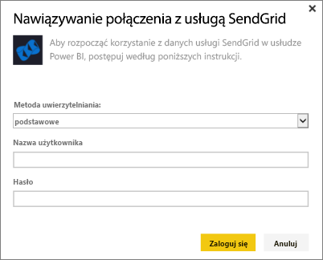
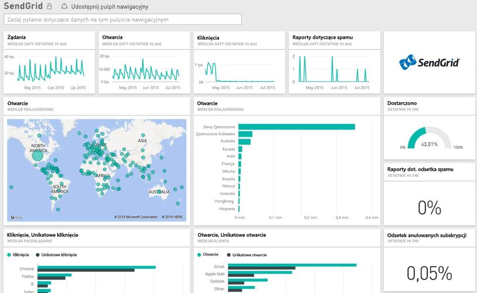

# Łączenie się z usługą SendGrid za pomocą usługi Power BI
Pakiet zawartości Power BI dla usługi SendGrid pozwala na wyodrębnianie szczegółowych danych i statystyk z Twojego konta SendGrid. Przy użyciu pakietu zawartości SendGrid możesz zwizualizować statystyki SendGrid na pulpicie nawigacyjnym.

Połącz się z [pakietem zawartości SendGrid](https://app.powerbi.com/getdata/services/sendgrid) dla usługi Power BI.

## Jak nawiązać połączenie
1. Wybierz pozycję **Pobierz dane** w dolnej części okienka nawigacji po lewej stronie.
   
    
2. W polu **Usługi** wybierz pozycję **Pobierz**.
   
    
3. Wybierz pakiet zawartości **SendGrid**, a następnie kliknij przycisk **Pobierz**.
   
    
4. Po wyświetleniu monitu podaj nazwę użytkownika i hasło do konta SendGrid. Wybierz pozycję **Zaloguj**.
   
   
5. Po zaimportowaniu danych przez usługę Power BI w lewym okienku nawigacji zobaczysz nowy pulpit nawigacyjny, raport i zestaw danych wypełniony statystykami dotyczącymi poczty e-mail z ostatnich 90 dni. Nowe elementy są oznaczone żółtą gwiazdką \*.
   
   

**Co teraz?**

* Spróbuj [zadać pytanie w polu funkcji Pytania i odpowiedzi](consumer/end-user-q-and-a.md) w górnej części pulpitu nawigacyjnego
* [Zmień kafelki](service-dashboard-edit-tile.md) na pulpicie nawigacyjnym.
* [Wybierz kafelek](consumer/end-user-tiles.md), aby otworzyć raport źródłowy.
* Dla zestawu danych jest zaplanowane codzienne odświeżanie, ale możesz zmienić harmonogram odświeżania lub odświeżyć go na żądanie przy użyciu polecenia **Odśwież teraz**

## Zawartość pakietu
Na pulpicie nawigacyjnym SendGrid dostępne są następujące metryki:

* Ogólne statystyki dotyczące wiadomości e-mail: żądania, dostarczone, zwrócone, zablokowane wiadomości-śmieci, raport na temat wiadomości-śmieci itp.
* Statystyka dotycząca wiadomości e-mail według kategorii
* Statystyka dotycząca wiadomości e-mail według lokalizacji geograficznej
* Statystyka dotycząca wiadomości e-mail według usługodawcy internetowego
* Statystyka dotycząca wiadomości e-mail według urządzenia, klienta, przeglądarki

## Następne kroki
[Co to jest usługa Power BI?](power-bi-overview.md)

[Pobieranie danych](service-get-data.md)

