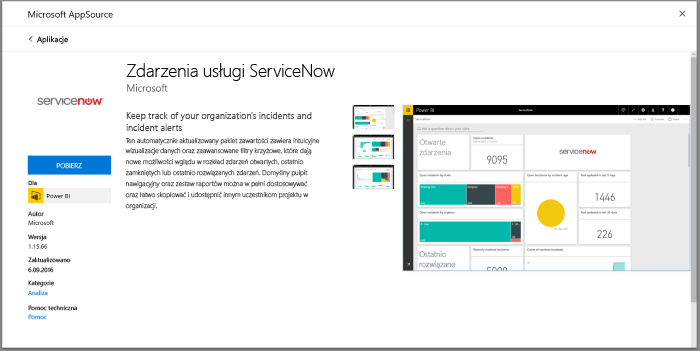
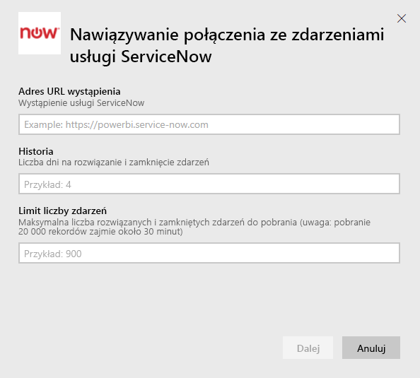
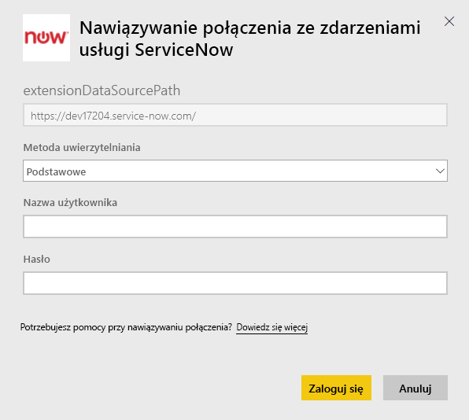
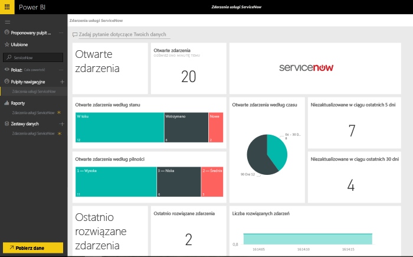

# Łączenie się z usługą ServiceNow za pomocą usługi Power BI w celu raportowania zdarzeń
Firma ServiceNow oferuje wiele produktów i rozwiązań, w tym dotyczących zarządzania działalnością biznesową, bieżącymi operacjami i zarządzania IT, które pozwalają usprawnić firmę. Ten pakiet zawartości obejmuje szereg raportów oraz szczegółowych informacji dotyczących otwartych, ostatnio rozwiązanych i ostatnio zakończonych zdarzeń.  

Połącz się z pakietem zawartości usługi Power BI dla usługi [ServiceNow Incidents](https://app.powerbi.com/getdata/services/servicenow).

## Jak nawiązać połączenie
1. Wybierz pozycję **Pobierz dane** w dolnej części okienka nawigacji po lewej stronie.
   
    
2. W polu **Usługi** wybierz pozycję **Pobierz**.
   
    
3. Wybierz pozycję **ServiceNow Incidents** \> **Pobierz**.
   
   
4. Podaj adres URL wystąpienia usługi ServiceNow i zakres dni/rekordów do pobrania. Po osiągnięciu limitu import zostanie zatrzymany.
   
   
5. Po wyświetleniu monitu wprowadź poświadczenia usługi ServiceNow dla **podstawowej** metody uwierzytelniania. Logowanie jednokrotne nie jest obecnie obsługiwane. Więcej szczegółowych informacji o wymaganiach systemowych można znaleźć poniżej.
   
   
6. Po zakończeniu przepływu logowania rozpocznie się proces importowania. Po zakończeniu nowy pulpit nawigacyjny, raport i model zostaną wyświetlone w okienku nawigacji. Wybierz pulpit nawigacyjny, aby wyświetlić zaimportowane dane.
   
    

**Co teraz?**

* Spróbuj [zadać pytanie w polu funkcji Pytania i odpowiedzi](consumer/end-user-q-and-a.md) w górnej części pulpitu nawigacyjnego
* [Zmień kafelki](service-dashboard-edit-tile.md) na pulpicie nawigacyjnym.
* [Wybierz kafelek](consumer/end-user-tiles.md), aby otworzyć raport źródłowy.
* Dla zestawu danych jest zaplanowane codzienne odświeżanie, ale możesz zmienić harmonogram odświeżania lub odświeżyć go na żądanie przy użyciu polecenia **Odśwież teraz**

## Wymagania systemowe
Aby nawiązać połączenie, potrzebne są następujące elementy:  

* Konto, które może uzyskać dostęp do witryny organizacja.service-now.com za pomocą uwierzytelniania podstawowego (logowanie jednokrotne nie jest obsługiwane w tej wersji)  
* Konto musi mieć rolę rest_service i dostęp w trybie do odczytu do tabeli zdarzeń  

## Rozwiązywanie problemów
Jeśli podczas ładowania występuje błąd poświadczeń, sprawdź powyższe wymagania dostępu. Jeśli masz odpowiednie uprawnienia, a problem nadal występuje, skontaktuj się z administratorem usługi ServiceNow, aby upewnić się, że masz dodatkowe uprawnienia, które mogą być wymagane w przypadku Twojego wystąpienia niestandardowego.

Jeśli ładowanie trwa długo, sprawdź liczbę zdarzeń oraz liczbę dni określonych podczas nawiązywania połączenia i rozważ zmniejszenie tych wartości.

## Następne kroki
[Co to jest usługa Power BI?](power-bi-overview.md)

[Power BI — podstawowe pojęcia](consumer/end-user-basic-concepts.md)

