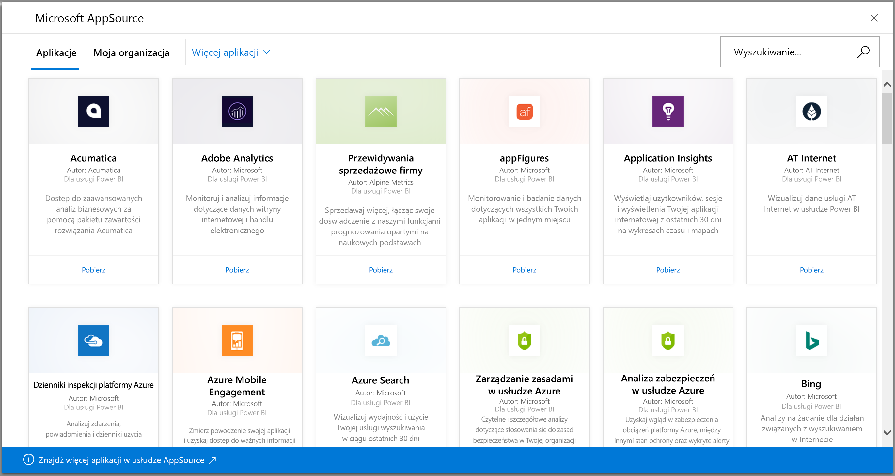
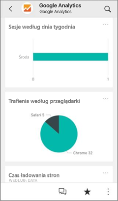
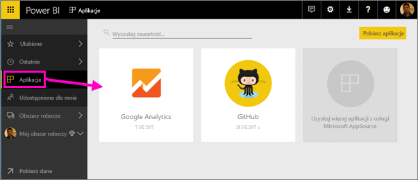
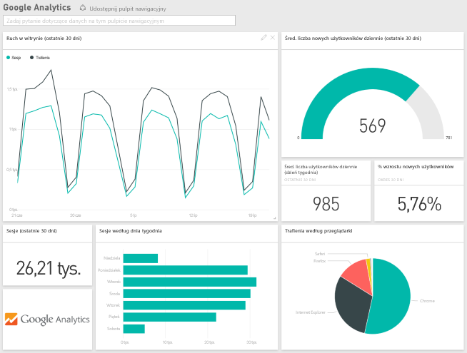

# Łączenie się z usługami używanymi z usługą Power BI
Możliwe jest nawiązanie połączenia z wieloma usługami, których używasz do prowadzenia firmy, takimi jak Salesforce, Microsoft Dynamics CRM i Google Analytics. Usługa Power BI łączy się z usługą za pomocą poświadczeń, a następnie tworzy aplikację Power BI z pulpitem nawigacyjnym i zestawem raportów usługi Power BI, które automatycznie wyświetlają dane i zapewniają wgląd wizualny w informacje o firmie.

Zaloguj się do usługi Power BI, aby wyświetlić wszystkie [usługi, z którymi możesz się połączyć](https://app.powerbi.com/getdata/services). Zespół usługi Power BI regularnie dodaje nowe usługi.

Po zainstalowaniu aplikacji możesz wyświetlić pulpit nawigacyjny i raporty w usłudze Power BI ([https://powerbi.com](https://powerbi.com)) oraz w aplikacjach mobilnych usługi Power BI. 

## Rozpoczęcie
[!INCLUDE [powerbi-service-apps-get-more-apps](./includes/powerbi-service-apps-get-more-apps.md)]

## Wyświetlanie pulpitu nawigacyjnego i raportów
Po zakończeniu importowania nowa aplikacja zostanie wyświetlona na stronie Aplikacje.

1. Wybierz pozycję **Aplikacje** w lewym okienku nawigacji, a następnie wybierz aplikację.
   
     
2. Zadaj pytanie, wpisując je w polu Pytania i odpowiedzi, lub kliknij kafelek, aby otworzyć raport źródłowy. 
   
    
   
    Dane w raporcie można filtrować i wyróżniać, ale nie można zapisywać zmian.

## Zawartość pakietu
Po nawiązaniu połączenia z usługą zobaczysz nowo utworzoną aplikację z pulpitem nawigacyjnym, raportami i zestawem danych. Dane z usługi dotyczą konkretnego scenariusza i mogą nie zawierać wszystkich informacji zawartych w usłudze. Dane są zaplanowane do automatycznego odświeżania raz dziennie. Harmonogram można kontrolować, wybierając zestaw danych.

Można również użyć [programu Power BI Desktop](desktop-get-the-desktop.md), aby połączyć się z niektórymi usługami, takimi jak Google Analytics, i utworzyć własne dostosowane pulpity nawigacyjne i raporty.  

Więcej informacji na temat nawiązywania połączenia z określonymi usługami można znaleźć na poszczególnych stronach dotyczących pomocy.

## Rozwiązywanie problemów
**Puste kafelki**  
Podczas pierwszego łączenia z usługą za pomocą usługi Power BI na pulpicie nawigacyjnym może zostać wyświetlony pusty zestaw kafelków. Jeśli po upływie 2 godzin pulpit nawigacyjny nadal jest pusty, nawiązanie połączenia prawdopodobnie nie powiodło się. Jeśli nie zostanie wyświetlony komunikat o błędzie z informacją o sposobie usunięcia problemu, prześlij zgłoszenie do pomocy technicznej.

* Wybierz ikonę znaku zapytania (**?**) w prawym górnym rogu, a następnie wybierz polecenie **Pomoc**.
  
    

**Brakujące informacje**  
Pulpit nawigacyjny i raporty obejmują zawartość usługi dotyczącą konkretnego scenariusza i nie uwzględniają wszystkich informacji zawartych w usłudze. Jeśli określona metryka nie jest wyświetlana w zawartości pakietu, zgłoś ten fakt na stronie [pomocy technicznej usługi Power BI](https://support.powerbi.com/forums/265200-power-bi).

## Proponowanie usług
Czy korzystasz z jakiejś usługi i chcesz zaproponować utworzenie dla niej aplikacji usługi Power BI? Przejdź do strony [pomocy technicznej usługi Power BI](https://support.powerbi.com/forums/265200-power-bi) i poinformuj nas o tym.

Masz usługę, dla której chcesz utworzyć aplikację? [Prześlij swoją propozycję](https://azure.microsoft.com/marketplace/programs/certified/apply/) i wybierz pozycję „Opublikuj pakiet zawartości usługi Power BI”, aby rozpocząć pracę.

## Następne kroki
* [Czym są aplikacje w usłudze Power BI?](service-install-use-apps.md)
* [Pobieranie danych w usłudze Power BI](service-get-data.md)
* Masz więcej pytań? [Zadaj pytanie społeczności usługi Power BI](http://community.powerbi.com/)

