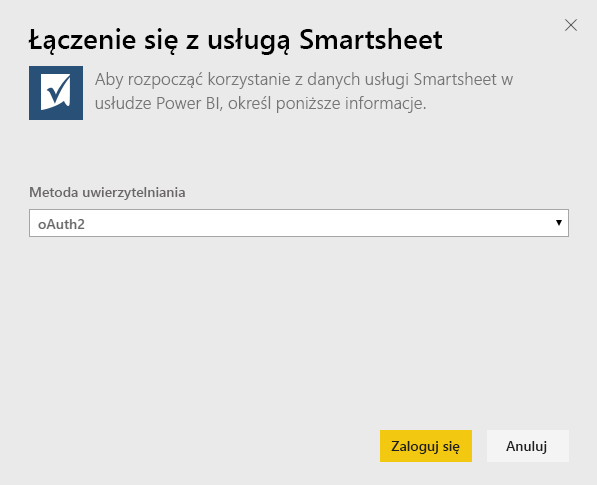
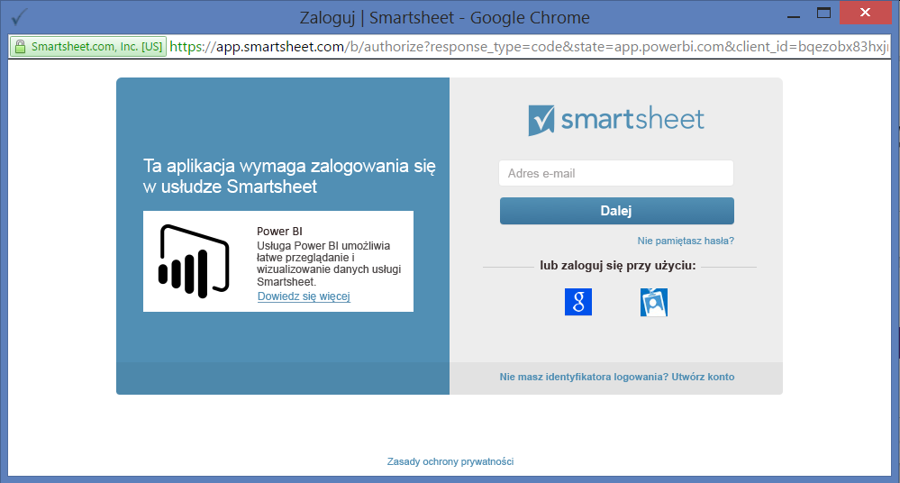
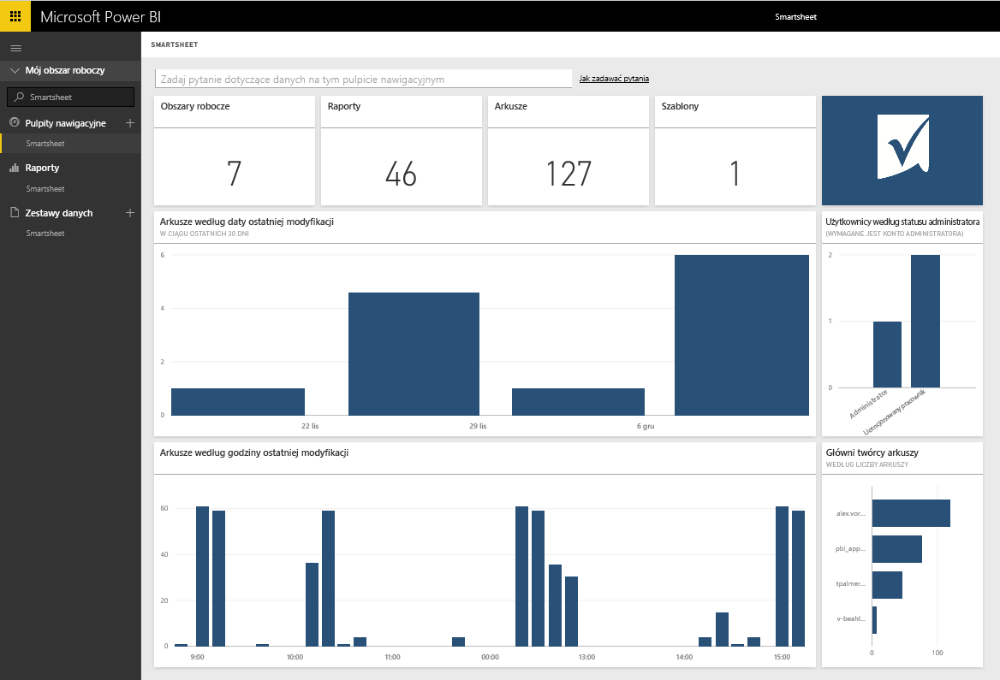

# Łączenie się z usługą Smartsheet za pomocą usługi Power BI
Usługa Smartsheet oferuje łatwą w obsłudze platformę do współpracy i udostępniania plików. Pakiet zawartości Smartsheet dla usługi Power BI oferuje pulpit nawigacyjny, raporty i zestaw danych, który zawiera przegląd Twojego konta Smartsheet. Możesz również użyć programu [Power BI Desktop](desktop-connect-to-data.md), aby nawiązać bezpośrednie połączenie z pojedynczymi arkuszami na Twoim koncie. 

Nawiąż połączenie z [pakietem zawartości Smartsheet](https://app.powerbi.com/groups/me/getdata/services/smartsheet) dla usługi Power BI.

>[!NOTE]
>Do nawiązania połączenia z pakietem zawartości Power BI i załadowania go preferowane jest konto administratora Smartsheet, ponieważ ma dodatkowy dostęp.

## Jak nawiązać połączenie
1. Wybierz pozycję **Pobierz dane** w dolnej części okienka nawigacji po lewej stronie.
   
   
2. W polu **Usługi** wybierz pozycję **Pobierz**.
   
    
3. Wybierz pozycję **Smartsheet \> Pobierz**.
   
   
4. Jako metodę uwierzytelniania wybierz opcję **oAuth2 \> Zaloguj**.
   
   Po wyświetleniu monitu wprowadź swoje poświadczenia Smartsheet i postępuj zgodnie z procesem uwierzytelniania.
   
   
   
   
5. Po zaimportowaniu danych przez usługę Power BI zobaczysz nowy pulpit nawigacyjny, raport i zestaw danych w okienku nawigacji po lewej stronie. Nowe elementy są oznaczone żółtą gwiazdką \*. Wybierz pozycję Smartsheet.
   
   

**Co teraz?**

* Spróbuj [zadać pytanie w polu funkcji Pytania i odpowiedzi](power-bi-q-and-a.md) w górnej części pulpitu nawigacyjnego
* [Zmień kafelki](service-dashboard-edit-tile.md) na pulpicie nawigacyjnym.
* [Wybierz kafelek](service-dashboard-tiles.md), aby otworzyć raport źródłowy.
* Zestaw danych zostanie ustawiony na codzienne odświeżanie, ale możesz zmienić harmonogram odświeżania lub spróbować odświeżyć go na żądanie przy użyciu opcji **Odśwież teraz**

## Zawartość pakietu
Pakiet zawartości Smartsheet dla usługi Power BI zawiera informacje o Twoim koncie Smartsheet, takie jak liczba obszarów roboczych, raporty i posiadane arkusze, czas ich modyfikacji itp. Administratorzy zobaczą też niektóre informacje dotyczące użytkowników w systemie, na przykład twórcy największej liczby arkuszy.  

Aby nawiązać bezpośrednie połączenie z pojedynczymi arkuszami na Twoim koncie, możesz również użyć łącznika usługi Smartsheet w usłudze [Power BI Desktop](desktop-connect-to-data.md).  

## Następne kroki:

[Wprowadzenie do usługi Power BI](service-get-started.md)

[Pobieranie danych dla usługi Power BI](service-get-data.md)