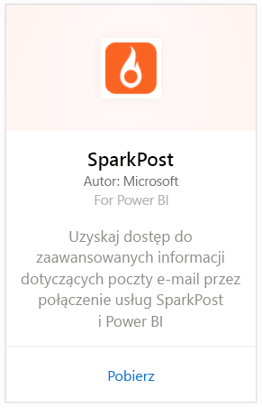
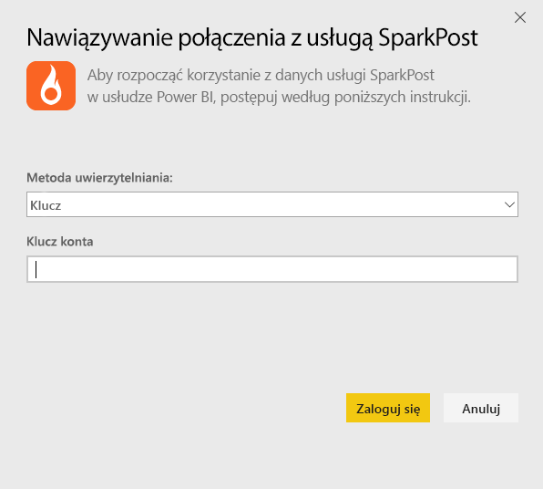
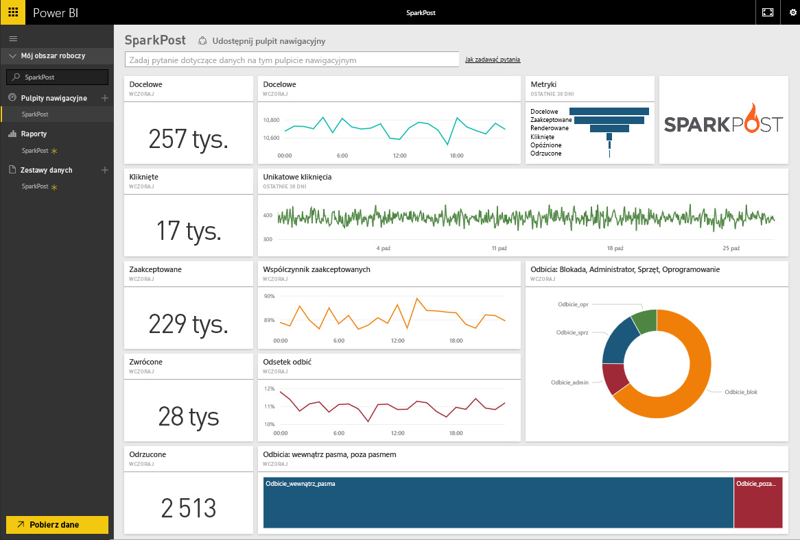
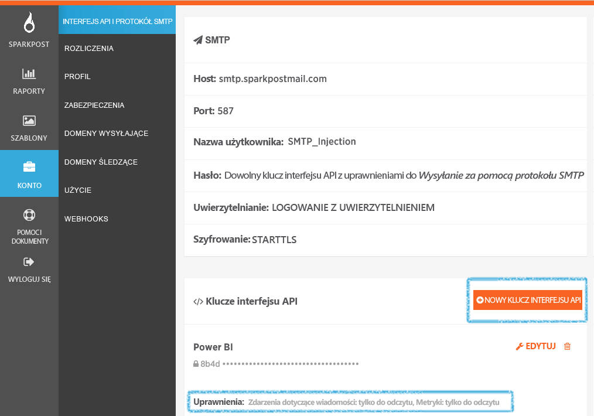

# Łączenie się z usługą SparkPost za pomocą usługi Power BI
Pakiet zawartości Power BI dla usługi SparkPost pozwala wyodrębnić cenne zestawy danych z konta SparkPost do jednego wnikliwego pulpitu nawigacyjnego. Przy użyciu pakietu zawartości SparkPost można zwizualizować ogólne statystyki dotyczące poczty e-mail, w tym domen, kampanii i zaangażowania przez usługodawcę internetowego.

Połącz się z [pakietem zawartości SparkPost dla usługi Power BI](https://app.powerbi.com/getdata/services/spark-post).

## Jak nawiązać połączenie
1. Wybierz pozycję **Pobierz dane** w dolnej części okienka nawigacji po lewej stronie.
   
   
2. W polu **Usługi** wybierz pozycję **Pobierz**.
   
   
3. Wybierz pakiet zawartości **SparkPost**, a następnie kliknij przycisk **Pobierz**. 
   
   
4. Po wyświetleniu monitu podaj klucz interfejsu API SparkPost oraz wybierz pozycję Zaloguj się. Poniżej znajdują się szczegółowe informacje dotyczące [wyszukiwania tych parametrów](#FindingParams).
   
   
5. Rozpocznie się ładowanie danych. Może to chwilę potrwać, w zależności od rozmiaru konta. Po zaimportowaniu danych przez usługę Power BI w lewym okienku nawigacji zobaczysz domyślny pulpit nawigacyjny, raport i zestaw danych wypełniony statystykami dotyczącymi poczty e-mail z ostatnich 90 dni. Nowe elementy są oznaczone żółtą gwiazdką \*.
   
   

**Co teraz?**

* Spróbuj [zadać pytanie w polu funkcji Pytania i odpowiedzi](consumer/end-user-q-and-a.md) w górnej części pulpitu nawigacyjnego
* [Zmień kafelki](service-dashboard-edit-tile.md) na pulpicie nawigacyjnym.
* [Wybierz kafelek](consumer/end-user-tiles.md), aby otworzyć raport źródłowy.
* Dla zestawu danych jest zaplanowane codzienne odświeżanie, ale możesz zmienić harmonogram odświeżania lub odświeżyć go na żądanie przy użyciu polecenia **Odśwież teraz**

## Zawartość pakietu
Pakiet zawartości SparkPost dla usługi Power BI zawiera takie informacje jak unikatowe kliknięcia oraz współczynniki akceptacji, odrzuceń, opóźnień i porzuceń oraz inne dane.

## Znajdowanie parametrów
Pakiet zawartości używa klucza interfejsu API do połączenia konta SparkPost z usługą Power BI. Klucz interfejsu API można znaleźć na swoim koncie w obszarze Konto \> Interfejs API i SMTP (więcej szczegółów [tutaj](https://support.sparkpost.com/customer/portal/articles/1933377-create-api-keys)). Zalecane jest używanie klucza interfejsu API z uprawnieniami `Message Events: Read-only ` i `Metrics: Read-only`.

