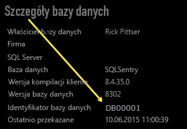

# Łączenie się z pakietem zawartości SQL Sentry przy użyciu usługi Power BI
Analizowanie danych dotyczących wydajności zbieranych przez program SQL Sentry jest bardzo proste dzięki usłudze Power BI. Usługa Power BI pobiera dane, a następnie tworzy domyślny pulpit nawigacyjny i powiązane raporty w oparciu o te dane.

Połącz się z [pakietem zawartości SQL Sentry](https://app.powerbi.com/groups/me/getdata/services/sql-sentry) dla usługi Power BI.

>[!NOTE]
>Aby nawiązać połączenie, wymagany jest dostęp do konta programu SQL Sentry używanego do łączenia się z witryną http://cloud.sqlsentry.com oraz identyfikator bazy danych, która będzie monitorowana.  Instrukcje, gdzie znaleźć identyfikator bazy danych, są zamieszczone poniżej.

## Jak nawiązać połączenie
1. Wybierz pozycję **Pobierz dane** w dolnej części okienka nawigacji po lewej stronie.
   
   
2. W polu **Usługi** wybierz pozycję **Pobierz**.
   
    
3. Wybierz pozycję **SQL Sentry  \> Pobierz**.
   
   
4. Podaj **identyfikator bazy danych** dla bazy danych, którą chcesz monitorować w usłudze Power BI. Poniżej znajdują się szczegółowe informacje o tym, [jak znaleźć tę wartość](#FindingParams).
   
   
5. Jako metodę uwierzytelniania wybierz opcję **oAuth2 \> Zaloguj**.
   
   Po wyświetleniu monitu wprowadź swoje poświadczenia witryny cloud.sqlsentry.com i postępuj zgodnie z procesem uwierzytelniania programu SQL Sentry.
   
   
   
   Przy pierwszym połączeniu usługa Power BI wyświetla monit o pozwolenie na dostęp tylko do odczytu do Twojego konta. Kliknij przycisk Udziel, aby rozpocząć proces importowania.  Proces importowania może zająć kilka minut w zależności od ilości danych na koncie.
   
   
6. Po zaimportowaniu danych przez usługę Power BI zobaczysz nowy pulpit nawigacyjny, raport i zestaw danych w okienku nawigacji po lewej stronie. Nowe elementy są oznaczone żółtą gwiazdką \*:
   
   
7. Wybierz pulpit nawigacyjny programu SQL Sentry.
   
   Jest to domyślny pulpit nawigacyjny utworzony przez usługę Power BI do wyświetlania Twoich danych. Możesz modyfikować pulpit nawigacyjny, aby wyświetlać dane w dowolny sposób.
   
   

**Co teraz?**

* Spróbuj [zadać pytanie w polu funkcji Pytania i odpowiedzi](power-bi-q-and-a.md) w górnej części pulpitu nawigacyjnego
* [Zmień kafelki](service-dashboard-edit-tile.md) na pulpicie nawigacyjnym.
* [Wybierz kafelek](service-dashboard-tiles.md), aby otworzyć raport źródłowy.
* Zestaw danych zostanie ustawiony na codzienne odświeżanie, ale możesz zmienić harmonogram odświeżania lub spróbować odświeżyć go na żądanie przy użyciu opcji **Odśwież teraz**

## Zawartość pakietu
W usłudze Power BI są dostępne następujące dane pochodzące z programu SQL Sentry:

| Nazwa tabeli | Opis |
| --- | --- |
| Connection (połączenie) |Ta tabela zawiera informacje dotyczące zdefiniowanych połączeń programu SQL Sentry. |
| Date (Data)  |Ta tabela zawiera daty począwszy od dnia dzisiejszego wstecz do najwcześniejszej daty, kiedy zostały odnotowane i zapisane dane dotyczące wydajności. |
| Downtime (Przestoje)  |Ta tabela zawiera informacje związane z przestojami oraz czasem pracy każdego serwera, który jest monitorowany w danym środowisku. |
| Memory Usage (Użycie pamięci)  |Ta tabela zawiera dane o ilości dostępnej lub wolnej pamięci na każdym serwerze.  |
| Server (Serwer)  |Ta tabela zawiera rekordy dla każdego serwera w środowisku. |
| Server Health (Kondycja serwera)  |Ta tabela zawiera dane wszystkich zdarzeń generowanych przez niestandardowe warunki w danym środowisku, w tym ich ważność i liczbę. |

## Znajdowanie parametrów
**Identyfikator bazy danych** można znaleźć, logując się do witryny <https://cloud.sqlsentry.com> w nowym oknie przeglądarki internetowej.  **Identyfikator bazy danych** znajduje się na głównej stronie przeglądu:

    

**Identyfikator bazy danych** jest również wyświetlany na ekranie Szczegóły bazy danych:

    

## Rozwiązywanie problemów
Jeśli dane z niektórych aplikacji nie są wyświetlane w usłudze Power BI, upewnij się, że używasz poprawnego identyfikatora bazy danych oraz że masz uprawnienia do wyświetlania tych danych. 

Jeśli nie jesteś właścicielem bazy danych programu SQL Sentry synchronizowanej z witryną <https://cloud.sqlsentry.com>, skontaktuj się z administratorem, aby upewnić się, że masz uprawnienia do wyświetlania zebranych danych.

## Następne kroki
[Wprowadzenie do usługi Power BI](service-get-started.md)

[Pobieranie danych dla usługi Power BI](service-get-data.md)

