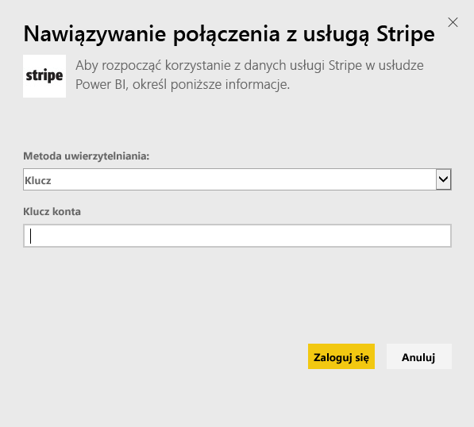
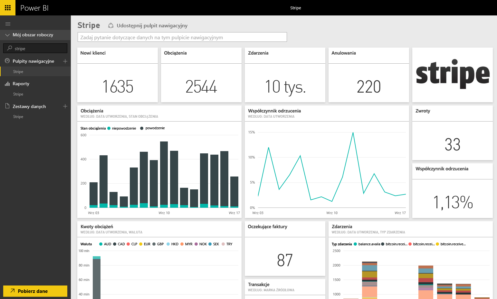

# Łączenie się z pakietem zawartości Stripe przy użyciu usługi Power BI
Za pomocą pakietu zawartości dla usługi Power BI możesz wizualizować i eksplorować dane usługi Stripe. Pakiet zawartości Stripe dla usługi Power BI pobiera dane o klientach, opłatach, zdarzeniach i fakturach. Dane obejmują najnowsze dziesięć tysięcy zdarzeń i pięć tysięcy opłat z ostatnich 30 dni. Zawartość będzie odświeżana automatycznie raz dziennie zgodnie z ustalonym przez Ciebie harmonogramem. 

Połącz się z [pakietem zawartości Stripe dla usługi Power BI](https://app.powerbi.com/getdata/services/stripe).

## Jak nawiązać połączenie
1. Wybierz pozycję Pobierz dane w dolnej części okienka nawigacji po lewej stronie.  
   
    
2. W polu **Usługi** wybierz pozycję **Pobierz**.  
   
      
3. Wybierz pozycje **Stripe** &gt; **Pobierz**.  
   
      
4. Podaj [klucz interfejsu API](https://dashboard.stripe.com/account/apikeys) usługi Stripe, aby się połączyć.  
   
    
5. Proces importowania rozpocznie się automatycznie. Po zakończeniu tego procesu w okienku nawigacji zostaną wyświetlone nowy pulpit nawigacyjny, raport i model, oznaczone gwiazdką. Wybierz pulpit nawigacyjny, aby wyświetlić zaimportowane dane.
   
    

**Co teraz?**

* Spróbuj [zadać pytanie w polu Pytania i odpowiedzi](service-q-and-a.md) w górnej części pulpitu nawigacyjnego
* [Zmień kafelki](service-dashboard-edit-tile.md) na pulpicie nawigacyjnym.
* [Wybierz kafelek](service-dashboard-tiles.md), aby otworzyć raport źródłowy.
* Zestaw danych zostanie ustawiony na codzienne odświeżanie, ale możesz zmienić harmonogram odświeżania lub spróbować odświeżyć go na żądanie przy użyciu opcji **Odśwież teraz**

## Następne kroki
[Wprowadzenie do usługi Power BI](service-get-started.md)

[Pobieranie danych dla usługi Power BI](service-get-data.md)

