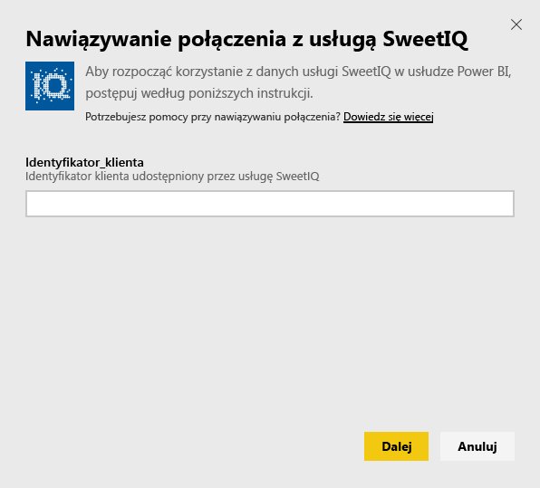
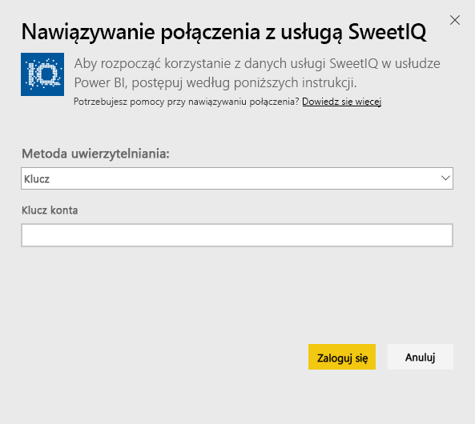
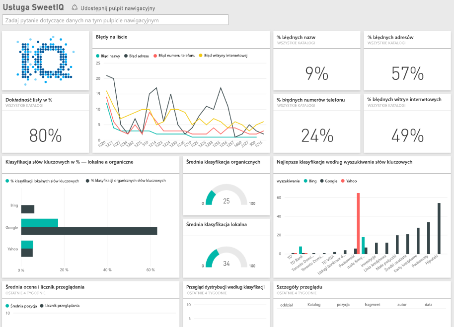

# Łączenie z pakietem zawartości SweetIQ przy użyciu usługi Power BI
Pakiet zawartości usługi Power BI pobiera dane z konta usługi SweetIQ i generuje zestaw gotowych zawartości, pozwalając łatwo eksplorować dane. Pakiet zawartości SweetIQ umożliwia analizowanie danych dotyczących lokalizacji, ofert, ocen i recenzji. Dane będą odświeżane codziennie, zapewniając aktualność monitorowanych danych.

Połącz się z [pakietem zawartości SweetIQ](https://app.powerbi.com/groups/me/getdata/services/sweetiq) dla usługi Power BI.

## Jak nawiązać połączenie
1. W okienku nawigacji po lewej stronie kliknij pozycję **Pobierz dane.**
   
    
2. Wybierz pozycję **SweetIQ** i kliknij przycisk **Pobierz.**
   
    
3. Podaj identyfikator klienta usługi SweetIQ. Zazwyczaj jest to wartość alfanumeryczna. Poniżej zamieszczono szczegółowe informacje o tym, jak znaleźć tę wartość.
   
    
4. Jako typ uwierzytelniania wybierz **Klucz** i podaj klucz interfejsu API usługi Sweet IQ. Zazwyczaj jest to wartość alfanumeryczna. Poniżej zamieszczono szczegółowe informacje o tym, jak znaleźć tę wartość.
   
    
5. Usługa Power BI rozpocznie ładowanie danych, co może nieco potrwać w zależności od rozmiaru danych na koncie. Po zakończeniu procesu importowania w okienku nawigacji po lewej stronie wyświetlony zostanie nowy pulpit nawigacyjny, raport i zestaw danych.
   
    

**Co teraz?**

* Spróbuj [zadać pytanie w polu funkcji Pytania i odpowiedzi](power-bi-q-and-a.md) w górnej części pulpitu nawigacyjnego
* [Zmień kafelki](service-dashboard-edit-tile.md) na pulpicie nawigacyjnym.
* [Wybierz kafelek](service-dashboard-tiles.md), aby otworzyć raport źródłowy.
* Zestaw danych zostanie ustawiony na codzienne odświeżanie, ale możesz zmienić harmonogram odświeżania lub spróbować odświeżyć go na żądanie przy użyciu opcji **Odśwież teraz**

## Znajdowanie parametrów
Identyfikator klienta i klucz interfejsu API dla tego pakietu zawartości nie są tożsame z nazwą użytkownika i hasłem usługi SweetIQ.

Wybierz identyfikator klienta dla jednego z klientów, do których konto ma dostęp. Listę klientów można znaleźć w obszarze „Zarządzanie klientami” na koncie usługi SweetIQ.

Skontaktuj się z administratorem, aby otrzymać klucz interfejsu API w celu uzyskania dostępu do danych dla konkretnego klienta.

## Następne kroki
[Wprowadzenie do usługi Power BI](service-get-started.md)

[Pobieranie danych dla usługi Power BI](service-get-data.md)

